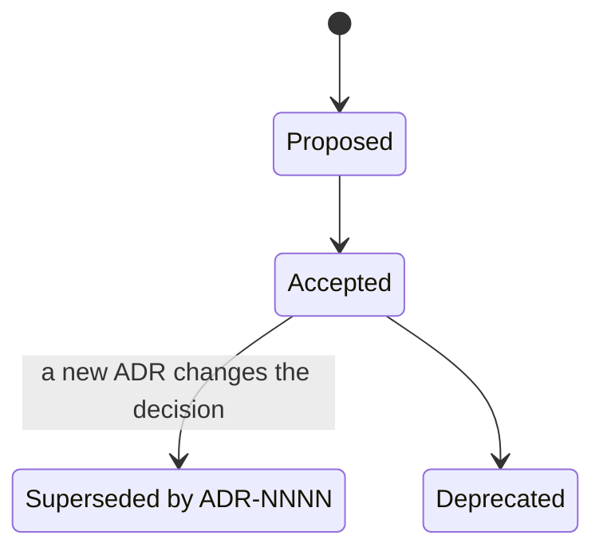

# ADR-0001 — Architecture decisions are recorded as ADRs, and the accepted ADRs are the repository contract

| | |
|---|---|
| Status | Accepted |
| Date | 2026-10-04 |
| Applies to | every repository built from this one, and every change to it |
| Enforced by | review (CODEOWNERS) |
| Related | [ADR-0005](0005-repository-layout-and-shared-tooling.md) |

**In short:** Every architecture decision is a numbered file in `docs/adr/` that states its rules, the reasons
behind them and the checks that enforce them. The accepted ADRs together are the contract that every app here, and
every repository built from this one, follows. A decision changes only through a new ADR that supersedes the old
one, so every change to the contract is visible.

## Context

This repository is the reference implementation of a set of conventions for Spring Boot applications: the
repository layout, the build, the configuration tree, the CI/CD workflows and the runtime operations. Teams reuse
those conventions in two ways. They add an app to this repository, or they create a new repository from it
([ADR-0005](0005-repository-layout-and-shared-tooling.md)). Both work only if the conventions are written down as
rules that a change can be checked against, together with the reasons behind them.

A convention that exists only in code is broken by the first change whose author does not know about it. A
convention that exists only in prose is not enforced. A single living "standards" document loses the reasoning, and
it silently changes the contract whenever somebody edits it.

This series replaces the repository's earlier decision records. Those described changes relative to a predecessor
codebase, not the design as it stands. They remain in the git history.

## Decision

1. **One decision per file.** Each architecture decision is one file, `docs/adr/NNNN-<slug>.md`, identified as
   `ADR-NNNN`. Numbers are assigned in sequence, and they are never reused or renumbered.
   - ADR-0001 to ADR-0999 are the **contract**: every repository built from this one shares them.
   - A repository's own decisions, those that do not belong to the contract, are numbered from ADR-1000.
2. **Format.** Every ADR has a header table (Status, Date, Applies to, Enforced by, Related) and the sections
   *Context*, *Decision*, *Alternatives considered* and *Consequences*.
3. **Normative language.** The *Decision* section states its rules with the keywords MUST, MUST NOT, SHOULD,
   SHOULD NOT and MAY, in the sense of RFC 2119, the standard that defines how strong each keyword is. The rules are
   the contract. The other sections explain them.
4. **The contract is the set of ADRs whose status is Accepted.** It applies to every app in this repository and to
   every repository built from this one. An ADR can narrow that scope in its *Applies to* row.
5. **Lifecycle.** An ADR starts as Proposed and becomes Accepted. Later it can become Superseded by ADR-NNNN, or
   Deprecated.
   - An accepted ADR is not edited in substance.
   - A changed decision is a new ADR that supersedes the old one, and the old one's status names its successor.
   - The only edits allowed are status changes, links, and corrections that do not change a rule.

The lifecycle of rule 5, as states:

6. **Enforcement.** The *Enforced by* row names the automated checks that fail when a rule is broken: a config-lint
   check, a Gradle task, a script's validation, a CI job or a test. "Review" means that only code review enforces the
   rule. A rule that is enforced only by review SHOULD get an automated check.
7. **The index is the living part.** [`docs/adr/README.md`](README.md) lists the ADRs, each with its status and a
   one-line summary of its rule. It also holds:
   - the checklists for adding an app and for creating a repository;
   - the **known gaps**: places where the tree does not conform yet;
   - the **open decisions**.

   Gaps are tracked there, not by editing ADRs.
8. **Changes keep the contract.** A pull request that changes behaviour governed by an ADR either conforms to it, or
   adds the ADR that supersedes it in the same pull request. It also updates the known gaps when it closes or opens
   one.
9. **References.** Code, configuration and documentation cite rules by ADR number (for example `ADR-0012`). They
   never cite documents outside this repository.

## Alternatives considered

- **One living standards document.** It is easy to read. But every edit silently changes the contract, the reasons
  are lost, and nothing shows which rule changed when.
- **Design documents in a wiki or another repository.** They drift from the code, they are not reviewed with it, and
  a repository created from this one does not get them.
- **ADRs without normative rules.** These are explanations, not a contract: a change cannot be checked against
  them.

## Consequences

- A newcomer reads the index first, then the ADRs of the area they work on.
- Changing a convention costs a new ADR. We want that friction: it makes a changed contract visible.
- A repository created from this one carries ADR-0001 to ADR-0999 unchanged, and records its own decisions from
  ADR-1000. It records each deviation from the contract as an ADR that says what it deviates from.
- Some comments in code and configuration still cite identifiers of retired documents. They are to be replaced by
  ADR numbers (a known gap in the index).
