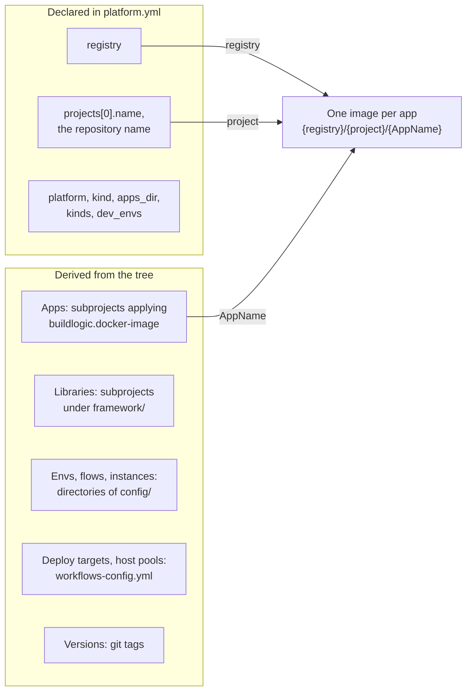

# ADR-0002 — One repository is one project: Spring Boot apps released together on one version line

| | |
|---|---|
| Status | Accepted |
| Date | 2026-10-04 |
| Applies to | every repository built from this one |
| Enforced by | `settings.gradle.kts` project discovery; `release.yml` (`printVersion` must equal the tag); `scripts/pool-deploy.sh`, `release.yml` and `scripts/ci/retention.sh` read the project from `platform.yml` |
| Related | [ADR-0003](0003-identity-tuple-names-every-instance.md), [ADR-0006](0006-apps-and-framework-modules.md), [ADR-0008](0008-versions-derived-from-git.md), [ADR-0010](0010-image-tags-digests-promotion-retention.md) |

**In short:** A repository holds one project: a set of Spring Boot apps and the libraries they share, versioned and
released together as `vX.Y.Z`. One release line means one tag series, one release pull request per release, and one
set of app and framework versions to test. `platform.yml` declares only the few project values that the file tree
cannot provide.

## Context

The apps of this repository share a framework, the conventions and one pipeline, and they are deployed into the
same flows. If each app had its own version, we would multiply the tags, the release pull requests, the image tag
sets, and the combinations of app and framework versions that have to be tested together.

A value that can be derived from the tree should not also be declared somewhere else. Two places for one fact drift
apart.

## Decision

1. **A repository holds exactly one project.** A project is:
   - one or more **apps**: deployable Spring Boot services, each in `apps/<AppName>/`;
   - zero or more **libraries** in `framework/<name>/`. They are built and tested with the apps, but never deployed
     ([ADR-0006](0006-apps-and-framework-modules.md)).
2. **The project name is the repository name.** The repository name, `rootProject.name` in `settings.gradle.kts`
   and `projects[0].name` in `platform.yml` MUST be equal. The project name is also:
   - the middle segment of every image name, `<registry>/<project>/<AppName>`;
   - the `<project>` directory on the hosts ([ADR-0018](0018-on-prem-host-layout-versioned-bundles.md)).
3. **One release line.** The repository has one tag series, `vX.Y.Z`
   ([ADR-0008](0008-versions-derived-from-git.md)). Every app and library is versioned, built, tested and released
   together, in lockstep. There MUST NOT be per-app versions, per-app tags or per-app release pull requests.
4. **Every app is a Spring Boot service on Java 21** (Spring Boot 4.x), packaged as exactly one container image
   ([ADR-0009](0009-one-shared-image-definition.md)).
5. **`platform.yml` is the manifest.** It declares only what the tree cannot derive:

   | Key | Meaning | Value here |
   |---|---|---|
   | `platform` | major version of this contract the repository follows | `v1` |
   | `kind` | `app`: builds, publishes and deploys its dev envs | `app` |
   | `registry` | image registry and namespace, the `<registry>` of image names | `ghcr.io/crazymatthsu` |
   | `projects[0].name` | the project (rule 2) | `github-cicd-simple-apps` |
   | `projects[0].apps_dir` | directory of the apps | `apps` |
   | `projects[0].kinds` | runtimes the project's instances can target | `[compose, helm]` |
   | `dev_envs` | the envs whose configuration lives and is deployed here ([ADR-0004](0004-environments-and-runtimes.md)) | `[us-dev]` |

   The manifest also declares the identity vocabulary: the allowed regions and flows
   ([ADR-0003](0003-identity-tuple-names-every-instance.md)).
6. **Everything else is derived, never declared a second time:**
   - apps: the subprojects that apply `buildlogic.docker-image`;
   - libraries: the subprojects under `framework/`;
   - envs, flows and instances: the directories of `config/`;
   - deploy targets and host pools: each flow's `workflows-config.yml`;
   - versions: git tags.
7. **Shared tooling reads project values from the manifest.** It MUST take them from `platform.yml` or derive them
   from the tree ([ADR-0005](0005-repository-layout-and-shared-tooling.md)). It MUST NOT hard-code them.

Where the project values come from, and how three of them make up an image name:

## Alternatives considered

- **An independent release line per app** (tags `<app>/vX.Y.Z`). Each app would get its own cadence. The cost is N
  release pull requests, per-app compatibility with the shared framework, and promotions that have to assemble a
  consistent set. The version plugin can model a second line (`VersionLine`); this contract forbids it.
- **One repository per app.** Isolation is maximal. But N copies of the shared tooling and of the framework have to
  be kept in step, and the framework needs its own published release line.
- **Several projects in one repository.** That means several release lines, with path-filtered triggers,
  permissions and image paths per project. This is the monorepo shape this contract was designed to avoid.

## Consequences

- Every merge to `main` builds new images for every app, and a release tags every app, changed or not. Release
  notes are per repository.
- A breaking change in one app bumps the major version of all of them.
- Adding an app needs no new pipeline, tag series or release configuration
  ([ADR-0006](0006-apps-and-framework-modules.md)).
- An app that needs its own cadence is moved to a new repository created from this one.
- The tree does not fully conform yet. These known gaps are tracked in the index:
  - `dev_envs`, `apps_dir` and `kinds` are declared, but nothing reads them;
  - the identity vocabulary is not in the manifest yet;
  - several project values are still hard-coded in the shared tooling;
  - nothing checks that `rootProject.name` equals `projects[0].name`.
