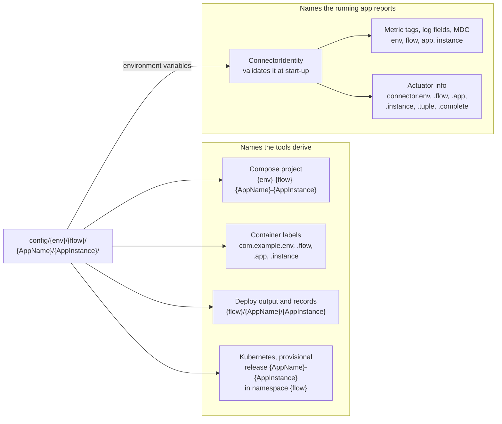

# ADR-0003 — The identity tuple `<env>/<flow>/<AppName>/<AppInstance>` names every running instance

| | |
|---|---|
| Status | Accepted |
| Date | 2026-10-04 |
| Applies to | every app, every instance, every tool that names one |
| Enforced by | config-lint checks 1 and 4; `run-compose.sh` and `pool-deploy.sh` argument validation; `ConnectorIdentity` (the app refuses to start); `scripts/smoke.sh` (identity in `/actuator/info`) |
| Related | [ADR-0004](0004-environments-and-runtimes.md), [ADR-0011](0011-configuration-tree-and-spring-layers.md), [ADR-0015](0015-actuator-health-and-metrics-contract.md), [ADR-0016](0016-logging-and-startup-configuration-summary.md) |

**In short:** Every running instance has a four-part identity: env, flow, app and instance. The four parts are the
instance's configuration path, and every tool derives its names from that path in the same way. So a log line, a
metric, a container or a deploy record shows which instance it belongs to, without a lookup table.

## Context

One app runs as many instances, in many envs and flows. Operators look at log lines, metrics, containers, deploy
records and directories on hosts. From any of them, an operator must be able to tell which instance it belongs to
without a lookup table. And every tool must derive the same names from the same source.

## Decision

1. **The four parts:**

   | Part | Meaning | Grammar |
   |---|---|---|
   | `env` | where it runs | `local`, or `<region>-<stage>` |
   | `flow` | a business flow | one of the `flows` of `platform.yml` (here `cash`, `deriv`, `swap`) |
   | `AppName` | the app | `^[a-z0-9]([a-z0-9-]*[a-z0-9])?$`, at most 20 characters |
   | `AppInstance` | one configured pipeline of the app in that flow | the same grammar, at most 32 characters |

   - A region is two lower-case letters, one of the `regions` of `platform.yml` (here `us`, `jp`). A stage is one of
     its `stages` (here `dev`, `qa`, `uat`, `prod` or `parallel`; [ADR-0004](0004-environments-and-runtimes.md)).
   - One flow in one env is one **cluster**, with its own hosts, deploy inventory and shared endpoints.
   - `AppName` is the app's directory under `apps/`, its Gradle project, its image name and its
     `spring.application.name`.
   - `AppInstance` is a business name, never a bare number. `<AppName>-<AppInstance>` is at most 53 characters: the
     Kubernetes release-name budget.
2. **The path is the identity.** An instance exists because the directory
   `config/<env>/<flow>/<AppName>/<AppInstance>/` exists ([ADR-0011](0011-configuration-tree-and-spring-layers.md)).
   The instance layer, the configuration files in that directory, restates the identity: `APP_ENV`, `APP_FLOW`,
   `APP_NAME` and `APP_INSTANCE` in `_docker-compose.instance.env` (and `identity`/`env` in the provisional Helm
   values). The restated values MUST equal the path. The deployer passes them to the container as environment
   variables.
3. **Every name is derived from the tuple, the same way in every tool:**

   | Where | Name |
   |---|---|
   | compose project | `<env>-<flow>-<AppName>-<AppInstance>`; CI test stacks prefix `ci-<run>-<attempt>-` |
   | container labels | `com.example.env`, `com.example.flow`, `com.example.app`, `com.example.instance` |
   | metric tags, log fields, MDC (the logging context) | `env`, `flow`, `app`, `instance` ([ADR-0015](0015-actuator-health-and-metrics-contract.md), [ADR-0016](0016-logging-and-startup-configuration-summary.md)) |
   | `/actuator/info` | `connector.env`, `.flow`, `.app`, `.instance`, `.tuple`, `.complete` |
   | deploy inventory target | `<AppName>/<AppInstance>`, relative to the flow's `workflows-config.yml` |
   | deploy output and records | `<flow>/<AppName>/<AppInstance>` (plus the box: `…@<host>`) |
   | host bundle | one per `<env>/<flow>`; a box, one bare-metal host, serves exactly one `<env>/<flow>` ([ADR-0018](0018-on-prem-host-layout-versioned-bundles.md)) |
   | Kubernetes (provisional) | release `<AppName>-<AppInstance>` in namespace `<flow>` ([ADR-0019](0019-kubernetes-and-helm-are-provisional.md)) |

   App-specific names MAY be derived further, for example the connectors' Deephaven table prefix
   `<flow>_<AppInstance>_`.
4. **The app validates its identity at start-up.** The framework's `ConnectorIdentity` reads `APP_ENV`, `APP_FLOW`,
   `APP_NAME` and `APP_INSTANCE`. The app refuses to start in two cases:
   - the identity breaks the grammar;
   - `APP_NAME` differs from `spring.application.name`: an image was started with another app's configuration.

   Without the variables (on a laptop, in a unit test) the identity is `local/none/<AppName>/none`, and it is
   reported as incomplete.

How the path reaches both the tools and the running app, with the main names it produces:

5. **One vocabulary.** The allowed stages, regions and flows MUST be defined once. They are project values declared
   in `platform.yml` ([ADR-0002](0002-one-repository-one-project-one-release-line.md)), and every implementation
   reads them: `run-compose.sh`, `pool-deploy.sh`, config-lint and `ConnectorIdentity`.

## Alternatives considered

- **Numbered instances** (`instance-1`). A number means nothing in a log line or an alert, and it gets reused after
  a deletion.
- **Identity as a property inside the configuration.** It duplicates the path and can drift from it. Instead, the
  path is the source, and the restated copy is checked against it.
- **No flow level.** One flow in one env is the unit of isolation: its own hosts, endpoints and inventory. Without
  the level, a shared value would reach every flow of the env.

## Consequences

- Renaming an instance means moving its directory. That makes it a new instance, with a new compose project and
  new names everywhere.
- Two instances on one box are told apart by name, but they need distinct `*_HOST_PORT` values
  ([ADR-0012](0012-compose-template-and-generated-env.md)).
- The length limits keep every derived Kubernetes name valid.
- The vocabulary is declared once, in `platform.yml`; config-lint, the scripts and `ConnectorIdentity` read it
  ([ADR-0030](0030-platform-yml-declares-every-project-value.md)).
