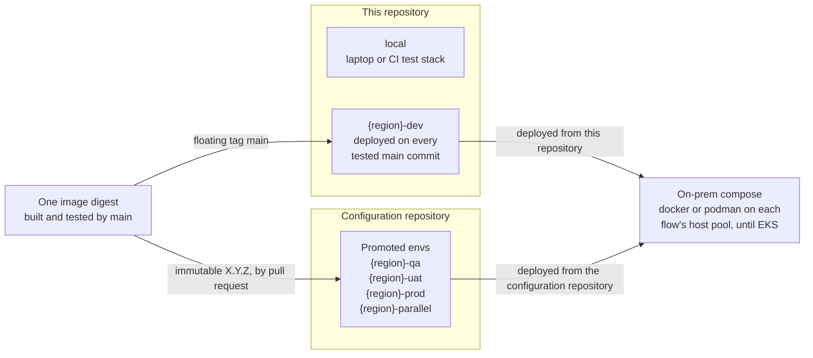

# ADR-0004 — Envs: dev is configured and deployed here, promoted envs live in a configuration repository, and on-prem compose runs them all until EKS

| | |
|---|---|
| Status | Accepted. Rule 3 superseded in part by [ADR-0030](0030-platform-yml-declares-every-project-value.md) |
| Date | 2026-10-04 |
| Applies to | every env of every project; this repository's `config/` |
| Enforced by | config-lint checks 1 (env grammar) and 10 (tag policy); the env allow-lists of `run-compose.sh` and `pool-deploy.sh`; the dev-env guard of `_deploy-dev.yml` ([ADR-0030](0030-platform-yml-declares-every-project-value.md)) |
| Related | [ADR-0003](0003-identity-tuple-names-every-instance.md), [ADR-0011](0011-configuration-tree-and-spring-layers.md), [ADR-0017](0017-run-compose-operations-cli-and-runtime-posture.md), [ADR-0019](0019-kubernetes-and-helm-are-provisional.md), [ADR-0027](0027-continuous-deployment-to-dev-and-the-deployment-record.md), [ADR-0029](0029-release-and-promotion.md) |

**In short:** This repository configures and deploys only `local` and its dev envs. The promoted envs (qa, uat,
prod and parallel) are configured in and deployed from a separate configuration repository, promoted by pull request
there. Every env runs the image that `main` tested, and until EKS exists, every deployed env runs on on-prem hosts
with docker or podman compose.

## Context

The envs differ in who owns their configuration, who approves a change, how they are deployed and which image tags
they may run. The runtime is on-prem bare-metal hosts that run docker or podman compose. Kubernetes on EKS
(Amazon's managed Kubernetes service) is the long-term target, but it does not exist yet. The image and the
operations tooling must stay the same in every env, so that what was tested in dev is what runs in prod.

## Decision

1. **Envs.** `local` is a laptop or a CI test stack, and no pipeline ever deploys it. Every other env is
   `<region>-<stage>` ([ADR-0003](0003-identity-tuple-names-every-instance.md)). The stage says what the env is for:
   - `dev`: integration of `main`;
   - `qa`: verification of a release;
   - `uat`: user acceptance;
   - `prod`: production;
   - `parallel`: a production-like run alongside prod.

   `qa`, `uat`, `prod` and `parallel` are the **promoted envs**. They differ from dev like this:

   | | dev | promoted envs |
   |---|---|---|
   | Configuration lives in | this repository: `config/<region>-dev/`, listed in `platform.yml` `dev_envs` | the configuration repository |
   | Deployed by | this repository, on every tested `main` commit ([ADR-0027](0027-continuous-deployment-to-dev-and-the-deployment-record.md)) | the configuration repository, on merge of a version-bump pull request |
   | Image tags in the config | the floating tag `main`, as an intent; the literal version is recorded at deploy time | immutable `X.Y.Z`, optionally `@sha256:<digest>` |

2. **The configuration repository.** It is a separate repository that holds `config/<env>/…` of the promoted envs.
   It uses the same tree layout and rules as this repository
   ([ADR-0011](0011-configuration-tree-and-spring-layers.md) to
   [ADR-0014](0014-config-lint-enforces-the-config-contract.md)). Its CODEOWNERS approve changes, and an approved
   pull request there is the deploy intent. This repository's `config/` MUST hold only `local` and the envs listed
   in `dev_envs`.
3. **One runtime until EKS, deployed from two places.** Until a decision on EKS supersedes
   [ADR-0019](0019-kubernetes-and-helm-are-provisional.md), every env (dev, qa, uat, prod and parallel) runs on
   **on-prem compose**: docker or podman compose on the boxes (bare-metal hosts) of each flow's host pool, laid out
   as versioned host bundles ([ADR-0018](0018-on-prem-host-layout-versioned-bundles.md)).

   > **Superseded in part by [ADR-0030](0030-platform-yml-declares-every-project-value.md) rule 5.** The allowed envs
   > are `local` and the envs of `dev_envs`, no longer every `*-dev` env.

   - This repository MUST deploy and operate only `local` and its dev envs. `run-compose.sh`
     ([ADR-0017](0017-run-compose-operations-cli-and-runtime-posture.md)) and `pool-deploy.sh`
     ([ADR-0028](0028-host-pool-deployment.md)) refuse every other env, and the dev deploy refuses anything that is
     not `*-dev` ([ADR-0027](0027-continuous-deployment-to-dev-and-the-deployment-record.md)).
   - The higher envs are deployed from the configuration repository. How it does so, on the same host layout, is
     an open decision.
4. **The same artifacts in every env.** Every env runs the image that `main` built and tested, promoted by its
   digest, the content hash of the image ([ADR-0010](0010-image-tags-digests-promotion-retention.md)). Every env also
   follows the same configuration rules and host layout. Promoted envs differ in only four things: who owns the
   configuration, which tags are allowed, who approves, and which pipeline deploys.
5. **Kubernetes targets are tests, not a runtime.** A `kind: helm` target on `cluster: kind-ci` in a dev inventory
   (a flow's `workflows-config.yml`) is deployed into a throwaway kind cluster (Kubernetes in Docker). The job
   deletes that cluster at its end. Such a target is a deployment test of the provisional charts
   ([ADR-0019](0019-kubernetes-and-helm-are-provisional.md)). An instance that must keep running MUST be a compose
   target.

How the envs, the two repositories and the runtime fit together:

## Alternatives considered

- **Configuration of every env in the project repository.** It gives one place for everything. But an app team's
  merge would become the deploy intent for prod, ops ownership would mix with app ownership, and every prod
  configuration change would run the app pipeline.
- **Kubernetes for the promoted envs now.** EKS is not available. A second runtime for some envs would also mean
  that dev never tests what prod runs.
- **An env per runtime** (`us-dev-k8s`). It duplicates the configuration of an env, and one pipeline would deploy
  it twice. The runtime is a property of the target, not of the env.

## Consequences

Work this decision requires (each item is a known gap in the index):

- The release workflow opens its version-bump pull request against `config/us-qa` in this repository. It must open
  it in the configuration repository ([ADR-0029](0029-release-and-promotion.md)).
- The `us-dev` instance `cash/source-database/positions-db-to-deephaven` is a `kind: helm` target, so it runs
  nowhere after the deploy job.

Decisions still open (in the index):

- The configuration repository's pipeline: how it validates, how it assembles host bundles from a release's
  runtime files, and how it deploys and records — and so whether the bundled `run-compose.sh` must operate the
  higher envs, which it refuses today.
- How secrets are provisioned on the boxes of the promoted envs.
