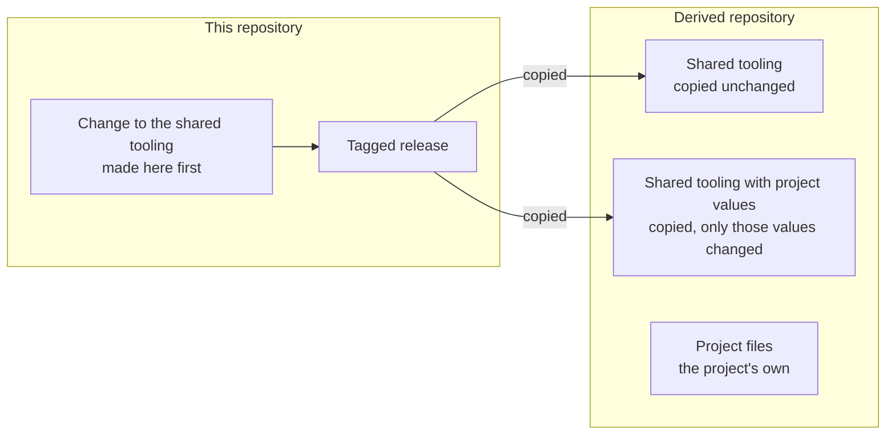

# ADR-0005 — Every repository has the same layout, split into shared tooling and project files

| | |
|---|---|
| Status | Accepted. Rules 5 and 6 superseded in part by [ADR-0030](0030-platform-yml-declares-every-project-value.md) |
| Date | 2026-10-04 |
| Applies to | every repository built from this one |
| Enforced by | review (CODEOWNERS: the shared tooling is owned by the platform maintainers); config-lint for `config/`; settings discovery for `apps/` and `framework/` |
| Related | [ADR-0001](0001-adrs-are-the-repository-contract.md), [ADR-0002](0002-one-repository-one-project-one-release-line.md), [ADR-0006](0006-apps-and-framework-modules.md), [ADR-0021](0021-ci-layering.md) |

**In short:** Every repository built from this one has the same skeleton. Each file is either shared tooling, copied
from a release of this repository with at most its project values changed, or a project file that the project owns.
The shared tooling is changed here first and then copied, so the copies do not fork.

## Context

The contract is reused in two ways:

- **adding an app to this repository** ([ADR-0006](0006-apps-and-framework-modules.md));
- **creating a new repository from this one**.

The second way works only if every repository has the same skeleton. It also needs a clear line between the
reusable tooling, which is copied unchanged, and the files that belong to the project. Without that line, a copied
repository forks the tooling, and every fix has to be found and repeated in each copy.

## Decision

1. **The skeleton.** Every repository has this layout. Generated paths are never committed.

   ```
   platform.yml                      the manifest (ADR-0002)
   settings.gradle.kts, build.gradle.kts, gradle.properties, gradle/, gradlew, gradlew.bat   Gradle root (ADR-0007)
   build-logic/                      convention plugins (ADR-0007)
   apps/<AppName>/                   one deployable Spring Boot app each (ADR-0006)
   framework/<name>/                 shared libraries, never deployed (ADR-0006)
   config/<env>/<flow>/…             configuration of local and the dev envs (ADR-0011)
   docker/                           spring-boot.Dockerfile, entrypoint.sh (ADR-0009); docker-compose.yml (ADR-0012)
   scripts/                          runtime and deploy scripts; scripts/ci/ CI helpers; scripts/test/ script tests
   test-infra/                       compose stacks, kind tier, seeds, test data (ADR-0025, ADR-0026)
   .github/                          workflows, composite actions, affected-map.yml, CODEOWNERS (ADR-0020 to ADR-0024)
   docs/                             README.md (the documentation index), adr/ (this contract)
   README.md, LICENSE, CHANGELOG.md, release-please-config.json, .release-please-manifest.json,
   renovate.json, .hadolint.yaml, .gitignore
   generated: build/, .gradle/, .run/ (combined envs, ADR-0012), test-infra/compose/.state/, test-infra/kind/.state/
   ```

2. **Each directory's standard is owned by the ADR of its topic:**

   | Directory | Standard |
   |---|---|
   | `apps/`, `framework/` | [ADR-0006](0006-apps-and-framework-modules.md) |
   | `build-logic/`, `gradle/`, root Gradle files | [ADR-0007](0007-gradle-build-with-convention-plugins.md) |
   | `config/` | [ADR-0011](0011-configuration-tree-and-spring-layers.md) to [ADR-0014](0014-config-lint-enforces-the-config-contract.md) |
   | `docker/` | [ADR-0009](0009-one-shared-image-definition.md), [ADR-0012](0012-compose-template-and-generated-env.md) |
   | `scripts/` | rule 3, [ADR-0017](0017-run-compose-operations-cli-and-runtime-posture.md), [ADR-0018](0018-on-prem-host-layout-versioned-bundles.md), [ADR-0028](0028-host-pool-deployment.md) |
   | `test-infra/` | [ADR-0024](0024-ephemeral-ci-environments.md), [ADR-0025](0025-integration-tests-on-compose-stacks.md), [ADR-0026](0026-integration-test-data-and-comparison.md) |
   | `.github/` | [ADR-0020](0020-branching-protection-and-merge-rules.md) to [ADR-0024](0024-ephemeral-ci-environments.md) |
   | `docs/` | rule 4, [ADR-0001](0001-adrs-are-the-repository-contract.md) |

3. **Scripts.** Scripts are bash, run with `set -euo pipefail`, and are ShellCheck-clean.
   - Each script prints its usage with `--help`. Each one that changes anything offers `--dry-run`, which prints
     the exact commands.
   - Exit codes are shared. A script adds its own codes above these (`6` placement conflict, `124` timeout):

     | Code | Meaning |
     |---|---|
     | `0` | ok |
     | `1` | the operation failed, or a check is negative |
     | `2` | usage |
     | `3` | refused by a safety rule |
     | `4` | configuration error |
     | `5` | tool or engine missing |

   - Script tests live in `scripts/test/*-test.sh`. They use stub `ssh`, `rsync` and engines, so they reach no
     host. CI-only helpers live in `scripts/ci/`.
   - Logic that CI runs belongs in a script or a Gradle task, never only in workflow YAML
     ([ADR-0021](0021-ci-layering.md)).
4. **Documentation.** Decisions are made only in ADRs.
   - `docs/README.md` indexes the documentation.
   - Topic READMEs live next to what they describe (`config/README.md`, `test-infra/README.md`,
     `apps/<AppName>/README.md`). They explain usage and MUST NOT contradict an ADR.
5. **Shared tooling and project files.** Every file belongs to one of three classes.

   > **Superseded in part by [ADR-0030](0030-platform-yml-declares-every-project-value.md) rule 7.**
   > `settings.gradle.kts` holds no project value and is shared tooling, copied unchanged. Since
   > [ADR-0031](0031-ci-derives-the-projects-from-the-build-files.md), `.github/affected-map.yml` holds only the path
   > classes and rarely needs an edit.

   - **Shared tooling.** A repository built from this one copies these files unchanged, and they MUST NOT be edited
     there:
     - `build-logic/`, `gradle/wrapper/`, `gradlew*`, root `build.gradle.kts`, `gradle.properties`;
     - `docker/*`, `scripts/**`, `.github/actions/**`, `.github/workflows/_*.yml`;
     - `test-infra/compose/{base.yml,it-runner.yml,stack.sh}`, `test-infra/kind/**`;
     - `.hadolint.yaml`, `.gitignore`, `docs/adr/0001-…` to `0999-…`.
   - **Shared tooling with project values.** These files are copied, and only the project values in them change:
     - `settings.gradle.kts` (`rootProject.name`), `gradle/libs.versions.toml` (the apps' libraries);
     - the trigger workflows `.github/workflows/{pr,main,release,release-please,nightly,config-lint}.yml`;
     - `release-please-config.json`, `renovate.json`.
   - **Project files.** These are the project's own:
     - `platform.yml`, `apps/**`, `framework/**`, `config/**`;
     - `test-infra/compose/{stacks.yml,versions.env,local-ports.yml,<stack>.yml}`, `test-infra/{seed,testdata,ca}/**`;
     - `.github/affected-map.yml`, `.github/CODEOWNERS`;
     - `docs/README.md`, ADR-1000 and later, `README.md`, `CHANGELOG.md`, `.release-please-manifest.json`.
6. **This repository is the source of the shared tooling.** A change to the shared tooling is made here first,
   released with this repository, and copied from a tagged release into the repositories built from it. A derived
   repository, one built from this one, changes shared tooling only by copying a newer release of it. Until the
   hard-coded project values move to `platform.yml` ([ADR-0030](0030-platform-yml-declares-every-project-value.md)), a derived repository may edit exactly those values
   in shared tooling, and nothing else.

   > **Superseded in part by [ADR-0030](0030-platform-yml-declares-every-project-value.md) rule 7.** The project values
   > have moved to `platform.yml`, so the permission to edit them in shared tooling has lapsed: a derived repository
   > edits no shared tooling.

How the shared tooling moves from this repository into a derived one:



7. **Creating a repository from this one** follows the checklist in the index:
   - copy the shared tooling;
   - set the project values;
   - replace the project files with the new project's own;
   - apply the repository settings ([ADR-0020](0020-branching-protection-and-merge-rules.md));
   - keep ADR-0001 to ADR-0999 unchanged.

## Alternatives considered

- **A one-shot copy with no boundary** (for example a GitHub template repository). It is fast to start, but the
  copies drift, and nobody can tell a deliberate local change from a stale copy.
- **Extract the shared tooling now** into versioned reusable workflows, composite actions and a published Gradle
  plugin. This is the clean end state, but it is premature with one consumer. The scripts and workflows already
  resolve apps by name and read the project from `platform.yml`, so the extraction stays a move, not a rewrite.
  When and how to do it is an open decision.
- **Git submodules or subtrees for the shared tooling.** They couple the repositories' histories. Also, GitHub
  Actions resolves local actions (`./.github/actions/…`) only from the repository's own tree.

## Consequences

- CODEOWNERS gives the shared tooling to the platform maintainers and the project files to the app team.
- A fix that a derived repository needs in the shared tooling lands here first, then in every copy.
- Nothing checks yet that a derived repository's shared tooling is unchanged, and how copies receive updates is
  undecided (index: known gaps and open decisions).
- The shared tooling reads the project values from `platform.yml` ([ADR-0030](0030-platform-yml-declares-every-project-value.md)).
