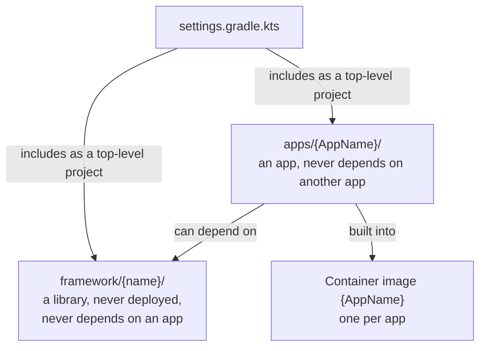

# ADR-0006 — Apps live in `apps/<AppName>/`, shared code in `framework/<name>/`

| | |
|---|---|
| Status | Accepted. Rule 6 superseded in part by [ADR-0030](0030-platform-yml-declares-every-project-value.md) |
| Date | 2026-10-04 |
| Applies to | every app and library module |
| Enforced by | `settings.gradle.kts` discovery; config-lint check 2 (configured apps are deployable subprojects; every deployable app is configured in `local`); `AbstractConnectorApplicationTest` in each app |
| Related | [ADR-0002](0002-one-repository-one-project-one-release-line.md), [ADR-0007](0007-gradle-build-with-convention-plugins.md), [ADR-0009](0009-one-shared-image-definition.md), [ADR-0015](0015-actuator-health-and-metrics-contract.md) |

**In short:** Each app is one directory under `apps/`, holding its code and only the infrastructure files that
really differ between apps. Shared code lives in libraries under `framework/`, which are built and released with the
apps but never deployed. Apps depend on libraries, never the other way round and never on each other.

## Context

Each app once carried its own Dockerfile, entrypoint, compose file, and run and smoke wrappers. The copies differed
only in the app's name, yet they drifted, and every infrastructure change had to be repeated once per app. An app
directory should hold the app's code, and only the infrastructure that really differs between apps.

## Decision

1. **An app is `apps/<AppName>/`,** a top-level Gradle project `:<AppName>`. The directory name, the Gradle project
   name, the image name, `spring.application.name` and the `AppName` of the identity tuple
   ([ADR-0003](0003-identity-tuple-names-every-instance.md)) MUST be the same string. The directory holds:

   ```
   apps/<AppName>/
     build.gradle.kts                      buildlogic.spring-boot-app, buildlogic.docker-image, buildlogic.integration-test
     README.md                             purpose, configuration keys, actuator specifics, how to run it
     src/main/java/…                       main class: ConnectorApplication.run(<Main>.class, args)
     src/main/resources/application.yml    layer 1: jar defaults, the import list (ADR-0011), operational defaults (ADR-0015, ADR-0016)
     src/test/java/…                       unit tests; one test class extends AbstractConnectorApplicationTest (ADR-0015)
     src/integrationTest/java/…            integration tests (ADR-0025)
     docker/docker-compose.override.yml    optional: what the app needs in every env, e.g. secret pass-through (ADR-0012)
     scripts/smoke.sh                      optional: app-specific checks that replace scripts/smoke.sh (ADR-0017)
     helm/<AppName>/                       provisional chart (ADR-0019)
     docker/Dockerfile                     discouraged: replaces the shared Dockerfile (ADR-0009); review asks why
   ```

   An app MUST NOT carry its own entrypoint, compose template, `.dockerignore`, or run, deploy or smoke wrapper
   beyond the optional files above. It MUST NOT hold the configuration of any env: configuration lives in `config/`
   ([ADR-0011](0011-configuration-tree-and-spring-layers.md)).
2. **A deployable app is a subproject that applies `buildlogic.docker-image`.** That is how config-lint, the scripts
   and the workflows know the app list ([ADR-0002](0002-one-repository-one-project-one-release-line.md)).
3. **A library is `framework/<name>/`.** It applies `buildlogic.java-conventions`, `java-library` and
   `java-test-fixtures`. It MUST NOT apply `buildlogic.spring-boot-app` or `buildlogic.docker-image`. It is built,
   tested and released with the apps, but it is never deployed and never published as an image.
4. **The framework carries the operational contract.** Every app depends on the framework module that implements
   that contract, today `framework/connectors-framework`. The module provides:
   - identity, the actuator contract, metric tags and the masked start-up summary
     ([ADR-0015](0015-actuator-health-and-metrics-contract.md),
     [ADR-0016](0016-logging-and-startup-configuration-summary.md));
   - test fixtures: the actuator contract test, the integration-test helpers and the result comparators
     ([ADR-0026](0026-integration-test-data-and-comparison.md)).
5. **Dependency rules:**
   - apps MAY depend on libraries (`implementation(project(":<name>"))`, `testFixtures(project(":<name>"))`);
   - libraries MUST NOT depend on apps;
   - apps MUST NOT depend on other apps.
6. **Discovery.** `settings.gradle.kts` includes every directory under `apps/` and `framework/` that holds a

   > **Superseded in part by [ADR-0030](0030-platform-yml-declares-every-project-value.md) rule 7.** The
   > `buildlogic.platform` settings plugin, applied by `settings.gradle.kts`, includes the modules, and the apps'
   > directory is `apps_dir` of `platform.yml`.

   `build.gradle.kts`, as the top-level project `:<directory>`. Project names MUST be unique across both
   directories. Adding a module never needs an edit to the settings file or the root build.

How Gradle finds the modules, and which way dependencies point:



## Alternatives considered

- **Nested app groups** (`apps/<group>/<AppName>`). The scripts can find `<dir>/<AppName>`, but a flat layout keeps
  every name unique and every path predictable.
- **A separately versioned framework library.** It is needed only when several repositories consume it. Inside one
  release line, lockstep is simpler, and it tests every app against the framework it ships with.
- **`libs/` as the directory name.** It collides with Gradle's `build/libs/` and with the version catalog's `libs.`
  accessors. Also, the apps are built on a framework, not on a bag of utilities.

## Consequences

- A new app needs no change to the settings, the root build, the Dockerfile, the compose template or the workflow
  files.
- It is not yet "just a directory", though:
  - `test-infra/compose/stacks.yml` must still be edited by hand
    ([ADR-0025](0025-integration-tests-on-compose-stacks.md)); CI derives the app itself from its build file
    ([ADR-0031](0031-ci-derives-the-projects-from-the-build-files.md));
  - the app also needs `local` configuration and, while Helm is provisional, a chart.

  The checklist in the index lists every step, and the hand-edited maps are a known gap.
- Every app depends on the framework, so a framework change rebuilds and retests every app.
- The framework mixes the generic operational contract with the connector domain (`connector.*` properties, the
  sink types). An app outside that domain would need the generic part split out (an open decision in the index).
