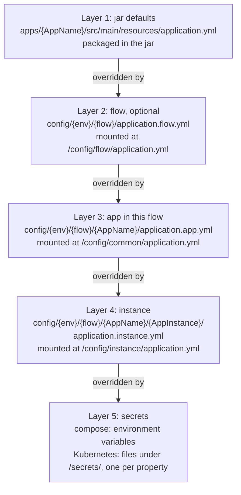

# ADR-0011 — Configuration lives in a tree whose path is the identity, applied as Spring layers

| | |
|---|---|
| Status | Accepted. Rule 5 superseded in part by [ADR-0036](0036-helm-checks-only-when-kinds-include-helm.md) |
| Date | 2026-10-04 |
| Applies to | every app, every instance, this repository's `config/` and the configuration repository |
| Enforced by | config-lint checks 1 to 5 and 9; `ConfigLayeringTest` (the precedence, against a rendered tree); `run-compose.sh` (required files, layouts it does not know) |
| Related | [ADR-0003](0003-identity-tuple-names-every-instance.md), [ADR-0004](0004-environments-and-runtimes.md), [ADR-0012](0012-compose-template-and-generated-env.md), [ADR-0013](0013-secrets.md), [ADR-0014](0014-config-lint-enforces-the-config-contract.md) |

**In short:** Configuration lives in the directory tree `config/<env>/<flow>/<AppName>/<AppInstance>/`, so a file's
path shows which instances an edit reaches. Spring Boot applies the files as layers (jar defaults, flow, app,
instance, then secrets), and the later layer wins. Nothing is shared above the flow, and a configuration change
never needs a rebuild.

## Context

One app runs as many instances. Their configuration must be reviewable in git. It must be layered, so that a shared
value is written once. It must never contain secrets.

The blast radius of an edit, meaning how far it reaches, must match its scope: one instance, one app in one cluster,
or one cluster. A cluster is one flow in one env. Finally, changing configuration must not require a rebuild.

## Decision

The diagram shows the five layers of rule 2, where each one lands in the container (rule 6), and which one wins.



1. **The tree.** Configuration lives in `config/<env>/<flow>/<AppName>/<AppInstance>/`. The path is the identity of
   the instance, the source of every name it has ([ADR-0003](0003-identity-tuple-names-every-instance.md)). This
   repository holds `local` and its dev envs. The configuration repository holds the promoted envs (qa, uat, prod
   and parallel), with the same layout and rules ([ADR-0004](0004-environments-and-runtimes.md)).
2. **The Spring layers, lowest precedence first:**

   | # | Layer | Source | Required |
   |---|---|---|---|
   | 1 | jar defaults | `apps/<AppName>/src/main/resources/application.yml` | yes |
   | 2 | flow (the cluster) | `config/<env>/<flow>/application.flow.yml` | no |
   | 3 | app in this flow | `config/<env>/<flow>/<AppName>/application.app.yml` | yes |
   | 4 | instance | `config/<env>/<flow>/<AppName>/<AppInstance>/application.instance.yml` | yes |
   | 5 | secrets | the environment (compose) or `/secrets/` (Kubernetes) ([ADR-0013](0013-secrets.md)) | — |

   In Spring Boot, environment variables override every file. So they are reserved for the identity, the container
   settings and secrets. They are never used to set an application property.
3. **Nothing is shared above the flow.** There is no env-wide layer and no layer shared across envs.
   - A value that is the same in every env is a jar default. It ships with the code and reaches each env with a
     release.
   - A value shared inside an env is a flow value, because one flow in one env is one cluster.
4. **Layers are files, named by level.** The name says which layer a file is and which tool reads it:
   - **`application.<layer>.yml`** is what the app reads. These are the only files of the tree that reach the
     container.
   - **`_<tool>.<layer>.<ext>`** files are read on the host by a deploy tool and never mounted:
     `_docker-compose.<layer>.env` and `_docker-compose.<layer>.yml`
     ([ADR-0012](0012-compose-template-and-generated-env.md)), and `_helm-values.<layer>.yaml` (provisional,
     [ADR-0019](0019-kubernetes-and-helm-are-provisional.md)). The leading `_` marks deploy-tool files and sorts
     them first.
   - `<layer>` is `flow`, `app` or `instance`, and MUST match the level of the directory the file is in.
5. **What each directory may hold** (anything else is an error):

   | Directory | Files |
   |---|---|
   | `config/` | `<env>/`, `README.md` |
   | `config/<env>/` | `<flow>/`, `known_hosts` ([ADR-0028](0028-host-pool-deployment.md)), `README.md` |
   | `config/<env>/<flow>/` | `workflows-config.yml` (dev envs: required, [ADR-0027](0027-continuous-deployment-to-dev-and-the-deployment-record.md)); optional `application.flow.yml`, `_docker-compose.flow.env`, `_docker-compose.flow.yml`; `<AppName>/` |
   | `config/<env>/<flow>/<AppName>/` | required `application.app.yml`, `_helm-values.app.yaml`; optional `_docker-compose.app.env`, `_docker-compose.app.yml`; `<AppInstance>/` |
   | `…/<AppInstance>/` | required `application.instance.yml`, `_docker-compose.instance.env`, `_helm-values.instance.yaml`; optional `_docker-compose.instance.yml`; no subdirectories |

6. **Each layer is mounted as one read-only file, always at the same container path:**
   - the flow layer at `/config/flow/application.yml` (a missing flow layer mounts `/dev/null`, an empty file);
   - the app layer at `/config/common/application.yml`;
   - the instance layer at `/config/instance/application.yml`.

   Mounting one file per layer keeps the rest of the tree out of the container. Every app's jar defaults MUST
   declare exactly this import list, in which later imports override earlier ones:

   ```yaml
   spring:
     config:
       import:
         - optional:file:/config/flow/application.yml
         - optional:file:/config/common/application.yml
         - optional:file:/config/instance/application.yml
         - optional:configtree:/secrets/
   ```

7. **What goes where:**
   - Application properties (endpoints, topics, table names, intervals, log levels) belong in the YAML layers.
   - Container settings belong in the env layers ([ADR-0012](0012-compose-template-and-generated-env.md)).
   - Secrets belong nowhere in the tree ([ADR-0013](0013-secrets.md)).
8. **Every deployable app MUST be configured in `local`,** so that it runs on a laptop and in the integration tests.

## Alternatives considered

- **An env-wide shared layer.** Flows are separate clusters, so nothing is shared at env level. The layer would only
  widen the blast radius of an edit.
- **A layer shared by all envs.** One edit would reach dev and prod at once. Values shared by every env belong in
  the jar, and reach each env with a release.
- **Layer directories mounted whole.** A flow directory holds every app and instance of the flow. Mounting it would
  expose all of them to each container.
- **Spring profiles per env.** The configuration is compiled into the jar, so a change needs a rebuild. Profiles
  also do not scale to instances.
- **A configuration server.** It adds a runtime dependency, and the reviewed files in git stop being the record.
- **App configuration in `.env` files.** Environment variables beat every YAML file, so this would invert the
  layering.

## Consequences

- A new instance is one directory with three files. In a dev env it also needs a target in the flow's deploy
  inventory, `workflows-config.yml`.
- An edit's reach is visible from its path. A flow file reaches every app of that cluster, never another flow or
  env.
- A configuration-only change needs no rebuild. In this repository it goes through config-lint, and on `main` it is
  deployed to dev.
- The configuration repository needs the same rules and a way to run them. This is an open decision: config-lint
  learns its apps from Gradle subprojects, which a configuration-only repository does not have.
- This repository's config-lint rejects every env but `local` and the dev envs of `platform.yml` ([ADR-0030](0030-platform-yml-declares-every-project-value.md)).
