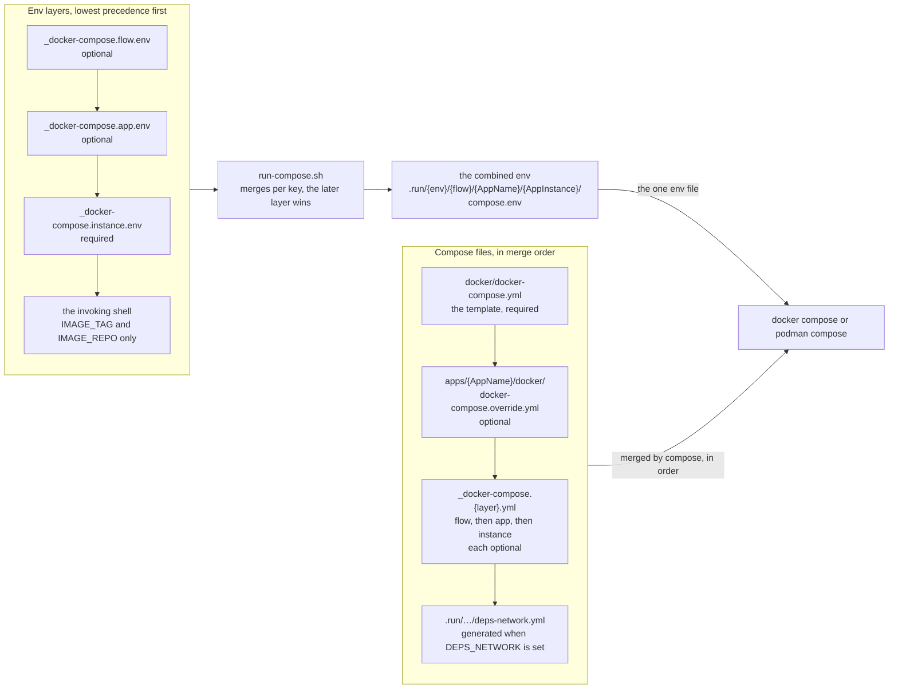

# ADR-0012 — One compose template for every instance; overrides and env layers merge into one generated env

| | |
|---|---|
| Status | Accepted. Rule 3 superseded in part by [ADR-0042](0042-property-roots-and-secret-properties-in-platform-yml.md) |
| Date | 2026-10-04 |
| Applies to | every compose-run instance (local, CI test stacks, every on-prem env) |
| Enforced by | `run-compose.sh` (checks the env layers and identity before every command, exit 4; `validate`); config-lint checks 5 and 6 (renders the whole file chain with the combined env; relative paths rejected) |
| Related | [ADR-0011](0011-configuration-tree-and-spring-layers.md), [ADR-0013](0013-secrets.md), [ADR-0017](0017-run-compose-operations-cli-and-runtime-posture.md), [ADR-0025](0025-integration-tests-on-compose-stacks.md) |

**In short:** One compose file, `docker/docker-compose.yml`, runs every app in every env, and small override files add
what differs. `run-compose.sh` merges the env layers into one generated env file per instance, because
podman-compose keeps only the last of several env files. Each value in that file names the layer it came from.

## Context

Compose, with docker or podman, is the runtime of every env until EKS
([ADR-0004](0004-environments-and-runtimes.md)). Each app once had its own compose file. The files differed only in
the service name and a few secret lines, yet they drifted apart.

Many instances share the same compose variables, such as the image repository, the time zone, JVM options and the
memory limit. So these variables must be layerable, like the Spring configuration.

We measured podman-compose 1.6.0, the latest release:

- repeated `--env-file` flags keep only the **last** file;
- `COMPOSE_ENV_FILES` is ignored;
- an `env_file:` list in a service layers correctly, but cannot fill the `${VAR}` placeholders of the compose file.

## Decision

The diagram shows how `run-compose.sh` assembles one instance; the rules below describe each part.



1. **One template.** `docker/docker-compose.yml` serves every app, env and instance.
   - The service is named `app`, because compose does not interpolate mapping keys: it fills `${VAR}` placeholders
     in values only. Other containers reach the app by the network alias `${APP_NAME}`.
   - It takes its image from `${APP_IMAGE}` (local only), else `${IMAGE_REPO}/${APP_NAME}:${IMAGE_TAG}`.
   - It loads the combined env (rule 4), the identity variables and the Spring layer mounts
     ([ADR-0011](0011-configuration-tree-and-spring-layers.md)). It also sets the runtime posture, the hardening
     every container gets ([ADR-0017](0017-run-compose-operations-cli-and-runtime-posture.md)).
   - It publishes the actuator port on `127.0.0.1` only.
2. **The file chain.** Files merge in this order. Each is passed with `-f` only when it exists:

   ```
   -f docker/docker-compose.yml                                          the template (required)
   -f apps/<AppName>/docker/docker-compose.override.yml                  what the app needs in every env
   -f config/<env>/<flow>/_docker-compose.flow.yml
   -f config/<env>/<flow>/<AppName>/_docker-compose.app.yml
   -f config/<env>/<flow>/<AppName>/<AppInstance>/_docker-compose.instance.yml
   -f .run/…/deps-network.yml                                            generated when DEPS_NETWORK is set
   ```

   - Overrides carry **structure**: a volume, a health check, a resource, a secret pass-through. Values belong in
     the env layers.
   - Overrides MUST NOT use relative paths. Compose resolves them against the first file's directory (`docker/`),
     not the override's.
   - Overrides add or change; they MUST NOT rely on `!reset` to remove anything. (`!reset` is the compose tag that
     deletes a value set by an earlier file.)
3. **The env layers** hold the compose variables, lowest precedence first:

   > **Superseded in part by [ADR-0042](0042-property-roots-and-secret-properties-in-platform-yml.md) rule 3.** The
   > `never` row forbids `SPRING_*`, `LOGGING_*`, `MANAGEMENT_*` and the environment-variable form of each root in
   > `platform.yml` `property_prefixes`; `CONNECTOR_*` is this repository's.

   1. `config/<env>/<flow>/_docker-compose.flow.env` (optional);
   2. `config/<env>/<flow>/<AppName>/_docker-compose.app.env` (optional);
   3. `config/<env>/<flow>/<AppName>/<AppInstance>/_docker-compose.instance.env` (required);
   4. the invoking shell, for `IMAGE_TAG` and `IMAGE_REPO` only.

   **Allowed variables:**

   | Layer | Variables |
   |---|---|
   | any layer | `IMAGE_REPO`, `JAVA_OPTS`, `TZ`, `LOG_LEVEL_ROOT`, `MEM_LIMIT`; `LOGS_DIR` and `DATA_DIR`, absolute host paths of which each instance mounts `<AppName>/<AppInstance>` ([ADR-0018](0018-on-prem-host-layout-versioned-bundles.md)) |
   | instance layer only | `IMAGE_TAG`; `APP_ENV`, `APP_FLOW`, `APP_NAME`, `APP_INSTANCE` (restating the path); `*_HOST_PORT` (1024–65535, distinct per box) |
   | never | `SPRING_*`, `LOGGING_*`, `MANAGEMENT_*`, `CONNECTOR_*`; the variables `run-compose.sh` sets (`COMPOSE_ENV_FILE`, `FLOW_APP_YML`, `APP_APP_YML`, `INSTANCE_APP_YML`, `PROJECT`, `INSTANCE_LOGS_DIR`, `INSTANCE_DATA_DIR`); secrets |

   Comments stand on lines of their own, because docker compose and podman-compose read a trailing `#` differently.
4. **One generated, combined env.** `run-compose.sh` merges the layers per key, and the later layer wins.
   - It writes only the winning value of each key. A comment above each value names the layer it came from and
     what it overrode.
   - The file is `.run/<env>/<flow>/<AppName>/<AppInstance>/compose.env` under the root: the checkout, or the
     host's version directory ([ADR-0018](0018-on-prem-host-layout-versioned-bundles.md)).
   - It is regenerated before every command, into a temporary file that is renamed into place, so it is never
     stale. It is never committed, never bundled and never edited.
   - It is passed as the single `--env-file`, to fill `${VAR}`. The template's `env_file:` loads it too, to give the
     container its environment. `run-compose.sh … printenv` shows it.
5. **One merge implementation.** The integration-test stacks get the combined env from
   `run-compose.sh … compose-env`. So the tests run with exactly what an operator runs
   ([ADR-0025](0025-integration-tests-on-compose-stacks.md)).
6. **Only two shell overrides.** `IMAGE_TAG` and `IMAGE_REPO` are the only values a shell may override, in any env.
   Each override is validated and announced. Every other value comes from the layers.

## Alternatives considered

- **A compose file per app.** It drifted. Everything per-app now lives in an optional override.
- **Several `--env-file` flags.** On podman-compose, every layer but the last is silently dropped.
- **An `env_file:` list per layer.** It layers the container environment, but cannot fill `${VAR}`. So the tag, the
  memory limit and the port could come from the instance only.
- **Layer directories holding compose files.** They break the flat-layer rule, and repeat the layer in both the
  directory and the file name.

## Consequences

- `printenv` explains every value: which layer set it, and what it overrode.
- On a host, each version directory has its own combined env, so a rollback runs with that version's values.
- An override can add or change, never remove. A removal needs a template change.
- The template and `run-compose.sh` work around several podman-compose faults:
  - an interpolated `external: false` reads as true, so `DEPS_NETWORK` adds a generated override with a literal
    `external: true`;
  - `ps -q <service>` is rejected, so the app container is found by its compose labels;
  - `up --wait` is ignored, so `start` polls the readiness probe.
