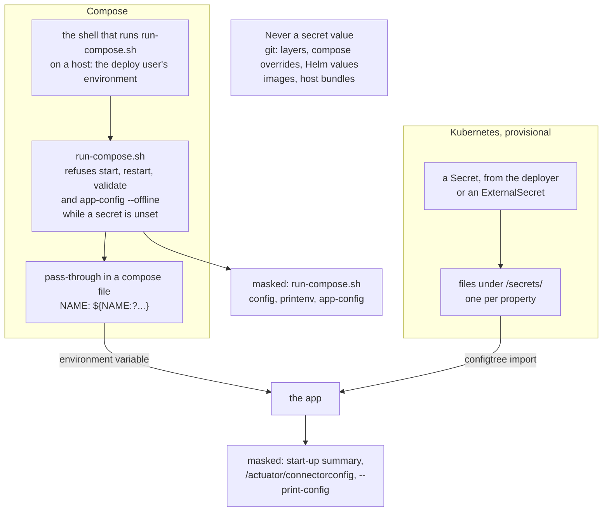

# ADR-0013 — Secrets never enter git, the configuration layers, the images or the host bundles

| | |
|---|---|
| Status | Accepted |
| Date | 2026-10-04 |
| Applies to | every app, every env, every pipeline |
| Enforced by | config-lint check 9 (secret keys in YAML layers, secret-looking values anywhere in the tree); `run-compose.sh` (refuses `start`, `restart`, `validate` and `app-config --offline` while a required secret is unset); `SecretMaskerTest`, `ConfigurationSummaryTest` and the actuator contract test (masking); the chart's values schema (secret-bearing `env` names) |
| Related | [ADR-0011](0011-configuration-tree-and-spring-layers.md), [ADR-0012](0012-compose-template-and-generated-env.md), [ADR-0016](0016-logging-and-startup-configuration-summary.md), [ADR-0028](0028-host-pool-deployment.md) |

**In short:** Secret values are never stored in the repository, in an image or in a host bundle. A running app gets
them from the environment of the shell that starts it, or on Kubernetes from files mounted at `/secrets/`. Every
output that prints configuration masks them, and config-lint check 9 looks for leaks before a merge.

## Context

The configuration tree is reviewed, and everyone with repository access can read it. Host bundles, the copies of a
flow's runtime files, are synced to many hosts ([ADR-0018](0018-on-prem-host-layout-versioned-bundles.md)). Images
are pulled by many runtimes. The start-up summary, the actuator and the operations CLI (`run-compose.sh`) all print
configuration. A secret in any of them is a leak.

## Decision

The diagram shows the two ways a secret value reaches a running app, where it is printed only masked, and where it
never goes.

1. **Nowhere in the repository.** No secret value is stored in git: not in a YAML layer, an env layer, a compose
   override or a Helm values file. Nor is one stored in an image or a host bundle. The test CA under
   `test-infra/ca/` is a public certificate; its private key MUST NOT exist in the repository.
2. **How a secret reaches an app:**
   - **Compose.** The compose files declare each required secret as a pass-through, which takes the value from the
     environment compose runs in: `NAME: ${NAME:?set in the shell, never in git}`.
     - An app's own secrets go in its `apps/<AppName>/docker/docker-compose.override.yml`, for example
       `SPRING_DATASOURCE_USERNAME` and `SPRING_DATASOURCE_PASSWORD`.
     - The values come from the shell that runs `run-compose.sh`. On a host, they come from the deploy user's
       environment, provisioned outside the repository.
     - `start`, `restart`, `validate` and `app-config --offline` refuse while a required secret is unset. The
       other commands never use the values, so they substitute placeholders.
   - **Kubernetes (provisional).** A Secret is mounted at `/secrets/`, one file per property, and read through
     `optional:configtree:/secrets/` ([ADR-0011](0011-configuration-tree-and-spring-layers.md)). The deployer
     creates it, or an ExternalSecret renders it from an external secret store.
   - **CI.** Secrets live in GitHub Environment secrets (`DEV_DEPLOY_SSH_KEY` in `us-dev`). Only the step that needs
     them uses them. The deploy key goes into that step's `ssh-agent`, and its temporary file is removed at once.
   - **Integration tests.** Throwaway credentials are generated per build (`IT_SA_PASSWORD`) and never committed.
3. **Masked wherever configuration is printed.**
   - The app's own outputs — the start-up summary, `/actuator/connectorconfig` (which `run-compose.sh app-config`
     shows) and `--print-config` — mask:
     - values whose key is a known secret property, or whose key has a secret-looking segment (`password`,
       `secret`, `token`, `credential`, `*key`);
     - the usernames paired with secret passwords;
     - credentials embedded in URLs (`;password=…`, `user:pass@`).
   - `run-compose.sh config` and `printenv` mask by key name: the values of secret-looking keys and of those
     usernames.

   `/actuator/env` is never exposed ([ADR-0015](0015-actuator-health-and-metrics-contract.md)).
4. **Detected before merge.** Config-lint check 9 fails on:
   - a secret property key in any YAML layer;
   - a secret-looking value anywhere in the tree: private keys, cloud access keys, GitHub and Slack tokens, a
     literal value assigned to a password-like key, a password inside a JDBC URL.
5. **Host access.** The deploy key reaches the hosts as a fixed deploy user. Host keys are pinned in the reviewed
   `config/<env>/known_hosts`, and an unknown host key is never accepted
   ([ADR-0028](0028-host-pool-deployment.md)).

## Alternatives considered

- **Encrypted secrets in git** (SOPS, sealed secrets). Key management moves into the repository, and the ciphertext
  stays in the history forever.
- **Secrets in env layers outside git** (`*.local.env`). Fine on a laptop, and git-ignored for that reason. On hosts
  they would be one more file to provision and protect, with no advantage over the deploy user's environment.
- **A secret manager agent on every host.** It is a candidate for the promoted envs; the choice is open.

## Consequences

- Any instance of a flow can be placed on any box (host) of its pool. So every box MUST hold the secret environment
  of every instance of its flow ([ADR-0028](0028-host-pool-deployment.md)).
- How secrets are provisioned and rotated on the hosts of the promoted envs is not decided (open decision).
- The list of secret property names exists twice, in config-lint and in `SecretMasker`, and names connector
  properties. That domain knowledge sits in shared tooling, which every repository built from this one copies
  (known gap).
