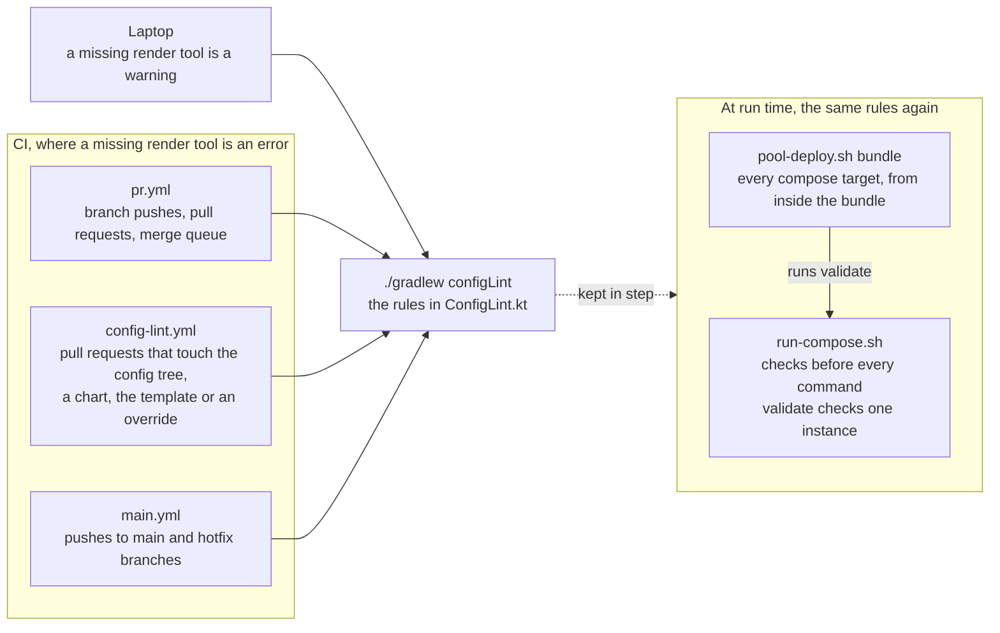

# ADR-0014 — `configLint` enforces the configuration contract, the same on a laptop and in CI

| | |
|---|---|
| Status | Accepted. Rule 2 superseded in part by [ADR-0036](0036-helm-checks-only-when-kinds-include-helm.md) |
| Date | 2026-10-04 |
| Applies to | every configuration tree |
| Enforced by | the `configLint` task in `pr.yml`, `main.yml` and `config-lint.yml`; `ConfigLinterTest` |
| Related | [ADR-0011](0011-configuration-tree-and-spring-layers.md), [ADR-0012](0012-compose-template-and-generated-env.md), [ADR-0013](0013-secrets.md), [ADR-0019](0019-kubernetes-and-helm-are-provisional.md), [ADR-0027](0027-continuous-deployment-to-dev-and-the-deployment-record.md), [ADR-0028](0028-host-pool-deployment.md) |

**In short:** One Gradle task, `./gradlew configLint`, runs numbered checks over the whole configuration tree.
It gives the same verdict on a laptop as in CI, so a configuration error shows up in the pull request, not during a
deploy. The tools that use the configuration at run time check the same rules again.

## Context

Without such a check, configuration errors surface at deploy time, on a host, in the middle of a rollout. Rules kept
only in prose drift. Rules that several tools implement separately disagree. A developer must get the same verdict
on a laptop as the pull request gets in CI.

## Decision

1. **One task.** `./gradlew configLint` (plugin `buildlogic.config-lint`) checks the whole `config/` tree. Errors
   fail the task. The report is written to `build/reports/config-lint/config-lint.txt`, and CI copies it into the
   job summary.
2. **The checks,** grouped by what they protect:

   | # | Checks |
   |---|---|
   | | **The tree has the expected shape** |
   | 1 | naming and layout: env, flow, AppName and AppInstance grammar and lengths; the files allowed at each level; a file's `<layer>` matches its level; instances hold no subdirectories; retired layouts are rejected with the name the file should have |
   | 2 | every configured app is a deployable subproject; every deployable app is configured in each complete env (`local`) |
   | 3 | required files exist; YAML parses; no other env files |
   | | **Each instance's values are consistent and allowed** |
   | 4 | the identity restated in the instance layer equals the path; provisional Helm values agree with the compose layers (`image.tag` = `IMAGE_TAG`; shared knobs warned when they differ) |
   | 5 | env layers: `KEY=VALUE` only, allowed variables per layer, port ranges, `IMAGE_REPO` present |
   | | **Compose accepts each instance** |
   | 6 | the compose files render: `compose config` over the whole `-f` chain with the combined env, as `run-compose.sh` passes them; no relative paths in overrides |
   | | **The merged configuration is valid** |
   | 7 | merged configuration against the apps' configuration metadata — not implemented yet |
   | 8 | parity report across envs — not implemented yet |
   | | **No secret is in the tree** |
   | 9 | secrets: secret keys in YAML layers, secret-looking values anywhere in the tree ([ADR-0013](0013-secrets.md)) |
   | | **Deploys use the right images and hosts** |
   | 10 | tag policy: valid tags; promoted envs only immutable `X.Y.Z[@sha256:<digest>]`; floating tags only in `local` and dev |
   | 11 | the deploy inventory `workflows-config.yml`, host pools and `known_hosts` ([ADR-0027](0027-continuous-deployment-to-dev-and-the-deployment-record.md), [ADR-0028](0028-host-pool-deployment.md)) |
   | | **Helm can render each instance** (provisional) |
   | 12 | provisional Helm: `helm lint` and `helm template` per instance through `helm-deploy-instance.sh`, then `kubeconform -strict` ([ADR-0019](0019-kubernetes-and-helm-are-provisional.md)) |

3. **Rendering tools in CI.** Checks 6 and 12 render files, so they need a compose CLI and Helm 4. With `CI=true`
   (`-PconfigLint.requireRender=true`), a missing tool is an error. On a laptop it is a warning.
4. **Code decides.** The rules live in `ConfigLint.kt`, with unit tests. Documentation describes them, but the code
   is what is enforced. A new rule is added to config-lint together with its test.
5. **Tools re-check what they consume.**
   - `run-compose.sh` checks the env layers, the identity and the required files before every command (exit 4). It
     also offers `validate` for one instance.
   - `pool-deploy.sh` validates every compose target of a bundle from inside the bundle, before syncing it.
   - Both MUST implement the same rules as config-lint.
6. **When it runs.**
   - In `pr.yml` and `main.yml`.
   - In `config-lint.yml`, on every pull request that touches `config/**`, a chart, the compose template or an
     app's compose override.

The diagram puts rules 5 and 6 together: where config-lint runs, and which tools check the same rules again at run
time.

## Alternatives considered

- **A JSON Schema per file.** It cannot express the rules that span files: identity against path, layer against
  level, tags against values, inventory against directories.
- **Review only.** It is inconsistent, and the errors come back at deploy time.
- **Validation only when a tool runs** (`run-compose.sh validate`). It comes too late for a pull request, and it sees
  one instance at a time.

## Consequences

- One command answers "is this tree deployable?", the same way everywhere.
- The env-layer rules are implemented twice, in Kotlin (config-lint) and in bash (`run-compose.sh`). Both must
  change together.
- Config-lint learns the app list from Gradle subprojects. The configuration repository has none, so it cannot run
  config-lint unchanged (open decision).
- Checks 1, 10 and 11 take the vocabulary, the runtimes and the dev envs from `platform.yml` ([ADR-0030](0030-platform-yml-declares-every-project-value.md)).
- Known gap: checks 7 and 8 are not implemented.
