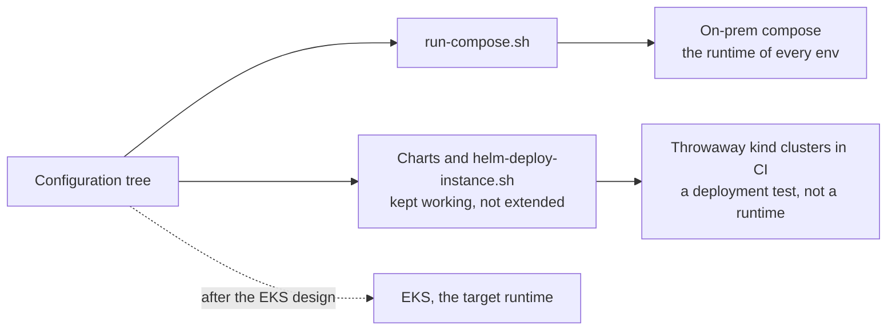

# ADR-0019 — Kubernetes and Helm are provisional until the EKS design: kept working, not extended

| | |
|---|---|
| Status | Accepted |
| Date | 2026-10-04 |
| Applies to | the charts, the `_helm-values.*` files, `scripts/helm-deploy-instance.sh`, the kind tier, `kind: helm` targets |
| Enforced by | config-lint checks 3, 4 and 12; `_kind-deploy.yml` in `pr.yml` and `main.yml` |
| Related | [ADR-0004](0004-environments-and-runtimes.md), [ADR-0011](0011-configuration-tree-and-spring-layers.md), [ADR-0014](0014-config-lint-enforces-the-config-contract.md), [ADR-0024](0024-ephemeral-ci-environments.md) |

**In short:** Kubernetes on EKS is the target runtime, but until it exists every env runs on on-prem compose. The
existing Helm path — charts, values, a deploy script, checks and a kind test tier — stays working, but we do not
extend it. A later decision on EKS will settle the rest and supersede this ADR.

## Context

Kubernetes on EKS (Amazon's managed Kubernetes) is the target runtime. Until it exists, every env runs on on-prem
compose ([ADR-0004](0004-environments-and-runtimes.md)). The repository already contains a working Helm path:

- one chart per app;
- Helm values in the configuration tree;
- one deploy script;
- a lint, render and schema-validation check;
- a kind tier that installs every dev instance of one app into a throwaway cluster in CI. kind runs a whole
  Kubernetes cluster in containers on one machine.

Designing Helm for real now would fix choices (chart structure, values layering, secrets) before EKS's
constraints are known. Dropping it would throw away a proven deployment test.

So today the configuration tree feeds two paths, and only compose is a runtime:

## Decision

1. **Provisional.** The Helm assets are kept working and are not extended. A decision on EKS supersedes this ADR.
2. **What stays green** (working, with its checks passing):
   - **Charts:** one per app, `apps/<AppName>/helm/<AppName>/`. They are identical except for the name.
   - **Values:** `_helm-values.app.yaml` and `_helm-values.instance.yaml` in the configuration tree, required by
     config-lint check 3. Their names are provisional.
   - **Deploy script:** `scripts/helm-deploy-instance.sh <env> <flow> <AppName> <AppInstance> --tag <tag>
     --mode lint|template|deploy`. It is the only implementation of the Helm flag list: config-lint, the kind tier
     and the dev deploy all call it. It requires Helm 4. `deploy` accepts only `local` and `*-dev`.
   - **Config-lint check 12:** `helm lint`, `helm template` and `kubeconform -strict` per instance. kubeconform
     validates the rendered manifests against the Kubernetes schemas.
   - **The kind tier** (`test-infra/kind/`, `_kind-deploy.yml`): runs on pull requests that touch the deploy
     inputs, and on `main` before the dev deploy.
   - **Dev `kind: helm` targets on `cluster: kind-ci`:** deployed into a cluster that the deploy job creates and
     deletes. They are deployment tests, not a runtime ([ADR-0004](0004-environments-and-runtimes.md)).
3. **What the EKS design SHOULD keep,** because the rest of the contract depends on it:
   - one release `<AppName>-<AppInstance>` per instance, in namespace `<flow>`
     ([ADR-0003](0003-identity-tuple-names-every-instance.md));
   - the same `application.<layer>.yml` files, mounted at the same `/config/{flow,common,instance}/application.yml`
     paths ([ADR-0011](0011-configuration-tree-and-spring-layers.md));
   - secrets as files under `/secrets/` ([ADR-0013](0013-secrets.md));
   - probes on the actuator groups ([ADR-0015](0015-actuator-health-and-metrics-contract.md));
   - the restricted Pod Security profile; the image by tag or by digest.
4. **Left to the EKS design:**
   - one library chart (a chart of shared templates that other charts use), or a chart per app;
   - how values are layered. The values repeat the identity, the tag and the shared knobs of the compose env
     layers; config-lint check 4 guards the copies;
   - secrets on EKS (an External Secrets Operator, workload identity);
   - whether the kind tier stays;
   - how each env moves from compose to Kubernetes.
5. **Until then a new app ships the Helm assets too:** a copy of an existing chart with the name changed, and Helm
   values for every instance. Config-lint requires them: a missing chart is an error in `local`.

## Alternatives considered

- **Remove Helm until EKS.** The charts, check 12, the kind jobs and the dev `kind: helm` target would go. That is
  less to maintain, but the Kubernetes path would have to be rebuilt and re-proven later.
- **Finish the Helm design now.** Premature: the cluster, the secret store and the registry mirror of EKS are not
  known yet.

## Consequences

- Every new app carries a chart it does not use in any running env. We accept that cost to keep the Kubernetes
  path proven.
- The charts are copies of each other: the same duplication that the shared Dockerfile and compose template
  removed. A library chart is the likely EKS answer.
- Dev's `kind: helm` instance (`cash/source-database/positions-db-to-deephaven`) runs nowhere after its deploy job.
  An instance that must keep running belongs on compose (known gap).
