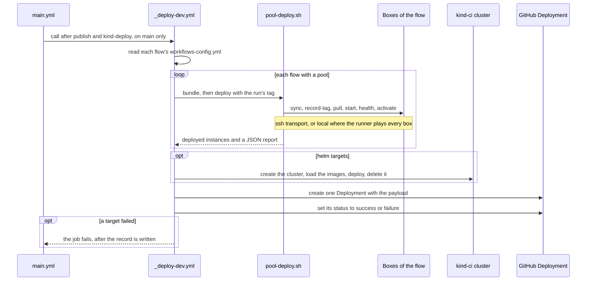
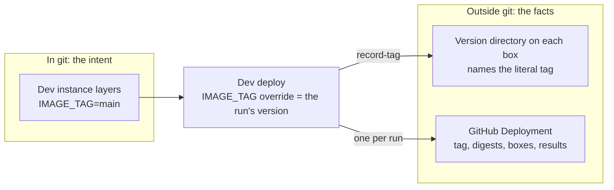

# ADR-0027 — Every tested `main` commit deploys to the dev envs, and a GitHub Deployment records it

| | |
|---|---|
| Status | Accepted |
| Date | 2026-10-04 |
| Applies to | the dev envs of `platform.yml` (`dev_envs`); `_deploy-dev.yml`; each dev flow's `workflows-config.yml` |
| Enforced by | `_deploy-dev.yml` (refuses any env that is not a dev env of `platform.yml`, [ADR-0030](0030-platform-yml-declares-every-project-value.md); its `contents` permission is `read` only); config-lint check 11 (inventory against the tree) |
| Related | [ADR-0004](0004-environments-and-runtimes.md), [ADR-0010](0010-image-tags-digests-promotion-retention.md), [ADR-0020](0020-branching-protection-and-merge-rules.md), [ADR-0023](0023-main-pipeline-build-once-test-publish.md), [ADR-0028](0028-host-pool-deployment.md) |

**In short:** Every `main` commit that passes its tests is deployed to the dev envs, so dev always runs what `main`
is. Git holds only the intent, `IMAGE_TAG=main`. What a run actually deployed is recorded in a GitHub Deployment,
because workflows never commit to `main`.

## Context

We want dev to run what `main` is at all times, so that integration problems show up within minutes of a merge.
Each deploy also has to be recorded: which tag, which image digests, which box (bare-metal host). But no workflow
may commit to `main` ([ADR-0020](0020-branching-protection-and-merge-rules.md)), so the record cannot be a commit.

## Decision

One dev deploy runs like this; the rules below give the details.



1. **Every tested `main` commit is deployed.** After `publish` and the kind deployment test (`kind-deploy`),
   `main.yml` runs `_deploy-dev.yml` for the dev envs ([ADR-0023](0023-main-pipeline-build-once-test-publish.md)).
   Configuration-only merges deploy too. Hotfix branches do not deploy dev.
2. **The deploy inventory.** Each dev flow has one inventory, `config/<env>/<flow>/workflows-config.yml`. It names
   the flow's boxes, if it has any, and one deploy target per instance:

   ```yaml
   env: us-dev                      # restates the path
   flow: cash                       # restates the path
   pool: {hosts: [...], user: deploy, keep: 5}    # the flow's boxes (ADR-0028)
   defaults: {kind: compose}        # any target field
   targets:                         # exactly one per instance directory of the flow
     - instance: <AppName>/<AppInstance>
       kind: compose                # compose | helm
       host: <box>                  # optional pin, one of pool.hosts
   ```

   There is no env-level inventory. A `helm` target names a `cluster` and a `namespace` (default: the flow).
   Today the only cluster is the throwaway `kind-ci` ([ADR-0019](0019-kubernetes-and-helm-are-provisional.md)): a
   kind (Kubernetes in Docker) cluster that the deploy job creates and deletes.
3. **The tree declares intent; the deploy records facts.**
   - The dev instance layers say `IMAGE_TAG=main` (and `image.tag: main`).
   - The deploy passes the literal version of the run as the `IMAGE_TAG` override.
   - `record-tag`, a `run-compose.sh` command, writes that version into the box's version directory: the directory
     that holds one deploy on a box ([ADR-0018](0018-on-prem-host-layout-versioned-bundles.md)).
   - Git is never written.

So git says what dev should run, and the records say what it ran:



4. **The record is a GitHub Deployment**, GitHub's own record of a deploy: a commit, an Environment, a status and a
   JSON payload. The job creates one per run, after the deploy, on the GitHub Environment named like the env
   (`us-dev`):
   - `ref` is the deployed commit, which is also the configuration tree that was deployed;
   - the payload holds:
     - `env`, `tag` (the literal version) and `configSha`;
     - the run URL (`run`);
     - `images`: Gradle project → digest-pinned reference;
     - `instances`: per instance, its name, kind, box or cluster and namespace, image, and `deployed` or `failed`;
     - `bundles`: per pooled flow, its version directory, root, sha256, file count and transport;
   - its status is `success` only when every instance deployed.

   The job summary is the readable copy. The Environment itself is used with `deployment: false`, so this record is
   the only one per run.
5. **What runs in dev** is answered by the last successful Deployment of the env, and on the boxes by `current`, the
   symlink to the live version directory. Retention keeps every tag that record names
   ([ADR-0010](0010-image-tags-digests-promotion-retention.md)).
6. **Deploy mechanics.**
   - Pooled compose targets go through `pool-deploy.sh` ([ADR-0028](0028-host-pool-deployment.md)). It reaches
     the boxes over the `ssh` transport once the Environment holds `DEV_DEPLOY_SSH_KEY`, and that transport refuses
     to run without `config/<env>/known_hosts`. Without the key, the runner plays every box (the `local` transport:
     a validated dry run).
   - Deploys of one env are serialized and never cancelled.
   - Every target is attempted. A failed target is recorded in the Deployment, and it fails the job after the
     record is written.

## Alternatives considered

- **Commit the deployed tag back to `main`.** It needs a bypass of branch protection. And every deploy becomes a
  commit, which must not trigger another deploy.
- **A rolling "record" pull request.** It adds noise to the pull-request list, and the record lags the deploy.
- **Create the Deployment before deploying.** A Deployment's payload cannot change after creation, so the
  per-instance results would have nowhere to go.

## Consequences

- `git log config/us-dev` shows what dev is meant to run, and the Deployments show what it ran. In the promoted
  envs, git is both: their tags are literal and change only by pull request
  ([ADR-0029](0029-release-and-promotion.md)).
- Known gaps:
  - a per-flow deploy policy (on every merge or on a schedule), and manual deploy and rollback dispatches, do not
    exist yet: every tested merge deploys every dev flow;
  - a compose target in a flow without a pool gets only a validated dry run.
