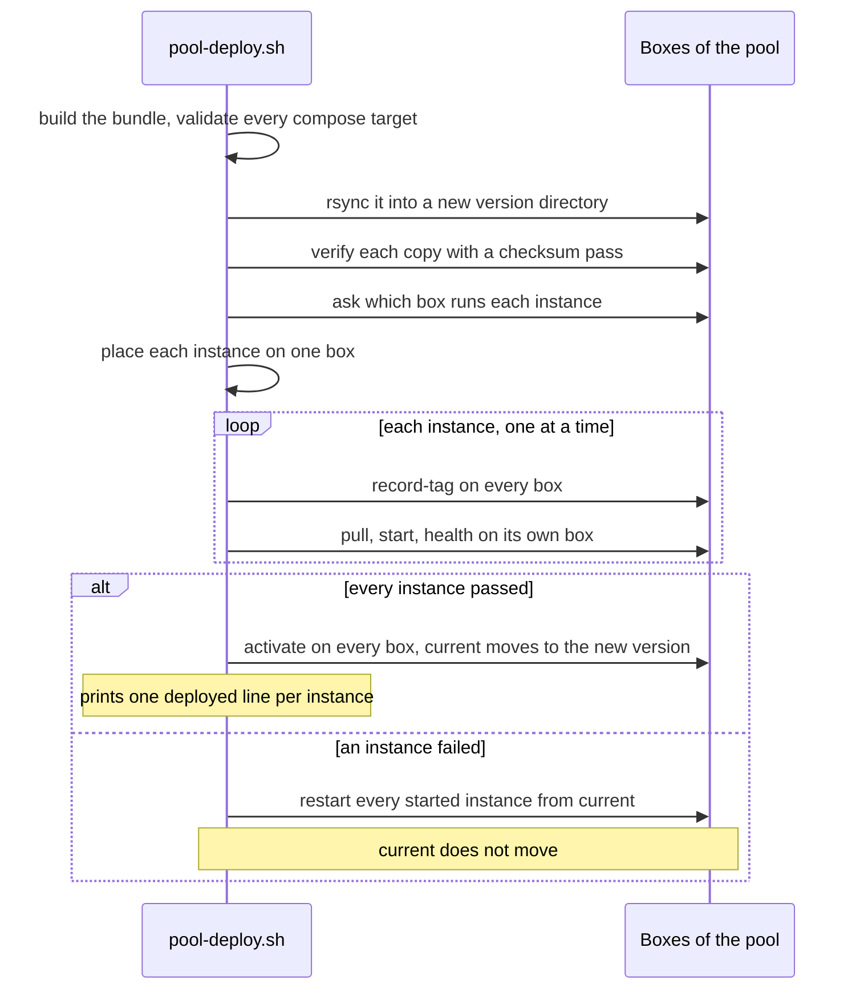
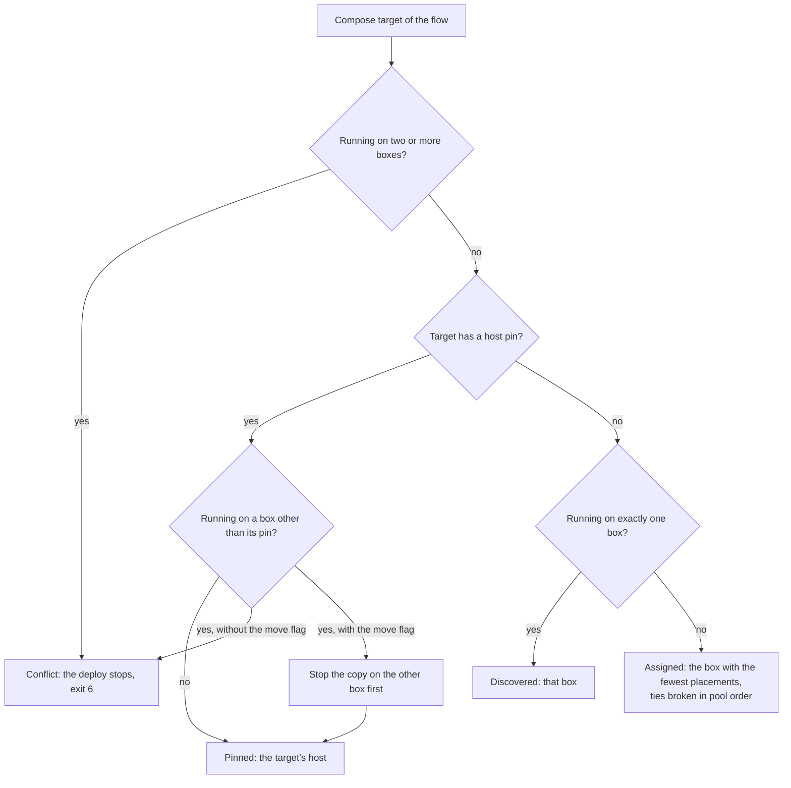

# ADR-0028 — Compose instances deploy to host pools: placed on a box, started from a new version, activated only when all are healthy

| | |
|---|---|
| Status | Accepted |
| Date | 2026-10-04 |
| Applies to | every dev flow whose compose targets run on a pool of boxes |
| Enforced by | `scripts/test/pool-deploy-test.sh` (stub `ssh`, `rsync` and engine; run in the `lint` job); ShellCheck; config-lint check 11; `pool-deploy.sh`'s own checks (exit codes 3 to 6) |
| Related | [ADR-0004](0004-environments-and-runtimes.md), [ADR-0013](0013-secrets.md), [ADR-0017](0017-run-compose-operations-cli-and-runtime-posture.md), [ADR-0018](0018-on-prem-host-layout-versioned-bundles.md), [ADR-0027](0027-continuous-deployment-to-dev-and-the-deployment-record.md) |

**In short:** Each flow runs on a pool of bare-metal boxes, and any of its instances can run on any of them, so a box
can fail or be drained. A deploy places each instance on one box and starts it from a new version directory. Every
box switches to that version only when all instances are healthy; otherwise everything returns to `current`.

## Context

A flow runs on several bare-metal boxes. We want any instance of the flow to be able to run on any box, so that a
box can fail or be drained. Each instance must run on exactly one box at a time. And a deploy must either move every
instance of the flow to the new version, or leave all of them on the old one: never a mix of configurations.

## Decision

1. **A pool per flow.** The boxes of a flow are its pool, `pool.hosts` in the flow's `workflows-config.yml`
   ([ADR-0027](0027-continuous-deployment-to-dev-and-the-deployment-record.md)).
   - Every box of the pool holds the flow's host bundle, the flow's runtime: scripts, compose template and
     configuration ([ADR-0018](0018-on-prem-host-layout-versioned-bundles.md)).
   - Any instance of the flow can run on any box of its pool, and each instance runs on exactly one box.
   - A box belongs to one pool only.
2. **One tool.** `scripts/pool-deploy.sh <env> <flow> bundle | plan | sync | discover | deploy | rollback | status`
   is the one implementation. It reaches the boxes through one of three transports:
   - `ssh` — to the deploy user on each box;
   - `local` — the runner plays every box in a directory per box;
   - `dry-run` — prints the commands.
3. **Deploy,** all or nothing:
   1. **Bundle:** build the flow's bundle and validate every compose target from inside it, with the tag being
      deployed.
   2. **Sync:** copy it with `rsync` into a new version directory on every box. A second pass, comparing
      checksums, verifies each copy.
   3. **Place** each instance on one box:
      - *pinned* — the target's `host`;
      - else *discovered* — the one box already running it. Each box is asked `run-compose.sh … status --json`,
        from the version just synced (`plan` and `discover` ask through `current/scripts/run-compose.sh`);
      - else *assigned* — the box with the fewest placements, ties broken in pool order.
   4. **Record:** run `record-tag` on every box, so each version directory names the tag it runs.
   5. **Start:** on the instance's box, from the new version, run `pull`, then `start`, then `health`.
   6. **Activate:** only when every instance passed, run `activate` on every box (`current` → the new version) and
      print `deployed <flow>/<AppName>/<AppInstance>@<host>=<tag>` per instance.

   Steps 4 and 5 run one instance at a time, so an instance's tag is recorded before it starts.

   **On failure:** every instance already started is restarted from `current` — the previous version, with its old
   image and its old configuration — and `current` never moves. On a box that has no `current` yet (a first
   deploy), each started instance is stopped instead.

The deploy, step by step:

How the Place step picks a box, including the conflicts of rule 4:

4. **Conflicts stop the deploy** (exit 6):
   - an instance found running on two or more boxes;
   - an instance running on a box other than its pin. `--move` stops it there first.
5. **Rollback.** `pool-deploy.sh <env> <flow> rollback [--to <version>]`:
   1. runs `activate --previous` (or `--to`) on every box;
   2. restarts every instance from the new `current`, on the box that runs it, else on its pinned box.
6. **The pool guard.** On a box, `run-compose.sh start` and `restart` first ask the pool's other boxes whether the
   instance already runs there, and refuse if it does ([ADR-0017](0017-run-compose-operations-cli-and-runtime-posture.md)).
   A box that does not answer only produces a warning, so that a dead box cannot block a failover.
7. **SSH.**
   - Connections use `BatchMode`, `StrictHostKeyChecking=yes` and the reviewed `config/<env>/known_hosts`. Without
     that file the `ssh` transport refuses to run.
   - The deploy key is the Environment's secret ([ADR-0013](0013-secrets.md)).
   - On the boxes, a forced command restricts the key to `run-compose.sh` and to `rsync` into a version directory
     ([ADR-0018](0018-on-prem-host-layout-versioned-bundles.md)). A forced command is set on the key on the box:
     SSH runs it instead of the command the client sends.
8. **Reporting.** `--report <file>` writes a JSON record: the version, each box's bundle hash, verification and
   activation, and each placement's box, method, result and commands. The dev deploy turns it into the job summary
   and the Deployment payload.
9. **Local and dev only.** `pool-deploy.sh` deploys `local` and the dev envs, and refuses every other env
   ([ADR-0004](0004-environments-and-runtimes.md)). Whether the configuration repository reuses it for the higher
   envs is an open decision.

## Alternatives considered

- **Each instance pinned to one box forever.** Simple, but a dead box takes its instances down until somebody edits
  the inventory.
- **A cluster scheduler** (Nomad, Kubernetes). That is the EKS path ([ADR-0019](0019-kubernetes-and-helm-are-provisional.md)),
  which is not yet available on-prem.
- **Configuration management** (Ansible) for deploys. It would work, but it duplicates the CLI the operators use,
  and it cannot run the same way on a laptop and in a dry run.

## Consequences

- A box can be drained or lost: its instances are re-placed on the next deploy, or moved with a pinning pull
  request.
- Every box of a pool must be able to run every instance of the flow. That includes holding every instance's
  secrets ([ADR-0013](0013-secrets.md)).
- A deploy takes longer as the pool and the number of instances grow.
- Known gaps:
  - the forced command is not implemented;
  - no boxes exist yet;
  - the promoted envs' pipeline in the configuration repository is undecided (open decision).
