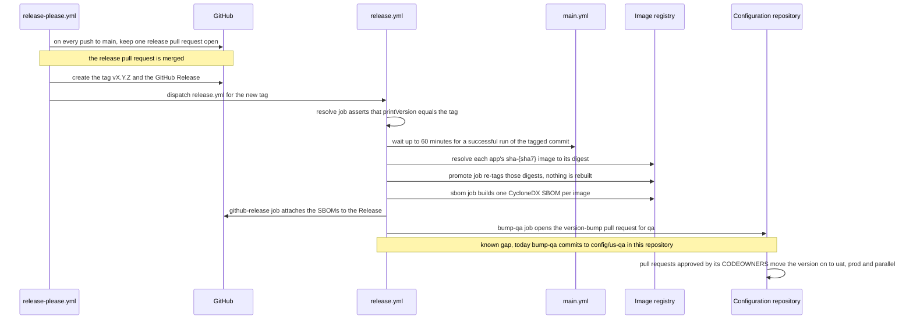

# ADR-0029 — A release promotes the digests `main` tested; promoted envs change only by pull request in the configuration repository

| | |
|---|---|
| Status | Accepted |
| Date | 2026-10-04 |
| Applies to | `release-please.yml`, `release.yml`, `release-please-config.json`; the configuration repository's version bumps |
| Enforced by | `release.yml`: the tag must be `vX.Y.Z` and equal `printVersion`, the commit's `main.yml` run must have succeeded, and promotion refuses to move an immutable tag; config-lint check 10 in the configuration repository (immutable tags); `scripts/ci/set-image-tag.sh` (the bump writes only the tag of the instance layers, [ADR-0012](0012-compose-template-and-generated-env.md)) |
| Related | [ADR-0004](0004-environments-and-runtimes.md), [ADR-0008](0008-versions-derived-from-git.md), [ADR-0010](0010-image-tags-digests-promotion-retention.md), [ADR-0020](0020-branching-protection-and-merge-rules.md), [ADR-0023](0023-main-pipeline-build-once-test-publish.md) |

**In short:** A release re-tags the image digests that `main` already built and tested, and attaches a software
bill of materials (SBOM) for each image; nothing is rebuilt. The promoted envs pick up a release only through pull
requests in the configuration repository, where their owners approve each change and git records it.

## Context

A release has to ship exactly what was tested, describe what changed, and leave a trail that can be audited. The
promoted envs — qa, uat, prod and parallel — are owned outside the app team, and their changes are approved outside
it too, in the configuration repository ([ADR-0004](0004-environments-and-runtimes.md)). So a release makes a
version available. It does not deploy it anywhere by itself.

## Decision

A release, from the release pull request to the promoted envs:

1. **release-please prepares releases.** release-please, run by `release-please.yml`, turns Conventional Commits
   (`feat:`, `fix:` and so on) into a release pull request. On every push to `main`, it keeps one release pull
   request open:
   - one package, `.`, of release type `simple`;
   - tags `vX.Y.Z`, without a component name;
   - first version `0.1.0`; a breaking change bumps the major version even before 1.0.

   The changelog comes from the Conventional Commits since the last tag. Merging the pull request creates the tag
   and a GitHub Release. Tags created with `GITHUB_TOKEN` start no workflow, so `release-please.yml` then
   dispatches `release.yml` for each new tag.
2. **`release.yml` runs for each tag `v*`,** pushed or dispatched. Its jobs run one after the other:
   - `resolve` checks out the tag and asserts that `./gradlew -q printVersion` equals it
     ([ADR-0008](0008-versions-derived-from-git.md)). It waits up to 60 minutes for a successful `main.yml` run of
     the tagged commit (on `main` or `hotfix/*`). Then it resolves every app's `sha-<sha7>` image to its digest.
   - `promote` re-tags those digests `X.Y.Z` and `sha-<sha7>`, plus `X.Y`, `X` and `latest` when this is the newest
     release of the series ([ADR-0010](0010-image-tags-digests-promotion-retention.md)). Nothing is rebuilt.
   - `sbom` creates one CycloneDX SBOM per image.
   - `github-release` creates the Release when it does not exist (a hand-pushed tag), and attaches the SBOMs.
   - `bump-qa` opens the version-bump pull request in the configuration repository (rule 4).

   A release whose own workflow file is broken can be finished by dispatching `release.yml` from a branch with the
   `tag` input. The workflow file then comes from the branch, and the code from the tag.
3. **Hotfix releases** are tagged by a release manager on the tested hotfix commit, and take the same path
   ([ADR-0020](0020-branching-protection-and-merge-rules.md)).
4. **Promotion is a pull request in the configuration repository.**
   - The release opens a pull request there that sets the instance layers of the first promoted env (`qa`) to the
     immutable version: `IMAGE_TAG=X.Y.Z` in `_docker-compose.instance.env`, optionally digest-pinned
     `X.Y.Z@sha256:<digest>`.
   - Moving the version on to `uat`, `prod` and `parallel` is a further pull request there, approved by that
     repository's CODEOWNERS. Their approval is the deploy intent, and git is the record.
   - The release pipeline itself never deploys a promoted env.
5. **The same runtime downstream.** The promoted envs run the promoted digests on on-prem compose hosts with the
   same layout as dev ([ADR-0018](0018-on-prem-host-layout-versioned-bundles.md)). This repository's tooling never
   deploys them; how the configuration repository does is an open decision ([ADR-0004](0004-environments-and-runtimes.md)).

## Alternatives considered

- **Rebuild from the tag.** The released bits would never have been tested.
- **Promote by moving a tag only, with no pull request** (for example `qa` → digest). There would be no review
  step, no record in git, and no way to promote one env without the others.
- **Keep the promoted envs' configuration in this repository.** The app team's merge would become the prod deploy
  intent, and every prod configuration change would run the app pipeline ([ADR-0004](0004-environments-and-runtimes.md)).

## Consequences

- A release is cheap (re-tagging and SBOMs), and it is exactly the build that passed the system test. The images'
  labels still carry the `-rc` version they were built with.
- The release pull request and the version-bump pull request are opened with `GITHUB_TOKEN`, so no workflow runs on
  them until a GitHub App token is used ([ADR-0020](0020-branching-protection-and-merge-rules.md), known gap).
- Known gaps:
  - the `bump-qa` job still commits to `config/us-qa` in **this** repository (skipped while that directory does not
    exist), and its commit title names this project's apps;
  - it must open the pull request in the configuration repository instead.
- Open decision: how the configuration repository validates, assembles host bundles from a release's runtime files
  (scripts, template, app overrides), deploys and records.
