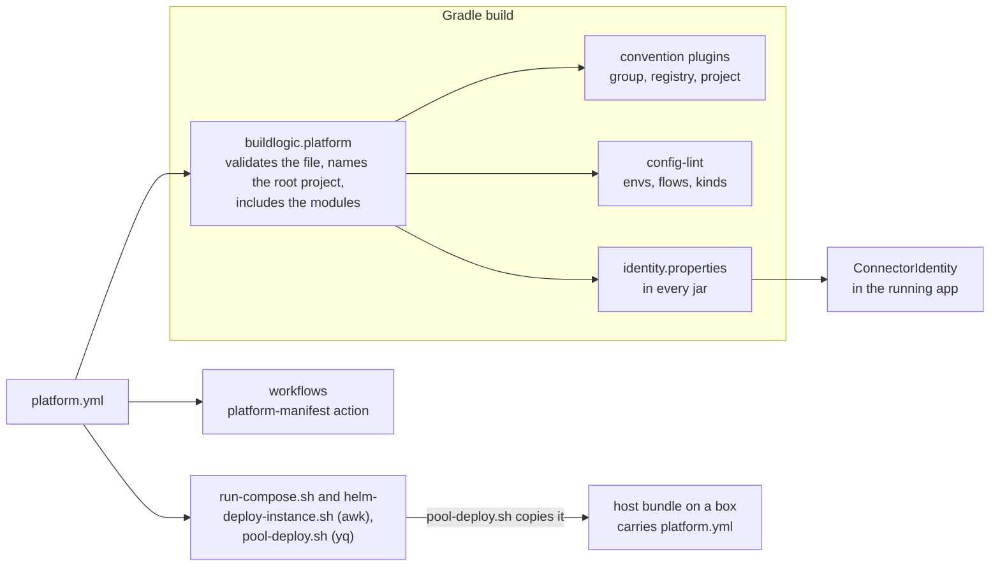

# ADR-0030 — `platform.yml` declares every project value, and the shared tooling reads them from it

| | |
|---|---|
| Status | Accepted. Supersedes rule 5 of ADR-0002, and in part rule 3 of ADR-0004, rules 5 and 6 of ADR-0005, rule 6 of ADR-0006, rule 3 of ADR-0007, rule 5 of ADR-0017, rule 2 of ADR-0018 and rule 2 of ADR-0019 (rule 7). Rules 1 and 3 superseded in part by [ADR-0035](0035-dev-envs-and-reference-app-are-optional.md) |
| Date | 2026-10-05 |
| Applies to | every repository built from this one; every part of the shared tooling that needs a project value |
| Enforced by | the `buildlogic.platform` settings plugin (validates the file on every Gradle run; `PlatformManifestTest`); config-lint checks 1, 10 and 11 (`ConfigLinterTest`); `ConnectorIdentity` (the app refuses to start; `ConnectorIdentityTest`); the argument checks of `run-compose.sh`, `pool-deploy.sh` and `helm-deploy-instance.sh` (`scripts/test/env-vocabulary-test.sh`, `scripts/test/pool-deploy-test.sh`); the `platform-manifest` action; the guard of `_deploy-dev.yml` |
| Related | [ADR-0002](0002-one-repository-one-project-one-release-line.md), [ADR-0003](0003-identity-tuple-names-every-instance.md), [ADR-0004](0004-environments-and-runtimes.md), [ADR-0005](0005-repository-layout-and-shared-tooling.md), [ADR-0006](0006-apps-and-framework-modules.md), [ADR-0007](0007-gradle-build-with-convention-plugins.md), [ADR-0010](0010-image-tags-digests-promotion-retention.md), [ADR-0018](0018-on-prem-host-layout-versioned-bundles.md), [ADR-0021](0021-ci-layering.md) |

**In short:** Every value that the shared tooling needs to know about a project, and that the tree cannot provide,
is declared in `platform.yml`: the registry, the project and its Gradle group, the apps directory, the runtimes, the
reference app, the dev envs, and the identity vocabulary of regions, stages and flows. The Gradle build validates
the file on every run. Every tool reads its values from there and hard-codes none: the build, the running app, the
scripts and the workflows. A new repository edits one file instead of searching the tooling.

## Context

[ADR-0002](0002-one-repository-one-project-one-release-line.md) made `platform.yml` the manifest and forbade project
values in the shared tooling (its rule 7). [ADR-0003](0003-identity-tuple-names-every-instance.md) asked for one
identity vocabulary, declared there. The tree did not follow:

- the registry was written into two workflows, a composite action, a convention plugin and the Dockerfile; the
  Gradle group into a convention plugin; the dev env and the reference app into the trigger workflows;
- the flows and the stages were hard-coded in five implementations and in the charts' schemas, and the copies
  disagreed about the regions. None accepted the stages `uat` and `parallel`, so an app image refused to start in
  those envs;
- nothing read `dev_envs`, `apps_dir` or `kinds`, and nothing checked that `rootProject.name` was the project;
- config-lint accepted directories of promoted envs, which [ADR-0004](0004-environments-and-runtimes.md) keeps out of
  this repository.

A repository created from this one had to find those values in files it is meant to copy unchanged
([ADR-0005](0005-repository-layout-and-shared-tooling.md)), and edit them there.

The readers of the file differ. Gradle can parse YAML. GitHub-hosted runners have yq. The boxes of a host pool, and
the job container of the build, may have neither: they have bash and awk. A running app has no file at all.

## Decision

1. **The schema.** `platform.yml`, at the repository root, holds these keys:

   > **Superseded in part by [ADR-0035](0035-dev-envs-and-reference-app-are-optional.md) rule 7.** `dev_envs` may be
   > `[]`, and `projects[0].reference_app` may be left out.

   | Key | Meaning | Rules | This repository |
   |---|---|---|---|
   | `platform` | the major version of this contract that the repository follows | | `v1` |
   | `kind` | what the repository does | `app`: builds, publishes and deploys its dev envs | `app` |
   | `registry` | the `<registry>` of every image: `<registry>/<project>/<AppName>`, and the base images `<registry>/base/<name>` ([ADR-0010](0010-image-tags-digests-promotion-retention.md)) | lower-case host, optional port, path | `ghcr.io/crazymatthsu` |
   | `projects` | the one project of the repository ([ADR-0002](0002-one-repository-one-project-one-release-line.md)) | exactly one entry | |
   | `projects[0].name` | the project: the repository name, `rootProject.name`, the image path, the host directory | lower-case kebab-case | `github-cicd-simple-apps` |
   | `projects[0].group` | the Gradle (Maven) group of every module | a Java package name | `com.example.connectors` |
   | `projects[0].apps_dir` | the directory of the apps ([ADR-0006](0006-apps-and-framework-modules.md)) | one directory name | `apps` |
   | `projects[0].kinds` | the runtimes a deploy target may name (`kind` in `workflows-config.yml`) | `compose`, `helm` or both | `[compose, helm]` |
   | `projects[0].reference_app` | the app of the system test, the kind deployment test and the nightly teardown drill | an app under `apps_dir` | `source-database` |
   | `dev_envs` | the envs this repository configures and deploys ([ADR-0004](0004-environments-and-runtimes.md)) | `<region>-dev`, with a region of `regions` | `[us-dev]` |
   | `regions` | the regions of the identity vocabulary ([ADR-0003](0003-identity-tuple-names-every-instance.md)) | two lower-case letters each | `[us, jp]` |
   | `stages` | the stages; every stage but `dev` is promoted | one word of lower-case letters and digits each; MUST include `dev` | `[dev, qa, uat, prod, parallel]` |
   | `flows` | the business flows | lower-case kebab-case | `[cash, deriv, swap]` |

   The last column is this repository's own `platform.yml`: an example, not a requirement. A repository built from
   this one sets its own values, and no shared tool expects these. Values that the tree can derive stay derived ([ADR-0002](0002-one-repository-one-project-one-release-line.md)
   rule 6). A new project value MUST be added to this schema by an ADR before any tool uses it.
2. **Lines that need no YAML parser.** `dev_envs`, `regions`, `stages` and `flows` MUST each be a one-line list of
   unquoted words at the top level, like `flows: [cash, deriv, swap]`. `registry` MUST be an unquoted value on one
   top-level line. Scripts read these lines with awk where no yq is installed.
3. **Validated on every build.** `settings.gradle.kts` applies the `buildlogic.platform` settings plugin first. On
   every Gradle run it parses the file and fails the build with every problem listed. It also:

   > **Superseded in part by [ADR-0035](0035-dev-envs-and-reference-app-are-optional.md) rule 7.** A missing
   > `reference_app` is valid; one that is present must name an app.

   - sets `rootProject.name` to `projects[0].name`, and fails in CI when the repository name differs
     ([ADR-0002](0002-one-repository-one-project-one-release-line.md) rule 2);
   - includes every directory under `apps_dir` and `framework/` that holds a `build.gradle.kts`
     ([ADR-0006](0006-apps-and-framework-modules.md) rule 6), and fails when `reference_app` is not one of the apps;
   - hands the values to every project, where the convention plugins read them.

   `settings.gradle.kts` holds no project value.
4. **Every tool reads the values; none restates them.**

   | Reader | Values | How |
   |---|---|---|
   | the convention plugins | `group`; `registry` and the project, for the image names, the default base image (also written into the staged Dockerfile) and the image labels | from the settings plugin |
   | config-lint | `regions`, `stages` and `flows` (check 1); the promoted stages (check 10); `kinds` (check 11); `dev_envs` (check 1) | from the settings plugin |
   | `ConnectorIdentity` | `regions`, `stages`, `flows` | `META-INF/platform/identity.properties`, which `buildlogic.java-conventions` writes into every jar. An app without it fails at start-up |
   | `run-compose.sh`, `helm-deploy-instance.sh` | `regions`, `stages`, `flows`, `dev_envs` | awk, from the `platform.yml` of their root |
   | `pool-deploy.sh` | the project, `regions`, `stages`, `flows`, `dev_envs` | yq |
   | the workflows | `registry`, the project, `dev_envs`, `reference_app` | the `platform-manifest` action (yq); `setup-build-env` and `registry-login` read `registry` with awk |
   | `release.yml` | `registry`, the project | yq |
   | `scripts/ci/retention.sh` | the project | yq |
5. **Envs come from the vocabulary.** An env is `local`, or `<region>-<stage>` with a region of `regions` and a stage
   of `stages`. Config-lint, `ConnectorIdentity` and the scripts accept no other env. Every stage but `dev` is
   promoted, so config-lint check 10 requires immutable tags there.

   As [ADR-0004](0004-environments-and-runtimes.md) requires, this repository's tree and deploy tools accept only
   `local` and the envs of `dev_envs`. Config-lint check 1, `run-compose.sh`, `pool-deploy.sh`,
   `helm-deploy-instance.sh --mode deploy` and `_deploy-dev.yml` refuse every other env. `main.yml` deploys every env
   of `dev_envs`, each into the GitHub Environment of the same name.
6. **The charts check the shape only.** A chart's `values.schema.json` checks that the identity has the shape of an
   env and a flow. It does not list the vocabulary: `helm-deploy-instance.sh` and config-lint check that.
7. **What this decision supersedes:**
   - [ADR-0002](0002-one-repository-one-project-one-release-line.md) rule 5: rule 1 here is the manifest's schema;
   - [ADR-0004](0004-environments-and-runtimes.md) rule 3, in part: the allowed envs are `local` and the envs of `dev_envs`
     (rule 5 here), no longer every `*-dev` env;
   - [ADR-0005](0005-repository-layout-and-shared-tooling.md) rules 5 and 6, in part: `settings.gradle.kts` holds no project
     value any more, so it is shared tooling, copied unchanged, and the permission of rule 6 to edit project values
     in shared tooling has lapsed;
   - [ADR-0006](0006-apps-and-framework-modules.md) rule 6, in part: the `buildlogic.platform` settings plugin, applied
     by `settings.gradle.kts`, includes the modules, and takes the apps' directory from `apps_dir`;
   - [ADR-0007](0007-gradle-build-with-convention-plugins.md) rule 3, in part: `buildlogic.platform` is a settings
     plugin, applied by `settings.gradle.kts` before `buildlogic.git-version`. `buildlogic.java-conventions` also
     sets the group and writes the identity vocabulary into every jar;
   - [ADR-0017](0017-run-compose-operations-cli-and-runtime-posture.md) rule 5 and
     [ADR-0019](0019-kubernetes-and-helm-are-provisional.md) rule 2, in part: the allowed envs are `local` and the
     envs of `dev_envs` (rule 5 here), no longer every `*-dev` env;
   - [ADR-0018](0018-on-prem-host-layout-versioned-bundles.md) rule 2, in part: a host bundle also holds
     `platform.yml`, from which `run-compose.sh` reads the vocabulary on the box.

Where the values go:

## Alternatives considered

- **Keep the values in the tools and list them in a checklist.** That was the state before this decision: a derived
  repository edited shared files, and the copies of the vocabulary drifted apart.
- **`gradle.properties` as the manifest.** Gradle reads it natively, but the scripts and the workflows would have
  to parse Java properties, and the vocabulary and the dev envs are not build settings.
- **yq everywhere.** Installing and pinning yq on every box and in every job container is one more dependency.
  Keeping four lists and one value on single lines costs nothing.
- **Generate the charts' schemas from `platform.yml`.** Helm is provisional
  ([ADR-0019](0019-kubernetes-and-helm-are-provisional.md)). A shape check in the schema plus the vocabulary check in
  the deploy script is enough until the EKS design.
- **Pass the vocabulary to the app as environment variables.** Every deployer would have to pass them, and unit
  tests would run without them. A resource in the jar travels with the code that checks it.

## Consequences

- A repository created from this one sets its project values in `platform.yml`, and edits none of the shared
  tooling to do so.
- A new flow, region or stage is one line in `platform.yml`, followed by its directories in `config/`. A new dev env
  is an entry in `dev_envs`, its `config/<env>/` tree, and a GitHub Environment with the same name.
- A broken `platform.yml` stops every Gradle run, even `./gradlew help`. That is intended: nothing should run with
  wrong project values. The scripts exit 4 when it is missing or malformed, before they check their arguments
  (`pool-deploy.sh` exits 5 first when yq is missing).
- A dev env that configures no instance of the reference app gets no kind deployment test: `_kind-deploy.yml`
  reports it in a notice and passes.
- Every jar carries the vocabulary it was built with, so an image refuses an identity that its repository does not
  allow.
- Host bundles synced before this decision hold no `platform.yml`. They also hold the older `run-compose.sh`, which
  does not read it, so they keep working until the next deploy replaces them.
- `apps_dir` lets a repository keep its apps in another directory without changing the tooling. That deviates from
  [ADR-0006](0006-apps-and-framework-modules.md), so such a repository records the deviation in an ADR of its own
  (ADR-1000 or later).
- What a repository may leave out at first, and what is then skipped rather than failed, is listed in the index
  ("What a new repository may leave out") and decided in [ADR-0033](0033-public-base-image-fallback.md) to [ADR-0037](0037-runtime-scripts-read-generic-actuator-names.md) and [ADR-0039](0039-an-adr-applies-where-its-subject-exists.md).
- CI derives the project list from the build files ([ADR-0031](0031-ci-derives-the-projects-from-the-build-files.md)).
