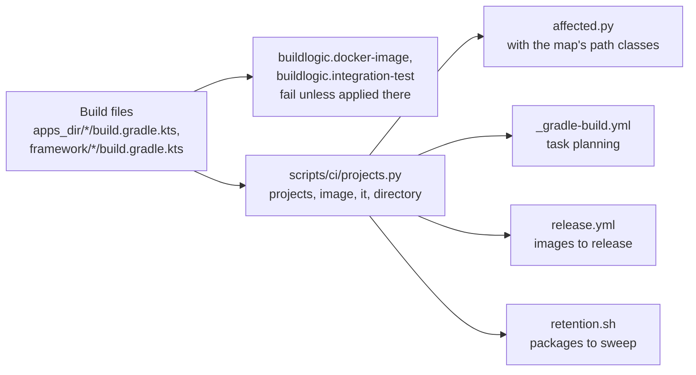

# ADR-0031 — CI derives the projects from the build files

| | |
|---|---|
| Status | Accepted. Supersedes in part rule 2 of ADR-0022 (rule 5) |
| Date | 2026-10-05 |
| Applies to | `scripts/ci/projects.py` and its readers: `affected.py`, `_gradle-build.yml`, `release.yml`, `scripts/ci/retention.sh`; `.github/affected-map.yml`; the plugins `buildlogic.docker-image` and `buildlogic.integration-test` |
| Enforced by | `buildlogic.docker-image` and `buildlogic.integration-test` (each fails the build when the project's own build file does not apply it; `ProjectIndexTest`); `affected.py` (refuses a map that lists projects or paths); `scripts/test/affected-test.sh` |
| Related | [ADR-0002](0002-one-repository-one-project-one-release-line.md), [ADR-0006](0006-apps-and-framework-modules.md), [ADR-0007](0007-gradle-build-with-convention-plugins.md), [ADR-0022](0022-pull-request-pipeline.md), [ADR-0025](0025-integration-tests-on-compose-stacks.md), [ADR-0030](0030-platform-yml-declares-every-project-value.md) |

**In short:** CI has to know the projects before it builds anything: which exist, which build an image, which have
integration tests, and which directory selects each. It reads them from the build files, with the rules the build
itself applies, so adding an app is a directory and nothing more for CI. The hand-kept project list in
`.github/affected-map.yml` is gone; the map keeps only its path classes.

## Context

`.github/affected-map.yml` listed every project by hand, with an image flag, an integration-test flag and a path glob.
Four tools read that list: affected detection, the build's task planning, the release, and the retention sweep. An
app missing from it was silently left out of the integration-test matrix, of publishing and of releases.

Gradle knows the truth. But CI needs the answer before Gradle runs, in jobs that have no JDK and that today decide
within seconds.

## Decision

1. **The rule.** The projects are the directories under `platform.yml`'s `apps_dir` and under `framework/` that hold
   a `build.gradle.kts`: the modules the build includes, `:<directory>` each
   ([ADR-0006](0006-apps-and-framework-modules.md), [ADR-0030](0030-platform-yml-declares-every-project-value.md)).
   - A project builds an image when its build file applies `buildlogic.docker-image`.
   - It has integration tests when its build file applies `buildlogic.integration-test`.
   - Its directory selects it in affected detection.
2. **One reader.** `scripts/ci/projects.py` implements the rule with the Python standard library, without Gradle or
   a YAML parser. `affected.py`, `_gradle-build.yml`, `release.yml` and `retention.sh` take the projects from it.
   Nothing else lists them.
3. **The build agrees.** `buildlogic.docker-image` and `buildlogic.integration-test` MUST be applied in the
   project's own `plugins` block. Each fails the build otherwise, so no plugin applied through another plugin can
   build an image or tests that CI does not know about. `projects.py` and `buildlogic.ProjectIndex` read build files
   the same way, and their tests share the cases.
4. **The map keeps the path classes.** `.github/affected-map.yml` holds `docs`, `config`, `shared`, `base-images`
   and `deploy-test`. It MUST NOT list projects or paths; `affected.py` refuses a map that does. `affected.py` adds
   the directory of `platform.yml`'s reference app to `deploy-test`, because the kind deployment test deploys that
   app.
5. **What this supersedes.** [ADR-0022](0022-pull-request-pipeline.md) rule 2, in part: its last step classifies a
   path by the project directories that `projects.py` derives, not by globs in the map. The order of the steps, and
   "an unmapped path counts as shared", stand.

Where the projects come from, and who reads them:

## Alternatives considered

- **Ask Gradle in CI**, with a task that prints the projects. It is exact, but every reader would need a JDK and a
  Gradle start before its first decision. Affected detection takes seconds today.
- **A file generated by Gradle and committed**, checked by the build. Adding an app is still a manual step, and the
  file is stale until the build runs.
- **Keep the hand-kept list and check it against the build.** That ends the silent omission, but every new app
  still edits a shared file.

## Consequences

- CI finds a new app as soon as its directory has a build file that applies the plugins. The app still needs a line
  in `test-infra/compose/stacks.yml` ([ADR-0025](0025-integration-tests-on-compose-stacks.md), known gap).
- A convention plugin can no longer apply the image or integration-test plugin on a project's behalf; the app's
  build file applies them, as [ADR-0007](0007-gradle-build-with-convention-plugins.md) rule 3 describes.
- CI's decisions do not change. Every tracked path, run through the old map and through the derivation, selects the
  same projects, matrix and flags. Only the order of the lists changed: apps by directory name, then the libraries.
