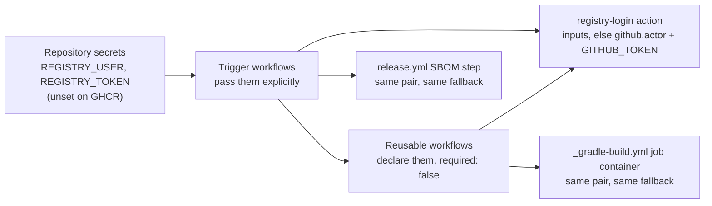

# ADR-0032 — Registry credentials come from two optional secrets; without them, `GITHUB_TOKEN` on GHCR

| | |
|---|---|
| Status | Accepted |
| Date | 2026-10-06 |
| Applies to | every repository built from this one; every workflow step that logs in to the registry of `platform.yml` |
| Enforced by | actionlint (the `secrets` declarations of the reusable workflows and the inputs of `registry-login`); `scripts/ci/retention.sh` (exits 0 with a notice on a registry other than GHCR); review |
| Related | [ADR-0009](0009-one-shared-image-definition.md), [ADR-0010](0010-image-tags-digests-promotion-retention.md), [ADR-0020](0020-branching-protection-and-merge-rules.md), [ADR-0021](0021-ci-layering.md), [ADR-0028](0028-host-pool-deployment.md), [ADR-0030](0030-platform-yml-declares-every-project-value.md) |

**In short:** The registry is declared once, in `platform.yml` ([ADR-0030](0030-platform-yml-declares-every-project-value.md)).
This decision adds the credentials: two optional repository secrets, `REGISTRY_USER` and `REGISTRY_TOKEN`. When
they exist, every login uses them. When they do not, every login uses the workflow's `GITHUB_TOKEN`, which is what
GHCR needs. This repository sets neither. A repository on the company's JFrog Artifactory sets both, points
`registry` at its Artifactory docker repository, and edits no shared tooling.

## Context

[ADR-0030](0030-platform-yml-declares-every-project-value.md) moved the registry path into `platform.yml`, and the
image plumbing is registry-agnostic: image names derive from that path, digests are resolved and tags promoted with
`docker buildx imagetools` ([ADR-0010](0010-image-tags-digests-promotion-retention.md)), which any OCI registry
serves, and Gradle already resolves its dependencies through Artifactory when `ARTIFACTORY_URL` is set
([ADR-0007](0007-gradle-build-with-convention-plugins.md)).

The logins were not registry-agnostic. The `registry-login` action, the job container of `_gradle-build.yml` and
the SBOM step of `release.yml` all used `github.actor` and `GITHUB_TOKEN`, and none of the eight callers of the
action could pass anything else: a composite action cannot read secrets, and the reusable workflows declared none.
A repository built from this one for Artifactory had to edit shared tooling in every one of those places, which
[ADR-0005](0005-repository-layout-and-shared-tooling.md) forbids. The `oidc` mode of `registry-login` is a stub,
and the Artifactory side of it does not exist yet.

Two more pieces are GHCR-shaped. The retention sweep of [ADR-0010](0010-image-tags-digests-promotion-retention.md)
rule 7 deletes package versions through the GitHub Packages API. And the deploy boxes of
[ADR-0028](0028-host-pool-deployment.md) never log in: the pool user's engine pulls with whatever credentials it
holds.

## Decision

1. **Two optional repository secrets.** `REGISTRY_USER` and `REGISTRY_TOKEN` hold the credentials of the registry
   of `platform.yml`. A repository whose registry is GHCR MUST leave both unset. A repository on another registry
   MUST set both; the token SHOULD be scoped to read and write that registry's docker repository and nothing else.
2. **Every login uses them, and falls back to `GITHUB_TOKEN`.** The `registry-login` action takes them as its
   `username` and `password` inputs; empty inputs mean `github.actor` and the workflow's `GITHUB_TOKEN`. The job
   container of `_gradle-build.yml` (the `ci-build` image) and the SBOM step of `release.yml` use the same pair
   with the same fallback. No step logs in any other way.
3. **How the secrets travel** ([ADR-0021](0021-ci-layering.md) rule 4). Each reusable workflow that logs in
   declares the two secrets under `on.workflow_call.secrets` as `required: false`, and each trigger workflow
   passes them explicitly. `_deploy-dev.yml` is the one exception: `main.yml` calls it with `secrets: inherit`,
   because `DEV_DEPLOY_SSH_KEY` is a secret of the env's GitHub Environment, and an Environment secret resolves
   only in the job that names the Environment, which is the called job.
4. **A pull request from a fork has neither** `packages: write` nor the secrets, so the rule of
   [ADR-0022](0022-pull-request-pipeline.md) holds on both registries: it builds images and pushes none.
5. **The retention sweep is GHCR-only.** `scripts/ci/retention.sh` reads the registry from `platform.yml`; on any
   host other than `ghcr.io` it prints a notice and exits 0. There the registry's own retention policy applies.
6. **Boxes.** Before the first deploy to a host pool, the pool user's engine on every box MUST hold read credentials
   for the registry. That is a repository setting of [ADR-0020](0020-branching-protection-and-merge-rules.md) rule
   8, applied once per pool; `pool-deploy.sh` and `run-compose.sh` never log in.
7. **Base images live under the same registry.** `<registry>/base/jre21` and `<registry>/base/ci-build`
   ([ADR-0009](0009-one-shared-image-definition.md)) are published by the company's base-image build into the
   registry of `platform.yml`.
8. **OIDC later.** The `oidc` mode of `registry-login` stays a stub that exits 1. The repository that gets the
   Artifactory OIDC integration writes the ADR that supersedes rule 1.

Where the credentials reach, and from where:

## Alternatives considered

- **`secrets: inherit` on every call.** One line per caller, but every repository secret then reaches every
  stage, against [ADR-0021](0021-ci-layering.md) rule 4. It stays where an Environment secret needs it.
- **GitHub OIDC to Artifactory now.** The clean end state: no stored token. But it needs the Artifactory OIDC
  integration first, and nothing could be tested until it exists. The stub keeps the slot.
- **A `registry_auth` key in `platform.yml`.** Credentials are not project values, and the file is committed.
- **One secret, `REGISTRY_TOKEN`, with a fixed user name.** Artifactory identities and robot accounts differ by
  installation; two secrets cost nothing.

## Consequences

- This repository keeps working with no secrets set.
- A repository built from this one for Artifactory needs: `registry` in `platform.yml`, the two secrets, the base
  images under that registry, read credentials for the registry on every box of its pools, and `IMAGE_REPO` in
  each flow's `_docker-compose.flow.env` (known gap G24: the line restates the registry and the project). Behind
  JFrog it also sets the repository variable `YQ_DOWNLOAD_BASE` to the generic remote of the GitHub releases, from
  which the `setup-yq` action fetches yq ([ADR-0021](0021-ci-layering.md)).
- [ADR-0020](0020-branching-protection-and-merge-rules.md) rule 8's table of repository settings gains the two
  optional secrets and the box credentials.
- [ADR-0010](0010-image-tags-digests-promotion-retention.md) rule 7's retention sweep applies on GHCR only.
- The `.hadolint.yaml` list of trusted registries and the registry paths of `renovate.json` still name GHCR; a
  derived repository edits them as the checklist says. They are not logins, so this decision leaves them alone.
