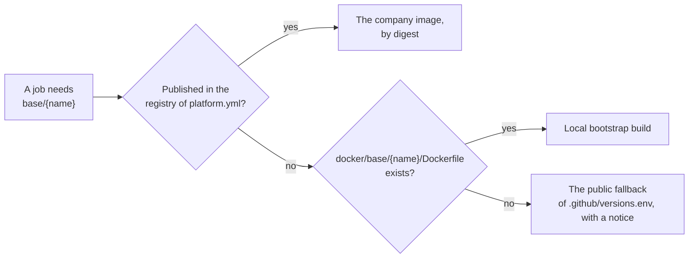

# ADR-0033 — A company base image that is not published falls back to a public Temurin image

| | |
|---|---|
| Status | Accepted. Supersedes in part rules 3 and 6 of ADR-0009, rule 1 of ADR-0007, rule 1 of ADR-0022 and rule 4 of ADR-0025 (rule 7) |
| Date | 2026-10-06 |
| Applies to | every repository built from this one, until its company base images are published; `setup-build-env`, `docker/spring-boot.Dockerfile`, `.github/versions.env` and the `public-base` job of `pr.yml` |
| Enforced by | the `public-base` job of `pr.yml` (`scripts/ci/public-base-smoke.sh`); `setup-build-env` (fails when an image is missing and has no fallback); hadolint on the Dockerfile |
| Related | [ADR-0007](0007-gradle-build-with-convention-plugins.md), [ADR-0009](0009-one-shared-image-definition.md), [ADR-0021](0021-ci-layering.md), [ADR-0022](0022-pull-request-pipeline.md), [ADR-0025](0025-integration-tests-on-compose-stacks.md), [ADR-0030](0030-platform-yml-declares-every-project-value.md), [ADR-0032](0032-registry-credentials.md) |

**In short:** The company base images `<registry>/base/jre21` and `<registry>/base/ci-build` are built outside this
repository, so a repository built from this one starts without them. Until they are published, CI builds the app
images on the public `eclipse-temurin:21-jre`, runs the Gradle job on the runner with `actions/setup-java`, and runs
the integration tests in `eclipse-temurin:21-jdk`. Both fallbacks are pinned in `.github/versions.env`. The shared
Dockerfile adds what the public image lacks, so the image is non-root and layered on either base. Where the company
images exist, as here, nothing changes, and one pull-request job proves the fallback.

## Context

[ADR-0009](0009-one-shared-image-definition.md) builds every app image on the company JRE image
`<registry>/base/jre21`. [ADR-0021](0021-ci-layering.md) runs the Gradle job in the company build image
`<registry>/base/ci-build`, and [ADR-0025](0025-integration-tests-on-compose-stacks.md) runs the integration tests in
it. Both images are built and published outside this repository (known gap G13), under the registry of
`platform.yml` ([ADR-0032](0032-registry-credentials.md)).

A repository built from this one starts on a registry where neither image exists. [ADR-0021](0021-ci-layering.md)
rule 6 already ran the Gradle job on the runner when `ci-build` was missing. Nothing else had a way out:
`setup-build-env` then required `docker/base/<name>/Dockerfile`, a bootstrap that no repository has, and failed. So
the first pull request of every new repository failed in its image build, before any of its own code ran. Its
integration tests and its first `main` run failed the same way.

The public Temurin images are the natural stand-in: the company images carry Temurin 21 too. But
`eclipse-temurin:21-jre` lacks what the company image adds and the shared Dockerfile relies on: the user `10001`,
`/config`, `/app/logs` and the company CA bundle. Its tags do not promise curl either, which the image's health check
and the compose template's call.

## Decision

1. **One fallback per base image.** `.github/versions.env` pins them as full references, each with a Renovate hint:

   | Base image | Variable | Fallback |
   |---|---|---|
   | `<registry>/base/jre21` | `BASE_IMAGE_FALLBACK` | `docker.io/library/eclipse-temurin:21-jre` |
   | `<registry>/base/ci-build` | `CI_BUILD_IMAGE_FALLBACK` | `docker.io/library/eclipse-temurin:21-jdk` |

   No other file pins them. They MUST stay on the Java major of the build
   ([ADR-0007](0007-gradle-build-with-convention-plugins.md)).
2. **The order.** For each base image a job needs, `setup-build-env` MUST take, in this order:
   1. the published `<registry>/base/<name>:latest`, by digest;
   2. a local build of `docker/base/<name>/Dockerfile`, when that file exists;
   3. the fallback, with a notice that names the missing image.

   It exports the result as `BASE_IMAGE` or `CI_BUILD_IMAGE`, as before. It fails only when an image is missing and
   `.github/versions.env` has no fallback for it. It reads the file with sed, because a job container may lack yq.
3. **Where the fallbacks apply.**
   - `buildImage` builds every app image on `BASE_IMAGE`, the environment variable that `buildlogic.docker-image`
     reads.
   - The Gradle job runs on the runner with `actions/setup-java` when `ci-build` is missing
     ([ADR-0021](0021-ci-layering.md) rule 6, unchanged).
   - The `it-runner` service runs in `CI_BUILD_IMAGE`, which wins over `test-infra/compose/versions.env`. In the
     fallback, the Gradle wrapper downloads its distribution into the bind-mounted Gradle user home. The image has no
     git, so Gradle warns and uses the version `0.1.0`; the integration tests do not depend on it.
4. **One Dockerfile for both bases.** `docker/spring-boot.Dockerfile` MUST build an image that runs on either base.
   Its runtime stage creates what the base lacks, and only that: the user and group `10001` (`app`), `/config`,
   `/app/logs` owned by `10001`, and curl. On the company base the step changes no file. The image stays non-root
   (`USER 10001:10001`) and layered, and its health check is unchanged.
5. **Proven on every shared change.** The `public-base` job of `pr.yml` runs in the full tier whenever every project
   is affected, which every change to `.github/`, `docker/` or `build-logic/` causes. `scripts/ci/public-base-smoke.sh`
   builds the reference app's image on `BASE_IMAGE_FALLBACK`, on the runner. It starts the image with a `local`
   identity under the compose template's posture, and requires readiness `UP`, the identity, user `10001` and a
   working curl. `pr-gate` needs the job; like every job, it passes when skipped. Without a `reference_app`
   ([ADR-0035](0035-dev-envs-and-reference-app-are-optional.md)) the job is skipped: there is no app to prove it
   with.
6. **Renovate.** The hints let Renovate propose updates of the fallbacks, as `ci(deps)`: in this repository they
   change no released artifact. The tags float within Java 21, so the only update Renovate can find is a new Java
   major. That is a decision of its own ([ADR-0007](0007-gradle-build-with-convention-plugins.md) rule 8), so it
   SHOULD wait for approval on the dependency dashboard, and `renovate.json` makes it wait.
7. **What this supersedes:**
   - [ADR-0009](0009-one-shared-image-definition.md) rule 3, in part: the base is the company image when it is
     published, else the fallback. The Dockerfile adds the user, the directories and curl when the base lacks them.
   - [ADR-0009](0009-one-shared-image-definition.md) rule 6, in part: a base image that is not published is no longer
     an error. CI resolves the company images to digests; it takes a fallback by its tag.
   - [ADR-0007](0007-gradle-build-with-convention-plugins.md) rule 1, in part: in CI the Gradle job's JDK comes from
     the `ci-build` image or, without it, from `actions/setup-java`. The integration tests' JDK comes from the
     `ci-build` image or the fallback.
   - [ADR-0022](0022-pull-request-pipeline.md) rule 1, in part: the full tier also runs `public-base`.
   - [ADR-0025](0025-integration-tests-on-compose-stacks.md) rule 4, in part: in CI the `it-runner` service runs on the
     `ci-build` image or the fallback.

How a job gets each base image:

## Alternatives considered

- **Fail until the base images exist.** That was the state before this decision. The first pull request of every new
  repository failed in shared tooling, for a reason outside the repository.
- **Ship the base-image Dockerfiles here.** They are the company's base-image build. A copy in every repository
  forks it, and in the enterprise the CA bundle is not kept in git.
- **Always build on the public images.** That gives up the company CA bundle and the company's patch cadence, which
  [ADR-0009](0009-one-shared-image-definition.md) requires wherever the company images exist.
- **A health check without curl** (bash `/dev/tcp`, or a Java probe). It would change the compose template and every
  check that runs curl in the container. Installing curl only where it is missing changes nothing on the company base.
- **Pin the fallbacks by digest.** Reproducible, but every upstream patch becomes a pull request, for images that
  serve only until the company images exist. CI takes the company images by `:latest` too.

## Consequences

- A repository built from this one passes its first pull request and its first `main` run before its base images
  exist. Every run says, in a notice, which image is missing.
- Images built on the fallback carry no company CA bundle. A repository whose apps call company services over TLS
  needs the company images before it deploys.
- This repository has both company images, so only `public-base` uses a fallback here. The Gradle job on the runner
  and the `it-runner` on `eclipse-temurin:21-jdk` run only in a repository without `ci-build`; no job here runs them.
- The full tier of a shared change runs one more job, in parallel with the build.
- `.hadolint.yaml` relaxes DL3008 for the curl install, as it does for the base images.
- Known gap G13 narrows: the base images are still built outside this repository, and the bootstrap Dockerfiles still
  do not exist, but a missing image no longer fails the build.
