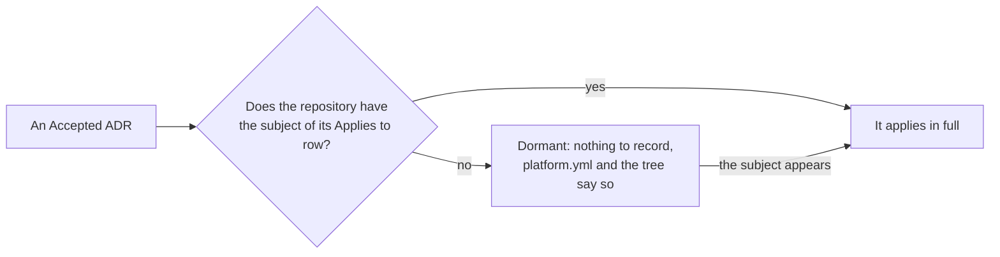

# ADR-0039 — A contract ADR applies where its subject exists; a repository without the subject deviates from nothing

| | |
|---|---|
| Status | Accepted. Supersedes in part rule 4 of ADR-0001 (rule 5). Rule 2 superseded in part by [ADR-0040](0040-actuator-contract-and-runtime-module-carry-generic-names.md) and [ADR-0044](0044-no-system-test-one-integration-test-level.md) |
| Date | 2026-10-06 |
| Applies to | every repository built from this one; the reading of every ADR's *Applies to* row |
| Enforced by | review; the tools of ADR-0033 to ADR-0038, which skip a stage rather than fail when its subject is absent |
| Related | [ADR-0001](0001-adrs-are-the-repository-contract.md), [ADR-0005](0005-repository-layout-and-shared-tooling.md), [ADR-0018](0018-on-prem-host-layout-versioned-bundles.md), [ADR-0019](0019-kubernetes-and-helm-are-provisional.md), [ADR-0025](0025-integration-tests-on-compose-stacks.md), [ADR-0027](0027-continuous-deployment-to-dev-and-the-deployment-record.md), [ADR-0028](0028-host-pool-deployment.md), [ADR-0030](0030-platform-yml-declares-every-project-value.md), [ADR-0035](0035-dev-envs-and-reference-app-are-optional.md), [ADR-0036](0036-helm-checks-only-when-kinds-include-helm.md) |

**In short:** [ADR-0001](0001-adrs-are-the-repository-contract.md) rule 4 makes every Accepted ADR apply to every
repository built from this one. Read literally, a repository that starts with one app, no chart, no integration
test, no dev env and no host pool breaks ADR-0018, ADR-0019, ADR-0025, ADR-0026, ADR-0027 and ADR-0028 from its
first commit, and ADR-0001 asks it to record each as a deviation. This decision reads the contract the way the
tooling has read it since ADR-0033 to ADR-0038: an ADR applies where the subject its *Applies to* row names exists.
Having no such subject is not a deviation and records nothing. The ADR applies from the moment the subject appears.

## Context

The contract was written against this repository, which has everything: three apps on the connector framework,
integration tests and test data, Helm charts, a dev env, a reference app and the company base images. Every ADR
applies here, so rule 4 of ADR-0001 cost nothing.

A repository built from this one starts with less. ADR-0033 to ADR-0038 made the tooling accept that: a missing
base image, an absent `reference_app`, `dev_envs: []`, `kinds` without `helm`, an app without integration tests and
a stack without a declaration each switch a part of the pipeline off instead of failing it. The contract still said
the opposite. ADR-0018 applies to "every on-prem host of every env", ADR-0026 to "every integration-test case", and
ADR-0001 rule 4 to every repository, so a repository with no host and no test case was non-conforming on paper and
owed a deviation ADR for each, saying "we have none". Nobody reads such records, a model writing them gets them
wrong, and they are deleted the day the subject appears.

The *Applies to* row already carries the information. What was missing is the rule that it decides.

## Decision

1. **Scope is the subject.** An Accepted contract ADR (ADR-0001 to ADR-0999) applies to a repository, an app or an
   instance when the subject its *Applies to* row names exists there. "Every repository built from this one" and
   "every app" name subjects that every repository has. An ADR MUST name its subject precisely enough that a reader
   can tell whether a repository has it.
2. **No subject, no deviation.** A repository without the subject MUST NOT record a deviation ADR for it, and no
   file lists which ADRs are dormant: `platform.yml` and the tree are the record. The subjects a new repository
   usually starts without, and the switch that each one is:

   > **Superseded in part by [ADR-0040](0040-actuator-contract-and-runtime-module-carry-generic-names.md) rule 1.**
   > The framework's switch is an app depending on `framework/app-runtime`, whose names are now the generic ones that
   > ADR-0037 reads first.

   > **Superseded in part by [ADR-0044](0044-no-system-test-one-integration-test-level.md) rule 5.** The reference
   > scenario has no system test: the switch `projects[0].reference_app` turns on the kind deployment test, the
   > nightly teardown drill and the `public-base` job.

   | Subject | The switch | Dormant until then |
   |---|---|---|
   | Helm charts and `kind: helm` targets | `helm` in `projects[0].kinds` | ADR-0019, ADR-0036; checks 3, 4 and 12 of ADR-0014 for the Helm artefacts |
   | integration tests | an app that applies `buildlogic.integration-test` and holds `src/integrationTest/java` | ADR-0025, ADR-0026, ADR-0038; the `integration-test` stage (ADR-0034) |
   | the reference scenario | `projects[0].reference_app` | the system test (ADR-0025 rule 6), the kind deployment test, the nightly teardown drill (ADR-0024 rule 5), the `public-base` job (ADR-0033) |
   | dev envs | a non-empty `dev_envs` | ADR-0027; the `kind-deploy` and `deploy-dev` jobs |
   | host pools | a dev flow whose `workflows-config.yml` names a pool of boxes | ADR-0018, ADR-0028 |
   | the company base images | `<registry>/base/jre21` and `<registry>/base/ci-build` published | ADR-0009 rules 3 and 6 as written; ADR-0033 applies instead |
   | the connector framework | an app depending on `framework/connectors-framework` | the framework's names in ADR-0015 and ADR-0016; ADR-0037 applies instead |

3. **The ADR applies from the first subject.** When the subject appears, the first chart, the first integration
   test, the first dev env, the first pool, the ADR applies to it in full and at once. There is no transition period
   and no opt-in.
4. **A deviation is a different answer, not an absent subject.** A repository that has the subject and handles it
   against a rule records the deviation as ADR-1000 or later, naming the rule it deviates from, as
   [ADR-0001](0001-adrs-are-the-repository-contract.md) says.
5. **What this supersedes.** [ADR-0001](0001-adrs-are-the-repository-contract.md) rule 4, in part: the contract
   applies where the subject exists, as the *Applies to* row names it, not to every repository as a whole. The
   deviation record of ADR-0001's Consequences narrows to rule 4 here.

How a reader decides whether an ADR applies:

## Alternatives considered

- **Keep rule 4 and record the deviations.** The deviation ADRs would say "we have no charts" and "we have no
  pools", be written badly or not at all, and be deleted when the subject appears. They record nothing a reader
  could not see in `platform.yml`.
- **A `profile` key in `platform.yml`** (`starter`, `full`) that names the active ADRs. A second place to keep in
  sync with the switches the tools already read, and a wrong profile silently changes the contract.
- **Two ADR series, core and extensions.** It renumbers nothing, but every reader learns two series, and the line
  between them moves with each decision. The *Applies to* row already draws it, per ADR.

## Consequences

- A repository that only builds, tests, publishes and releases conforms to the contract from its first commit, with
  no ADR of its own.
- The *Applies to* row carries weight. An ADR that names a vague subject gets a correction (ADR-0001 rule 5 allows
  it), not a new ADR.
- The index lists the switches next to the creation checklist ("What a new repository may leave out"), with what
  the tooling does for each.
- The *Enforced by* checks of a dormant ADR do not run, or pass with nothing to check. That is by design: the tools
  of ADR-0033 to ADR-0038 skip, with a notice, rather than fail.
