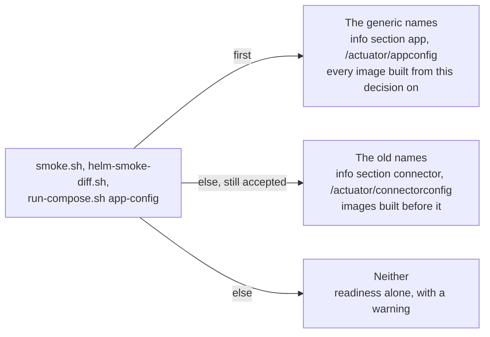

# ADR-0040 — The actuator contract and the runtime module carry generic names: `app`, `appconfig`, `framework/app-runtime`

| | |
|---|---|
| Status | Accepted. Supersedes in part rules 1 and 4 of ADR-0006, rule 3 of ADR-0013, rules 1, 3, 4, 6 and 9 of ADR-0015, rule 5 of ADR-0016, rules 1, 3 and 7 of ADR-0037 and rule 2 of ADR-0039 (rule 8) |
| Date | 2026-10-06 |
| Applies to | every app built on the framework module `framework/app-runtime`, and the module itself; the readers of the old names: `scripts/smoke.sh`, `scripts/helm-smoke-diff.sh` and `run-compose.sh app-config` |
| Enforced by | `AbstractPlatformApplicationTest` (each app's unit test: readiness holds exactly `readinessState` and `app`, `/actuator/info` has the `app` section and no `connector` section, `/actuator/appconfig` masks secrets); `ConnectorPropertiesTest` (the auto-configuration registers `AppHealthIndicator`); the Gradle build (every app resolves `project(":app-runtime")`); `scripts/test/smoke-test.sh` and `scripts/test/pool-deploy-test.sh` in the `lint` job (the old names are still accepted); review |
| Related | [ADR-0001](0001-adrs-are-the-repository-contract.md), [ADR-0006](0006-apps-and-framework-modules.md), [ADR-0013](0013-secrets.md), [ADR-0015](0015-actuator-health-and-metrics-contract.md), [ADR-0016](0016-logging-and-startup-configuration-summary.md), [ADR-0017](0017-run-compose-operations-cli-and-runtime-posture.md), [ADR-0019](0019-kubernetes-and-helm-are-provisional.md), [ADR-0037](0037-runtime-scripts-read-generic-actuator-names.md), [ADR-0039](0039-an-adr-applies-where-its-subject-exists.md) |

**In short:** The framework's actuator names, its contract test, its `main` helper and its module no longer name
the connector domain. Every app on the framework exposes `/actuator/appconfig`, gates readiness on the `app`
indicator, and publishes its identity in the `app` section of `/actuator/info` only. The module is
`framework/app-runtime`, the Gradle project `:app-runtime`. The runtime scripts still accept `connector` and
`connectorconfig`, so an image built before this decision still passes `health` and deploys. The identity class,
the `connector.*` properties, the Java package and the split of the module stay open (open decision O5).

## Context

[ADR-0015](0015-actuator-health-and-metrics-contract.md) and
[ADR-0016](0016-logging-and-startup-configuration-summary.md) named the operational contract after the first apps
built on it: the health indicator `connector`, the endpoint `connectorconfig`, the `connector` section of
`/actuator/info`, the module `framework/connectors-framework`, the `main` helper `ConnectorApplication` and the
contract test `AbstractConnectorApplicationTest`. Nothing in that contract is about connectors: it is identity,
readiness, metrics tags and a masked configuration summary.

[ADR-0037](0037-runtime-scripts-read-generic-actuator-names.md) made the runtime scripts read the generic names
`app` and `appconfig` first and accept the framework's. It left the framework's names to open decision O5, and had
the framework publish its identity under both sections in the meantime. Known gap G11 recorded the rest: the
framework mixes the generic contract with the connector domain, so a repository built from this one for another
domain inherits the connector names in every app, dashboard and runbook.

The owner has decided O5 in part: the names that every app, test and operator sees are renamed now, and the split of
the module into a generic part and domain parts waits. Two facts make the rename cheap. The scripts already read both
names, so no deploy breaks when images built before and after the rename run side by side. And the probes, the
compose health check and the deploys read only the readiness status, never the name of an indicator.

## Decision

1. **The names.** The framework module and the parts of the contract that every app sees are renamed:

   | What | Before | Now |
   |---|---|---|
   | the module that carries the operational contract ([ADR-0006](0006-apps-and-framework-modules.md) rule 4) | `framework/connectors-framework`, Gradle project `:connectors-framework` | `framework/app-runtime`, Gradle project `:app-runtime` |
   | the `main` helper; its `--print-config` is unchanged | `ConnectorApplication` | `PlatformApplication` |
   | the actuator contract test that each app's unit test extends | `AbstractConnectorApplicationTest` | `AbstractPlatformApplicationTest` |
   | the masked configuration summary of the running instance | `ConnectorConfigEndpoint`, `/actuator/connectorconfig` | `AppConfigEndpoint`, `/actuator/appconfig` |
   | the readiness health indicator | `ConnectorHealthIndicator`, contributor `connector` | `AppHealthIndicator`, contributor `app` |
   | the identity in `/actuator/info` | `ConnectorInfoContributor`, sections `app` and `connector` | `AppInfoContributor`, section `app` |
   | the auto-configuration | `ConnectorFrameworkAutoConfiguration` | `AppRuntimeAutoConfiguration` |

   The framework, every app, their tests and the documentation MUST use the names of the last column. The old names
   MUST NOT come back, except in the readers that rule 6 keeps.
2. **Exposed endpoints.** An app exposes `health`, `info` and `prometheus`, plus `appconfig` when it has a
   configuration summary. An app on the framework has one, so it exposes exactly these four, and its
   `management.endpoints.web.exposure.include` names them. No app exposes `connectorconfig`, and no other endpoint is
   exposed.
3. **Readiness.** The readiness group of an app on the framework is `readinessState` plus the `app` indicator:
   `management.endpoint.health.group.readiness.include: readinessState,app` in its `application.yml`. An external
   dependency affects readiness only through the `app` indicator, where a real pipeline reports its source and sink
   connections ([ADR-0015](0015-actuator-health-and-metrics-contract.md) rule 4). Liveness does not change.
4. **One identity section.** `/actuator/info` carries the identity under `app` only: `env`, `flow`, `app`,
   `instance`, `tuple` and `complete` ([ADR-0037](0037-runtime-scripts-read-generic-actuator-names.md) rule 2). The
   framework MUST NOT publish the `connector` section.
5. **The contract test.** Each app's unit test extends `AbstractPlatformApplicationTest`. Besides the rest of
   [ADR-0015](0015-actuator-health-and-metrics-contract.md) rule 9, it asserts that readiness holds exactly
   `readinessState` and `app`, that `/actuator/info` has the `app` section with the instance's tuple and `complete`
   and no `connector` section, and that `/actuator/appconfig` masks secrets.
6. **The scripts still read the old names.** `scripts/smoke.sh`, `scripts/helm-smoke-diff.sh` and
   `run-compose.sh app-config` MUST keep reading the generic name first and accepting `connector` and
   `connectorconfig` ([ADR-0037](0037-runtime-scripts-read-generic-actuator-names.md) rules 1 and 4 to 6). These are
   now the names of images built before this decision: a dev host or a pool runs one until its next deploy, and a
   rollback ([ADR-0018](0018-on-prem-host-layout-versioned-bundles.md),
   [ADR-0028](0028-host-pool-deployment.md)) or a promoted env on an older release brings one back. The script tests
   MUST keep a case for each old name. A later ADR MAY drop the old names once no env runs such an image.
7. **What keeps its name.** O5 stays open for `ConnectorIdentity`, `ConnectorProperties` and the `connector.*`
   properties, `ConnectorMdc`, `ConnectorStartupReporter`, `SecretMasker`, `ConfigurationSummary` and its summary
   prefixes, the Java package `com.example.connectors.framework` and the internal property
   `connectors.framework.print-config`. It also stays open for splitting `framework/app-runtime` into a generic
   module and domain modules. `--print-config` keeps its name.
8. **What this supersedes, and how older text reads.** The accepted ADRs keep the old names in their text
   ([ADR-0001](0001-adrs-are-the-repository-contract.md) rule 5). Where an older rule, *Applies to* row, *Enforced
   by* row or diagram names an old name of rule 1, it reads as the new name. The rules this decision changes, each
   in part:
   - ADR-0006 rule 1: the main class calls `PlatformApplication.run(<Main>.class, args)`, and the unit test extends
     `AbstractPlatformApplicationTest` (rule 1);
   - ADR-0006 rule 4: the module is `framework/app-runtime` (rule 1);
   - ADR-0013 rule 3: the running instance's masked summary is `/actuator/appconfig` (rule 1);
   - ADR-0015 rule 1: the auto-configuration registers the health indicator `app` and the `appconfig` endpoint
     (rule 1);
   - ADR-0015 rule 3: the exposed endpoints are `health`, `info`, `prometheus` and `appconfig` (rule 2);
   - ADR-0015 rule 4: readiness is `readinessState` plus `app` (rule 3);
   - ADR-0015 rule 6: the identity section is `app`, and there is no `connector` section (rule 4);
   - ADR-0015 rule 9: the contract test is `AbstractPlatformApplicationTest` (rule 5);
   - ADR-0016 rule 5: the running instance serves the summary at `/actuator/appconfig` (rule 1);
   - ADR-0037 rule 1: the second name is that of an image built before this decision, not the framework's (rule 6);
   - ADR-0037 rule 3: the framework publishes the generic names only (rule 4);
   - ADR-0037 rule 7: no app exposes `connectorconfig` (rule 2);
   - ADR-0039 rule 2: the framework's switch is an app depending on `framework/app-runtime` (rule 1).

Which names an instance answers to, and in which order the runtime scripts read them:

## Alternatives considered

- **Keep the framework's names and publish both, as ADR-0037 left it.** Every app inherits the names of a domain it
  may not belong to, `/actuator/info` carries the identity twice, and every new reader learns two names for one
  thing.
- **Rename everything O5 lists at once:** `ConnectorIdentity`, `ConnectorProperties`, the `connector.*` properties
  and the package. The properties are set in every configuration layer, here and in the configuration repository,
  and the module split decides where those classes end up. Renaming them before the split renames them twice.
- **Keep `connectorconfig` and the `connector` section as aliases for a while.** The scripts already accept both
  names from older images, so the aliases would serve only readers outside this repository, and an alias that costs
  nothing is never removed. Those readers switch once, on the release that carries this decision.
- **Drop the old names from the scripts in the same change.** A host or a pool that still runs an image built before
  this decision, or a rollback to one, would fail `health` and the deploy while ready.
- **Other names.** `AppApplication` stutters. `PlatformApplication` names the platform contract that the helper
  applies to the app, the one `platform.yml` declares. `app-runtime` is the name O5 already gave the generic module.

## Consequences

- An image built from this decision on answers to the generic names only. The scripts read both, so a pool or a dev
  host may run images built before and after it side by side during a deploy.
- Dashboards, alerts and runbooks outside this repository that read `/actuator/connectorconfig`, the `connector`
  section of `/actuator/info` or the `connector` health component switch to `appconfig` and `app` before images
  built from this decision reach the envs they watch. The readiness status, which the probes, the compose health
  check and the deploys read, does not change.
- The Gradle project path is `:app-runtime`, so a command or a build file naming `:connectors-framework` fails. CI
  derives its projects from the build files ([ADR-0031](0031-ci-derives-the-projects-from-the-build-files.md)), so
  no workflow names the module. `test-infra/compose/stacks.yml` keys the module's stacks by `app-runtime`.
- The older ADRs keep the old names, and rule 8 says how to read them. The index, its checklist and the README files
  use the new names.
- Known gap G11 narrows: the actuator names, the contract test and the module name are generic, while the identity
  class, the `connector.*` properties, the summary prefixes and the package are not. O5 keeps those names and the
  module split.
