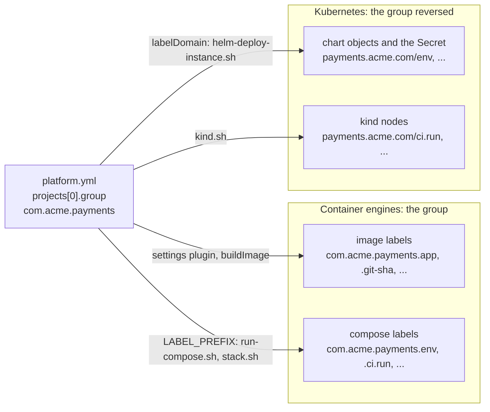

# ADR-0041 — Every label prefix derives from `projects[0].group` of `platform.yml`

| | |
|---|---|
| Status | Accepted. Supersedes in part rule 3 of ADR-0003, rule 4 of ADR-0009, rule 3 of ADR-0012, rule 7 of ADR-0017, rule 2 of ADR-0024 and rules 1, 2 and 4 of ADR-0030 (rule 6) |
| Date | 2026-10-06 |
| Applies to | every repository built from this one; every label key that the shared tooling or a chart sets or filters by: the image labels, the compose labels of containers, volumes and networks, the Kubernetes labels of the charts and of `helm-deploy-instance.sh`, the labels of the kind nodes |
| Enforced by | the `buildlogic.platform` settings plugin (the shape and the line of `group`, on every Gradle run; `PlatformManifestTest`); the readers' own checks, exit 4 (`scripts/test/env-vocabulary-test.sh`, `scripts/test/stack-test.sh`); `scripts/test/pool-deploy-test.sh` (case `labels`) and `scripts/test/stack-test.sh`, whose fixtures have a group of their own; the `${LABEL_PREFIX:?}` guard of the compose files; the charts' required `labelDomain`; config-lint checks 5 and 6 (`ConfigLinterTest`) |
| Related | [ADR-0003](0003-identity-tuple-names-every-instance.md), [ADR-0005](0005-repository-layout-and-shared-tooling.md), [ADR-0009](0009-one-shared-image-definition.md), [ADR-0012](0012-compose-template-and-generated-env.md), [ADR-0017](0017-run-compose-operations-cli-and-runtime-posture.md), [ADR-0019](0019-kubernetes-and-helm-are-provisional.md), [ADR-0024](0024-ephemeral-ci-environments.md), [ADR-0030](0030-platform-yml-declares-every-project-value.md) |

**In short:** The tooling labels images, compose containers, volumes and networks, Kubernetes objects and kind nodes,
and its teardown and leak checks filter by those labels. Their keys started with `com.example.` and
`platform.example.com/`, written into the shared tooling, so a repository built from this one had to edit shared
files or carry another project's label domain. Every label key now starts with a prefix derived from
`projects[0].group` of `platform.yml`: the group itself on images and compose resources (`<group>.env`), and the
group reversed as a DNS name on Kubernetes objects and kind nodes (`<domain>/env`). The build checks that the group
is lower-case words on a line of its own. Each tool derives the prefix from there, the same way, and none names a
label domain.

## Context

[ADR-0005](0005-repository-layout-and-shared-tooling.md) copies the shared tooling unchanged into every repository
built from this one, and [ADR-0030](0030-platform-yml-declares-every-project-value.md) moved every project value into
`platform.yml`. The label domain is a project value too: it says who owns a container, a volume or a pod. ADR-0030's
schema did not list it, so it stayed in the tools:

- the image labels `com.example.{app,git-sha,build-url,version-kind}` in `buildlogic.docker-image` and the shared
  Dockerfile ([ADR-0009](0009-one-shared-image-definition.md));
- the identity and run labels of the compose template and of every stack file, `com.example.{env,flow,app,instance}`
  and `com.example.ci.{run,attempt}` ([ADR-0017](0017-run-compose-operations-cli-and-runtime-posture.md),
  [ADR-0024](0024-ephemeral-ci-environments.md));
- the run labels of the kind nodes, and `platform.example.com/{env,flow,app,instance}` in the charts and on the
  Secret that `helm-deploy-instance.sh` creates;
- the readers: `stack.sh` prunes and checks for leaks by `com.example.ci.run`, and `run-compose.sh version` reads the
  image's `com.example.build-url`.

`projects[0].group` already names a namespace that the project owns: by the Maven convention, a domain written in
reverse. Labels want the same thing. Docker asks for reverse-DNS label keys, and a Kubernetes label key that a tool
sets carries a DNS subdomain as its prefix, as in `app.kubernetes.io/name`.

Four constraints shape the derivation:

- docker compose fills `${VAR}` in values and never in mapping keys, so a key cannot be interpolated in the map form
  of `labels`;
- the scripts read `platform.yml` without a YAML parser: the boxes and the job containers have no yq
  ([ADR-0030](0030-platform-yml-declares-every-project-value.md) rule 2);
- a Kubernetes label prefix is a DNS subdomain: lower case, at most 253 characters, each part at most 63;
- a Java package name may hold upper-case letters and underscores, which Kubernetes rejects in a label prefix and
  Docker's guideline for label keys leaves out.

## Decision

1. **One source.** Every label key that the shared tooling or a chart sets or filters by MUST start with a prefix
   derived from `projects[0].group` of `platform.yml`. The keys of other owners stay as they are:
   `org.opencontainers.image.*`, `com.docker.compose.*`, `io.x-k8s.kind.cluster`, `app.kubernetes.io/*`,
   `helm.sh/*` and `pod-security.kubernetes.io/*`. No file names a label domain of its own, and no tool falls back
   to a default prefix or accepts one from its caller.
2. **Two derivations, fixed names.**

   | Label system | Prefix | With `group: com.acme.payments` |
   |---|---|---|
   | container engines: the image labels, the compose labels of containers, volumes and networks | the group, then `.` | `com.acme.payments.env` |
   | Kubernetes: the charts' objects, the Secret of `helm-deploy-instance.sh`, the kind nodes | the group reversed as a DNS name, then `/` | `payments.acme.com/env` |

   The names after the prefix are the same in every repository:

   | Names | Meaning | On |
   |---|---|---|
   | `env`, `flow`, `app`, `instance` | the identity tuple ([ADR-0003](0003-identity-tuple-names-every-instance.md)) | compose containers; Kubernetes objects |
   | `ci.run`, `ci.attempt` | the CI run and its attempt, `local` and `0` outside CI ([ADR-0024](0024-ephemeral-ci-environments.md)) | compose containers, volumes and networks; kind nodes |
   | `app`, `git-sha`, `build-url`, `version-kind` | the app, the short commit, the build and the kind of version of an image ([ADR-0009](0009-one-shared-image-definition.md)) | images |

   This repository's group, `com.example.connectors`, gives `com.example.connectors.env` and
   `connectors.example.com/env`: an example, not a requirement.
3. **The group's shape.** `projects[0].group` MUST be lower-case words of letters and digits, each starting with a
   letter and at most 63 characters long, joined by dots, 253 characters at most. Such a Java package name is a key
   prefix that both label systems take unchanged. It MUST be an unquoted value on a line of its own, and the first
   `group:` line of the file, so that a script reads it with awk, as it reads `registry`. The settings plugin checks
   both on every Gradle run. The row of [ADR-0030](0030-platform-yml-declares-every-project-value.md) rule 1 reads:

   | Key | Meaning | Rules |
   |---|---|---|
   | `projects[0].group` | the Gradle (Maven) group of every module, and the prefix of every label | a Java package name of lower-case words of letters and digits, each starting with a letter, at most 63 characters, joined by dots; unquoted, on a line of its own |

4. **Who derives it, and how.**

   | Reader | Labels | Reads the group |
   |---|---|---|
   | `buildlogic.docker-image` | `<group>.app`, `.git-sha`, `.build-url` and `.version-kind` on every image, passed with `--label` | from the settings plugin |
   | `docker/spring-boot.Dockerfile` | none of its own: it sets only the `org.opencontainers.image.*` labels | |
   | `run-compose.sh` | exports `LABEL_PREFIX` for the compose template; `version` reads `<group>.build-url` | awk, from the `platform.yml` of its root, which a host bundle carries |
   | `stack.sh` | exports `LABEL_PREFIX` for the stack files and the template, and records it in the state file and in `$GITHUB_ENV` for the later compose calls; `down`, `diagnostics` and `leak-check` filter by `<group>.ci.run`, with the prefix that `up` recorded | awk |
   | config-lint check 6 | renders the compose files with the `LABEL_PREFIX` that `run-compose.sh` exports | from the settings plugin |
   | `helm-deploy-instance.sh` | `--set-string labelDomain=<domain>` in its flag list, in every mode; `<domain>/env`, `/flow`, `/app` and `/instance` on the Secret | awk |
   | the charts | `<labelDomain>/env`, `/flow`, `/app` and `/instance` on every object | the value `labelDomain`, which the schema and the template require |
   | `kind.sh` | `<domain>/ci.run` and `<domain>/ci.attempt` on every node | awk |

   A script that finds no valid group MUST stop with exit 4 (configuration) before it creates, labels or removes
   anything.
5. **Compose labels are lists.** Every `labels` block whose keys derive from the group MUST be a list of
   `"<key>=<value>"` strings, because compose interpolates values only. The first such label of each compose file is
   written `${LABEL_PREFIX:?…}`, so a compose call that did not come through the scripts fails instead of labelling
   `.env`. `LABEL_PREFIX` is a variable the scripts set: an env layer MUST NOT set it, and config-lint check 5 and
   `run-compose.sh` reject it, as they reject `PROJECT`.
6. **What this supersedes:**
   - [ADR-0003](0003-identity-tuple-names-every-instance.md) rule 3, in part: the container labels are `<group>.env`,
     `.flow`, `.app` and `.instance`, and the Kubernetes objects carry `<domain>/env` and the rest.
   - [ADR-0009](0009-one-shared-image-definition.md) rule 4, in part: the project's image labels are
     `<group>.{app,git-sha,build-url,version-kind}`; the Dockerfile sets only the OCI labels.
   - [ADR-0012](0012-compose-template-and-generated-env.md) rule 3, in part: `LABEL_PREFIX` joins the variables that
     the scripts set and no env layer may.
   - [ADR-0017](0017-run-compose-operations-cli-and-runtime-posture.md) rule 7, in part: the template's labels are
     `<group>.{env,flow,app,instance}`, plus the run labels.
   - [ADR-0024](0024-ephemeral-ci-environments.md) rule 2, in part: the run labels are `<group>.ci.run` and
     `<group>.ci.attempt`; the kind nodes carry `<domain>/ci.run` and `<domain>/ci.attempt`.
   - [ADR-0030](0030-platform-yml-declares-every-project-value.md) rule 1, in part: `projects[0].group` is also the
     prefix of every label, and its rule narrows to rule 3 here. Its row's meaning is corrected to say so.
   - [ADR-0030](0030-platform-yml-declares-every-project-value.md) rule 2, in part: `projects[0].group` is read
     without a YAML parser too.
   - [ADR-0030](0030-platform-yml-declares-every-project-value.md) rule 4, in part: `run-compose.sh`,
     `helm-deploy-instance.sh`, `stack.sh` and `kind.sh` read `group` with awk, and config-lint check 6 renders with
     it.

Where the prefix goes:

## Alternatives considered

- **A `label_prefix` key in `platform.yml`.** One more value to keep in step with the group, which already names a
  namespace that the project owns. Two keys could name two owners, and the key would need a schema change of its own
  ([ADR-0030](0030-platform-yml-declares-every-project-value.md) rule 1) for nothing the group does not give.
- **Keep `com.example` and `platform.example.com` as conventions of the contract.** Every repository would carry this
  one's label domain. Two projects on one box or one runner would share a label namespace, so neither a filter nor
  a leak check could tell their resources apart.
- **The group unchanged as the Kubernetes prefix** (`com.acme.payments/env`). It is a valid DNS subdomain, but it
  names a domain that nobody owns. Kubernetes prefixes read as domains, like `app.kubernetes.io`, and the reversed
  group is the domain the Maven convention started from.
- **The group as an unprefixed Kubernetes label name** (`com.acme.payments.env`). A name without a prefix is limited
  to 63 characters, and Kubernetes keeps the prefix for the labels that tools set.
- **Accept any Java package name and transform it** (lower-case it, replace `_`). Kotlin, awk and bash would each
  need the same transformation, and two readers that disagree are the failure this decision removes. Java and Maven
  write package names in lower case anyway.
- **An `ARG LABEL_PREFIX` in the Dockerfile**, which `LABEL` expands. It would keep two project labels on an image
  built by hand, where they hold only `unknown` and `local`, at the price of a key that hadolint reports as invalid
  (DL3048). `buildImage` passes every label already, so the Dockerfile keeps only the OCI labels and names no
  project.
- **A generated compose override with literal keys**, as `run-compose.sh` writes one for `DEPS_NETWORK`. It works
  with any compose, but `stack.sh` would have to know every service and volume of every stack file. List-form labels
  interpolate in docker compose and in podman-compose 1.6.0, the version
  [ADR-0012](0012-compose-template-and-generated-env.md) measured.

## Consequences

- A repository built from this one gets its own labels by setting `group`, and edits no shared file.
- This repository's labels change once: `com.example.env` becomes `com.example.connectors.env`,
  `com.example.ci.run` becomes `com.example.connectors.ci.run`, and `platform.example.com/env` becomes
  `connectors.example.com/env`. A running instance keeps its old labels until compose recreates its container at the
  next start. Nothing here finds a container by these labels (`run-compose.sh` uses compose's own), so an older
  bundle on a box keeps working. A dashboard or a query outside the repository that filters by an old key must
  follow.
- On Kubernetes the new keys are in the pod template, not in the selector, which uses `app.kubernetes.io/*` only. A
  `helm upgrade` rolls the pods and needs no new Deployment.
- The charts require `labelDomain`. A hand-written `helm` line without it fails; the one deployer passes it
  ([ADR-0019](0019-kubernetes-and-helm-are-provisional.md)).
- Changing `group` later changes every label, like renaming the project: what was labelled before is invisible to
  the next leak check. Change it between runs, with nothing running.
- A group with upper-case letters, underscores or quotes now fails every Gradle run and every script, with the
  reason. Group names are lower case by convention, so few repositories notice.
- The labels of images built outside this repository, such as the CA bundle label of the company base images
  (`test-infra/ca/`), belong to those builds and are not derived here.
