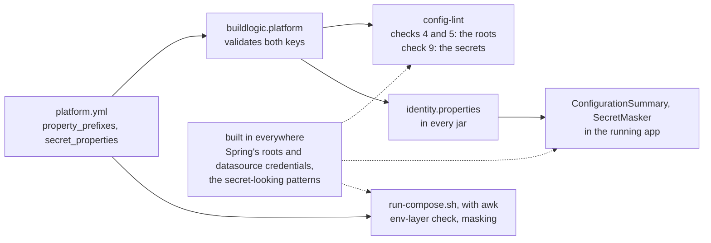

# ADR-0042 — The app's property roots and the project's secret properties are keys of `platform.yml`

| | |
|---|---|
| Status | Accepted. Supersedes in part rule 3 of ADR-0012, rules 3 and 4 of ADR-0013, rule 2 of ADR-0014, rule 4 of ADR-0016 and rules 1, 2 and 4 of ADR-0030 (rule 7) |
| Date | 2026-10-06 |
| Applies to | every repository built from this one; every tool that knows a property name of the apps: config-lint checks 4, 5 and 9, the env-layer check and the masking of `run-compose.sh`, and the framework's `SecretMasker` and `ConfigurationSummary` |
| Enforced by | the `buildlogic.platform` settings plugin (`PlatformManifestTest`); config-lint checks 4, 5 and 9 (`ConfigLinterTest`); `run-compose.sh` (`scripts/test/env-vocabulary-test.sh`); `SecretMaskerTest` and `ConfigurationSummaryTest` in the framework |
| Related | [ADR-0005](0005-repository-layout-and-shared-tooling.md), [ADR-0012](0012-compose-template-and-generated-env.md), [ADR-0013](0013-secrets.md), [ADR-0014](0014-config-lint-enforces-the-config-contract.md), [ADR-0016](0016-logging-and-startup-configuration-summary.md), [ADR-0030](0030-platform-yml-declares-every-project-value.md) |

**In short:** Two new keys of `platform.yml` carry the names of the apps' own configuration. `property_prefixes`
lists the apps' property roots: the start-up summary shows every property below them, and no env layer may set them
in environment-variable form. `secret_properties` lists the project's secret properties: no YAML layer may hold
them, and every output masks them. Config-lint, `run-compose.sh` and the framework read both from there. Only
Spring's own names and the generic secret patterns stay built in, so the secret list exists once.

## Context

Three pieces of tooling carried this repository's property names:

- config-lint held the secret properties of check 9 (`connector.amps.username` and four more) and forbade
  `CONNECTOR_*` in the env layers and the Helm `env:` maps (checks 4 and 5);
- `run-compose.sh` forbade `CONNECTOR_*` in the env layers and masked three usernames by name, two of them
  `connector_*`;
- the framework's `SecretMasker` held the same secret list again, and `ConfigurationSummary` showed the roots
  `connector` and `spring.datasource`.

The first two are shared tooling, copied unchanged ([ADR-0005](0005-repository-layout-and-shared-tooling.md)), and
since [ADR-0030](0030-platform-yml-declares-every-project-value.md) a derived repository edits no shared tooling. A
repository whose apps read `orders.*` therefore got none of the protection: its env layers could pass `ORDERS_*`
properties through the shell, which [ADR-0012](0012-compose-template-and-generated-env.md) forbids, check 9 never
looked for its secrets, and its start-up summary showed nothing of its own.
[ADR-0016](0016-logging-and-startup-configuration-summary.md) recorded the summary's roots as a known gap, and the
index recorded the secret list that existed twice (G11).

These are project values: the tree cannot derive them, and every tool that needs them must agree. ADR-0030 rule 1
asks for an ADR before such a value enters the schema, and rule 2 asks for a one-line list at the top level when a
script reads it without a YAML parser. Three kinds of reader need the values: Gradle, which parses the file; the
running app, which has no `platform.yml` but the resource that the build writes into every jar; and `run-compose.sh`
on the boxes, which has awk only.

## Decision

1. **Two keys.** `platform.yml` holds, at the top level, as one-line lists:

   | Key | Meaning | Rules | This repository |
   |---|---|---|---|
   | `property_prefixes` | the apps' own property roots: the start-up summary shows every property below them, and no env layer sets them | a non-empty list of property names: dotted, lower-case kebab-case segments, the first one starting with a letter | `[connector]` |
   | `secret_properties` | the project's secret properties: no YAML layer holds them or a key below them, and every output masks them | a list of property names, as above; MAY be `[]` | `[connector.amps.username, connector.amps.password, connector.kafka.sasl, connector.deephaven.token, connector.tls.keystore.password]` |

   Both are top-level one-line lists because `run-compose.sh` reads both with awk (ADR-0030 rule 2). The last
   column is this repository's own `platform.yml`: an example, not a requirement.
2. **Spring's names stay built in.** Every tool keeps, whatever the project:
   - the roots `spring`, `logging` and `management`, whose environment-variable forms `SPRING_*`, `LOGGING_*` and
     `MANAGEMENT_*` no env layer may set;
   - the root `spring.datasource`, which the summary always shows, to prove its credentials are masked;
   - the secret properties `spring.datasource.username` and `spring.datasource.password`;
   - the generic secret patterns: a key with a secret-looking segment (`password`, `passwd`, `secret`, `token`,
     `credential`, `*key`), credentials inside URLs, and the secret-looking values of check 9.

   These names are Spring's or generic, the same in every repository. A tool MUST NOT name any other property of a
   project; it reads the project's names from `platform.yml`.
3. **The environment-variable form of a root** is the one Spring's relaxed binding reads: `_` for `.`, no `-`,
   upper case, then `_`. `connector` becomes `CONNECTOR_`, `acme.billing-svc` becomes `ACME_BILLINGSVC_`.
   `run-compose.sh` and config-lint checks 4 and 5 MUST refuse a variable that starts with the form of a
   `property_prefixes` entry or of a Spring root, in an env layer and in a Helm `env:` map.
4. **A secret property covers its subtree.** A key is secret when it equals a secret property, built in or of
   `secret_properties`, or lies below one, in any relaxed form: dotted, kebab-case or as an environment variable.
   - Config-lint check 9 MUST fail on such a key in any YAML layer.
   - `SecretMasker` MUST mask its value in the start-up summary, `--print-config` and the config endpoint.
   - `run-compose.sh` `config`, `printenv` and `app-config` MUST mask its value by key name, usernames included.
5. **Each reader gets the values from one place:**

   | Reader | Values | How |
   |---|---|---|
   | config-lint checks 4 and 5 | `property_prefixes` | from the settings plugin, as `buildlogic.platform.propertyPrefixes` |
   | config-lint check 9 | `secret_properties` | from the settings plugin, as `buildlogic.platform.secretProperties` |
   | `ConfigurationSummary` | `property_prefixes` | `META-INF/platform/identity.properties`, which `buildlogic.java-conventions` writes into every jar |
   | `SecretMasker` | `secret_properties` | the same resource |
   | `run-compose.sh` | both | awk, from the `platform.yml` of its root |

   The build always writes the resource, so a running app never misses it. A unit test of a module whose jar was
   not built may: the framework SHOULD then fall back to the built-in names of rule 2, the summary showing
   `spring.datasource` only.
6. **Validated on every build.** The settings plugin MUST fail when either key is missing, is not a one-line list
   at the top level, holds a word that is not a property name or holds one twice, and when `property_prefixes` is
   empty. `run-compose.sh` exits 4 when either key is missing or `property_prefixes` is empty.
7. **What this decision supersedes:**
   - [ADR-0012](0012-compose-template-and-generated-env.md) rule 3, in part: the `never` row forbids `SPRING_*`,
     `LOGGING_*`, `MANAGEMENT_*` and the form of each `property_prefixes` entry (rule 3 here); `CONNECTOR_*` is
     this repository's;
   - [ADR-0013](0013-secrets.md) rule 3, in part: the known secret properties are Spring's datasource credentials
     and `secret_properties`, each with its subtree, and `run-compose.sh` masks them by key name (rule 4 here);
   - [ADR-0013](0013-secrets.md) rule 4, in part: check 9's secret property keys are those of rule 4 here;
   - [ADR-0014](0014-config-lint-enforces-the-config-contract.md) rule 2, in part: checks 4, 5 and 9 take the
     apps' roots and the secret properties from `platform.yml` (rule 5 here);
   - [ADR-0016](0016-logging-and-startup-configuration-summary.md) rule 4, in part: the summary shows every property
     under the `property_prefixes` entries and under `spring.datasource` (rule 1 here);
   - [ADR-0030](0030-platform-yml-declares-every-project-value.md) rule 1, in part: the schema gains the two keys of
     rule 1 here;
   - [ADR-0030](0030-platform-yml-declares-every-project-value.md) rule 2, in part: `property_prefixes` and
     `secret_properties` are one-line lists too, and their words are dotted property names;
   - [ADR-0030](0030-platform-yml-declares-every-project-value.md) rule 4, in part: config-lint,
     `ConfigurationSummary`, `SecretMasker` and `run-compose.sh` read the two keys (rule 5 here).

Where the two keys go:

## Alternatives considered

- **`secret_properties` under `projects[0]`**, next to the other values of the project's code. Only a YAML parser
  reads it there. `run-compose.sh` masks on the boxes with awk, so the script would keep a copy of its own, the
  duplication this decision removes.
- **The generic patterns only, no list.** `connector.amps.username` and `connector.kafka.sasl.jaas-config` have no
  secret-looking segment, and [ADR-0013](0013-secrets.md) masks the usernames that rotate with a password. Masking
  every `*username*` would hide harmless values and still miss names like `sasl`.
- **Spring's datasource credentials in the list.** Every Spring Boot app with a database has them, the masker must
  mask them without the resource too, and a repository could drop them from its list by mistake.
- **Read the names from the apps' code**, from an annotation or the configuration metadata. Config-lint and
  `run-compose.sh` do not read the apps' code, and a box checks an env layer before any jar starts. Check 7, which
  would read the metadata, is not implemented.
- **A resource of its own for the two lists.** `identity.properties` already travels in every jar, and the framework
  already reads it; its name is historical. A second generated file per jar adds a task and a reader for nothing.
- **An empty `property_prefixes`.** The summary would show the datasource alone, and an env layer could pass any
  property of the app through the shell. Every app has a root of its own.

## Consequences

- This repository is unchanged: its `platform.yml` declares `[connector]` and the five secret properties the tools
  named before. Two small differences: `run-compose.sh` masks every key below a secret property
  (`CONNECTOR_KAFKA_SASL_*`, not only its username), as `SecretMasker` always did, and the error messages of
  checks 4 and 5 and of `run-compose.sh` name the forbidden prefixes.
- A repository built from this one sets its roots and its secret properties in `platform.yml` and edits no tool.
  Its summary shows its own properties, which closes the gap that
  [ADR-0016](0016-logging-and-startup-configuration-summary.md) recorded; check 9 scans for its secrets; and its env
  layers cannot pass its properties through the shell.
- The secret list exists once. Known gap G11 narrows to the framework's split (open decision O5), the blocks every
  app copies, the apps' charts, whose values schemas still reject the connector variables by name (a chart is a
  project file, copied per app), and the framework's actuator contract test, which expects a `connector.*` property
  in the summary.
- A derived repository that copies the release with this decision adds both keys: the build and `run-compose.sh`
  fail until it does, and name the missing key.
- Host bundles synced before this decision hold the older `run-compose.sh`, with its built-in names, and keep
  working until the next deploy replaces them.
- The `secret_properties` line grows with the list. It stays one line, as ADR-0030 rule 2 requires.
