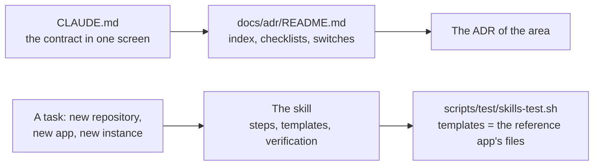

# ADR-0043 — The repository carries its operating instructions for a coding agent, as shared tooling

| | |
|---|---|
| Status | Accepted. Supersedes in part rule 5 of ADR-0005 (rule 6) |
| Date | 2026-10-06 |
| Applies to | every repository built from this one; `CLAUDE.md`, `.claude/skills/**`, `scripts/test/skills-test.sh` |
| Enforced by | `scripts/test/skills-test.sh` in the `lint` job (frontmatter, cited paths, templates against the reference app, the `platform.yml` template's keys); review |
| Related | [ADR-0001](0001-adrs-are-the-repository-contract.md), [ADR-0005](0005-repository-layout-and-shared-tooling.md), [ADR-0006](0006-apps-and-framework-modules.md), [ADR-0022](0022-pull-request-pipeline.md), [ADR-0030](0030-platform-yml-declares-every-project-value.md), [ADR-0039](0039-an-adr-applies-where-its-subject-exists.md) |

**In short:** A coding agent that creates a repository from this one, adds an app or adds an instance should not
have to rediscover the contract from forty ADRs. The repository carries two things for it: `CLAUDE.md`, the
contract in one screen, and three skills under `.claude/skills/`, the executable form of the three checklists of
the index. Both are shared tooling: copied unchanged into every repository built from this one, changed here
first, free of project values. A test keeps the skills' templates equal to the reference app's files, so a skill
cannot drift from the tree it describes.

## Context

The index holds three checklists: add an app, add an instance, create a repository from this one. They are
written for a person who knows the repository. An agent following them had to find the files to copy, and the
only files to copy were this repository's apps, which carry their own domain: a copied `application.yml` brought
the connector properties, a copied chart the wrong image path. The gap analysis of the template review found that
an agent would also miss what a new repository may leave out ([ADR-0039](0039-an-adr-applies-where-its-subject-exists.md))
and where a project value may live ([ADR-0030](0030-platform-yml-declares-every-project-value.md)).

Claude Code reads a `CLAUDE.md` at the repository root on every turn and the skills under `.claude/skills/` when
their task comes up. Both are plain Markdown and travel with the repository. [ADR-0005](0005-repository-layout-and-shared-tooling.md)
rule 5 did not class them, and `.github/affected-map.yml` classed `.claude/**` as documentation, so a change to a
skill ran no check.

## Decision

1. **Two files are the agent's entry points.** `CLAUDE.md` at the root states the contract in short form and
   points to the index; the skills `new-repo-from-template`, `add-app` and `add-instance` under
   `.claude/skills/<name>/SKILL.md` are the executable form of the index checklists of the same names. Each
   skill MUST say which checklist it executes.
2. **They are shared tooling** ([ADR-0005](0005-repository-layout-and-shared-tooling.md) rule 5, class 1):
   copied unchanged into every repository built from this one, changed here first. They MUST NOT contradict an
   ADR; where they do, the ADR wins and the file is corrected in the same pull request.
3. **They hold no project value.** `CLAUDE.md` and the skills read `platform.yml` and the tree, and say so. A
   skill's template holds a placeholder (`__APP_NAME__`, `__ENV__`, `__PORT__`, ...) where a value goes.
4. **A skill's templates are the contract's files, not a copy of an app.** `scripts/test/skills-test.sh` fails
   the `lint` job when: a skill's frontmatter lacks the name of its directory or a description; a path cited by
   `CLAUDE.md` or a skill does not exist; a template of `add-app` differs from the reference app's file but for
   the name (the chart, the `server`, `management` and `logging` blocks of `application.yml`, the classes the
   main class and the test use, the module the build file depends on); or the `platform.yml` template lacks a
   key of this repository's `platform.yml`. Without a reference app the template comparison is skipped
   ([ADR-0035](0035-dev-envs-and-reference-app-are-optional.md)).
5. **A checklist and its skill change together.** A pull request that changes a checklist of the index, a file
   class, a layer or a required file changes the skill in the same pull request.
6. **What this supersedes.** [ADR-0005](0005-repository-layout-and-shared-tooling.md) rule 5, in part: the
   shared tooling class gains `CLAUDE.md` and `.claude/skills/**`. For affected detection
   ([ADR-0022](0022-pull-request-pipeline.md)) `.claude/**` is shared, so a change to a skill or a template runs
   the `lint` job; the documentation class of `.github/affected-map.yml` names its Markdown locations instead of
   every `*.md`, so a `SKILL.md` is not documentation.
7. **A repository built from this one** keeps both unchanged and puts its own guidance in `docs/README.md` and
   in its ADRs from ADR-1000.

What an agent reads, and in which order:

## Alternatives considered

- **Checklists only.** They are the source of the skills and stay. Alone, they left the agent to copy an app and
  strip its domain, which it does badly.
- **Skills outside the repository** (a plugin, a shared skills repository). They would drift from the tree they
  describe, and a repository built from this one would not get them.
- **Generating the skills from the ADRs.** The ADRs are prose; a generator would need a schema the ADRs do not
  have. A test that compares templates with the tree is cheaper and catches the drift that matters.
- **Classing `.claude/**` as documentation**, as before. A broken skill then reaches `main` unchecked.

## Consequences

- `CLAUDE.md` loads on every turn, so it stays short: under a hundred lines, facts and pointers, no narration.
- A skill is a procedure, not a rule: it cites the ADRs it follows and adds none. New rules go in ADRs.
- The reference app is also the reference for the templates. A change to its `application.yml` contract blocks
  or its chart changes the templates in the same pull request, or the lint job fails.
- The `lint` job runs on a change to a skill or a template, with the whole full tier, as for any shared file. A
  change to `CLAUDE.md` alone is documentation and stays docs-only.
