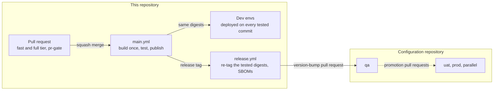

# The repository contract

This folder is the contract that every Spring Boot app in this repository, and every repository built from this
one, follows. It is what lets those apps reuse the same CI/CD workflows, configuration management and runtime
operations. Each rule is an ADR — an architecture decision record. The format and the rules about the rules are in
[ADR-0001](0001-adrs-are-the-repository-contract.md).

How to read it:

- **New here:** start with ADR-0002 to ADR-0006 (what a project, an env, an instance and a repository are), then the
  group you work in.
- **Adding an app, adding an instance, or creating a repository:** follow the checklists below.
- **Changing a convention:** write the ADR that supersedes the old one, in the same pull request
  ([ADR-0001](0001-adrs-are-the-repository-contract.md)).

This index is the living part of the folder: ADR statuses, checklists, known gaps and open decisions are kept up to
date here. The ADRs themselves change only by supersession.

## At a glance

A change travels from a pull request to production like this.

1. A pull request is tested; once `pr-gate` is green, it is squash-merged into `main`.
2. `main` builds every image once, tests those exact images, publishes them, and deploys them to the dev envs.
3. A release re-tags the same tested images; nothing is rebuilt.
4. The promoted envs — qa, uat, prod and parallel — pick up a release only through pull requests in the separate
   configuration repository.

Every env runs on on-prem compose until EKS exists.

| You want to understand… | Read |
|---|---|
| what a project, an env, a flow and an instance are | [ADR-0002](0002-one-repository-one-project-one-release-line.md), [ADR-0003](0003-identity-tuple-names-every-instance.md), [ADR-0004](0004-environments-and-runtimes.md) |
| where the project values come from, and which tool reads which | [ADR-0030](0030-platform-yml-declares-every-project-value.md) |
| what an app may contain, and what is shared tooling | [ADR-0005](0005-repository-layout-and-shared-tooling.md), [ADR-0006](0006-apps-and-framework-modules.md) |
| how configuration reaches a running container | [ADR-0011](0011-configuration-tree-and-spring-layers.md), [ADR-0012](0012-compose-template-and-generated-env.md), [ADR-0013](0013-secrets.md) |
| how an instance is operated and rolled back on a host | [ADR-0017](0017-run-compose-operations-cli-and-runtime-posture.md), [ADR-0018](0018-on-prem-host-layout-versioned-bundles.md), [ADR-0028](0028-host-pool-deployment.md) |
| what CI does with a pull request and with `main` | [ADR-0021](0021-ci-layering.md) to [ADR-0024](0024-ephemeral-ci-environments.md) |
| how a release reaches prod | [ADR-0010](0010-image-tags-digests-promotion-retention.md), [ADR-0029](0029-release-and-promotion.md) |
| how a job logs in to the registry, on GHCR or on Artifactory | [ADR-0032](0032-registry-credentials.md) |

## The ADRs

| ADR | Rule in one line | Status |
|---|---|---|
| **Foundations** | | |
| [0001](0001-adrs-are-the-repository-contract.md) | Decisions are numbered ADRs with MUST/SHOULD rules and an "Enforced by" line. ADR-0001 to ADR-0999 are the shared contract; a repository's own decisions start at ADR-1000. | Accepted; rule 4 superseded in part by ADR-0039 |
| [0039](0039-an-adr-applies-where-its-subject-exists.md) | A contract ADR applies where the subject its *Applies to* row names exists. A repository without the subject (no Helm, no integration test, no dev env, no pool) deviates from nothing and records nothing; the ADR applies from the first subject. | Accepted; rule 2 superseded in part by ADR-0040 |
| [0002](0002-one-repository-one-project-one-release-line.md) | A repository is one project of Spring Boot apps and libraries, released together as `vX.Y.Z`. `platform.yml` declares only what the tree cannot derive. | Accepted; rule 5 superseded by ADR-0030 |
| [0003](0003-identity-tuple-names-every-instance.md) | `<env>/<flow>/<AppName>/<AppInstance>` is the configuration path and the source of every name. | Accepted |
| [0004](0004-environments-and-runtimes.md) | Only local and dev are configured and deployed here. qa, uat, prod and parallel are configured and deployed from a separate configuration repository, promoted by pull request. On-prem compose runs every env until EKS. | Accepted; rule 3 superseded in part by ADR-0030 |
| [0005](0005-repository-layout-and-shared-tooling.md) | One skeleton for every repository. Shared tooling is copied unchanged, project files are the project's own, and changes to the tooling are made here first. | Accepted; rules 5 and 6 superseded in part by ADR-0030 |
| [0006](0006-apps-and-framework-modules.md) | `apps/<AppName>/` holds an app's code and only the infrastructure that differs between apps. `framework/<name>/` holds shared libraries, never deployed. | Accepted; rule 6 superseded in part by ADR-0030, rules 1 and 4 in part by ADR-0040 |
| [0030](0030-platform-yml-declares-every-project-value.md) | `platform.yml` declares every project value: registry, project, group, apps directory, runtimes, reference app, dev envs, regions, stages and flows. The build validates it on every run, and every tool reads it; none hard-codes a value. | Accepted; rules 1 and 3 superseded in part by ADR-0035 |
| [0035](0035-dev-envs-and-reference-app-are-optional.md) | `dev_envs` may be `[]` and `reference_app` may be left out. No dev env skips the kind deployment test and the dev deploy; no reference app skips the system test, the kind deployment test and the teardown drill. A new repository goes green before its boxes exist. | Accepted |
| **Build and artifacts** | | |
| [0007](0007-gradle-build-with-convention-plugins.md) | Convention plugins in `build-logic/`, one version catalog and the Spring Boot BOM give reproducible, cached builds; a module declares only its plugins and dependencies. | Accepted; rule 3 superseded in part by ADR-0030 and ADR-0038, rule 1 in part by ADR-0033 |
| [0008](0008-versions-derived-from-git.md) | Versions come from git tags and Conventional Commits on every build. No version file exists. | Accepted |
| [0009](0009-one-shared-image-definition.md) | One Dockerfile and a three-file build context for every app; images are non-root and layered, and Gradle builds them with docker or podman. | Accepted; rules 3 and 6 superseded in part by ADR-0033 |
| [0010](0010-image-tags-digests-promotion-retention.md) | Images are `<registry>/<project>/<AppName>` with immutable version and sha tags. They move by digest, are promoted by re-tagging, and the retention sweep keeps everything in use. | Accepted; rule 7 superseded in part by ADR-0032 |
| [0033](0033-public-base-image-fallback.md) | A company base image that is not published falls back to a public Temurin image pinned in `.github/versions.env`: `eclipse-temurin:21-jre` for the app images, `eclipse-temurin:21-jdk` for the integration tests. The shared Dockerfile adds the user, the directories and curl that the public image lacks, and a pull-request job proves it. | Accepted |
| **Configuration** | | |
| [0011](0011-configuration-tree-and-spring-layers.md) | Spring layers apply jar < flow < app < instance < secrets. Layers are files named by level, only `application.<layer>.yml` reaches the container, and nothing is shared above the flow. | Accepted; rule 5 superseded in part by ADR-0036 |
| [0012](0012-compose-template-and-generated-env.md) | One compose template plus structural overrides. The env layers merge into one generated, annotated env per instance, from allow-listed variables. | Accepted |
| [0013](0013-secrets.md) | Secrets never enter git, the layers, the images or the bundles. They are passed through from the shell or mounted at `/secrets/`, masked wherever printed, and scanned for. | Accepted; rule 3 superseded in part by ADR-0040 |
| [0014](0014-config-lint-enforces-the-config-contract.md) | `./gradlew configLint` enforces the configuration rules with numbered checks, the same on a laptop and in CI. | Accepted; rule 2 superseded in part by ADR-0036 |
| [0036](0036-helm-checks-only-when-kinds-include-helm.md) | config-lint requires a chart per app and the Helm values of every instance, and renders them, only when `platform.yml` `kinds` includes `helm`; a values file that exists is checked either way. | Accepted |
| **Runtime operations** | | |
| [0015](0015-actuator-health-and-metrics-contract.md) | Every app exposes `health`, `info`, `prometheus` and its configuration summary `appconfig` on port 8080. Readiness is `readinessState` plus the `app` indicator, the identity is on every meter, and one test checks all of it. | Accepted; rules 3 and 6 superseded in part by ADR-0037, rules 1, 3, 4, 6 and 9 in part by ADR-0040 |
| [0016](0016-logging-and-startup-configuration-summary.md) | Logs go to stdout with the identity on every line. The masked effective configuration is available at start-up, from an endpoint, and offline. | Accepted; rule 5 superseded in part by ADR-0037 and ADR-0040 |
| [0017](0017-run-compose-operations-cli-and-runtime-posture.md) | `run-compose.sh` operates every compose-run instance of this repository — laptop, CI, dev host — with safety rules and an audit line; the shared template hardens every container. | Accepted; rule 5 superseded in part by ADR-0030, rule 1 in part by ADR-0037 |
| [0037](0037-runtime-scripts-read-generic-actuator-names.md) | The runtime scripts read the generic names first, the `app` section of `/actuator/info` and `/actuator/appconfig`, and accept `connector` and `connectorconfig`, the names of images built before ADR-0040. An app that publishes neither passes on readiness, with a warning. | Accepted; rules 1, 3 and 7 superseded in part by ADR-0040 |
| [0040](0040-actuator-contract-and-runtime-module-carry-generic-names.md) | The framework and its actuator contract carry generic names: the module `framework/app-runtime`, `PlatformApplication`, `AbstractPlatformApplicationTest`, the endpoint `appconfig`, the readiness indicator `app` and the identity in the `app` section of `/actuator/info` only. The runtime scripts still accept the old `connector` and `connectorconfig`. | Accepted |
| [0018](0018-on-prem-host-layout-versioned-bundles.md) | Hosts keep `/apps/<user>/versions/<project>/<version>/` per deploy, with `current` the live one. Activation is atomic, and rollback points `current` back. | Accepted; rule 2 superseded in part by ADR-0030 |
| [0019](0019-kubernetes-and-helm-are-provisional.md) | Charts, Helm values, the Helm deploy script, check 12 and the kind tier are kept working, not extended, until the EKS design. | Accepted; rule 2 superseded in part by ADR-0030 and ADR-0036, rule 5 in part by ADR-0036 |
| **Source control** | | |
| [0020](0020-branching-protection-and-merge-rules.md) | `main` and `hotfix/*` change only by squash-merged pull request with `pr-gate` green. Pull-request titles are Conventional Commits, and no workflow writes to protected branches. | Accepted; rule 8 superseded in part by ADR-0032 |
| **CI** | | |
| [0021](0021-ci-layering.md) | Thin trigger workflows call reusable stage workflows, then composite actions, then scripts and Gradle tasks that run on a laptop. Least privilege, and JSON between stages. | Accepted |
| [0022](0022-pull-request-pipeline.md) | Affected projects come from the changed paths, classified by `affected-map.yml` and the projects' own directories: a fast tier on push, a full tier on pull requests and the merge queue. `pr-gate` is the only required check. | Accepted; rule 2 superseded in part by ADR-0031, rule 1 in part by ADR-0033 |
| [0023](0023-main-pipeline-build-once-test-publish.md) | Build once, run the component and system tests on those digests, then publish, then deploy dev. | Accepted; rule 2 superseded in part by ADR-0034 |
| [0024](0024-ephemeral-ci-environments.md) | Each job gets its own labelled stack or cluster, torn down in `always()` steps; a leak check and a nightly drill prove the teardown. | Accepted; rule 5 superseded in part by ADR-0035 |
| [0031](0031-ci-derives-the-projects-from-the-build-files.md) | CI derives the projects — which build an image, which have integration tests, which directory selects each — from the build files, with the build's own rules; the affected map keeps only path classes. | Accepted |
| [0032](0032-registry-credentials.md) | Two optional secrets, `REGISTRY_USER` and `REGISTRY_TOKEN`, log every job in to the registry of `platform.yml`; without them, `GITHUB_TOKEN` on GHCR. The retention sweep is GHCR-only, and the boxes of a pool hold their own read credentials. | Accepted |
| [0034](0034-main-runs-the-test-stages-the-repository-has.md) | `main` runs the integration tests when a project has them and the system test when `versions.env` declares the system image; publish follows the stages that ran and passed, never a failed or cancelled one. | Accepted; rule 5 superseded in part by ADR-0035 |
| **Testing** | | |
| [0025](0025-integration-tests-on-compose-stacks.md) | One `stack.sh` serves laptops and CI. Stacks are declared per project, the app under test runs as deployed, and tests run at a component and a system level. | Accepted; rules 2, 5 and 7 superseded in part by ADR-0038, rule 4 in part by ADR-0033, rule 6 in part by ADR-0034 |
| [0026](0026-integration-test-data-and-comparison.md) | Test cases are `test-infra/testdata/<AppName>/<case>/`: a manifest, inputs, and canonical JSON Lines, compared by shared comparators with explicit tolerances. | Accepted |
| [0038](0038-stacks-publish-their-test-environment.md) | Each stack declares in `stacks.yml` its seed and the variables it publishes to the tests, generated secrets included; `stack.sh` writes them for the it-runner and the host JVM. The shared tooling names no dependency, and an app declares its own test clients. | Accepted |
| **CD and release** | | |
| [0027](0027-continuous-deployment-to-dev-and-the-deployment-record.md) | Every tested `main` commit deploys dev from a per-flow inventory. The configuration tree declares intent; a GitHub Deployment records what happened, with nothing written back to git. | Accepted; rule 1 superseded in part by ADR-0035 |
| [0028](0028-host-pool-deployment.md) | Placement is pinned, else discovered, else assigned. Instances start from a new version, and every box activates it only when all are healthy; otherwise everything returns to `current`. | Accepted |
| [0029](0029-release-and-promotion.md) | release-please tags; `release.yml` re-tags the tested digests and attaches SBOMs. The promoted envs change only by pull request in the configuration repository. | Accepted |

## Glossary

| Term | Meaning |
|---|---|
| project | the one release line of a repository: its apps and libraries ([ADR-0002](0002-one-repository-one-project-one-release-line.md)) |
| app | a deployable Spring Boot service, `apps/<AppName>/`, one image |
| library | a module under `framework/`, built and released with the apps, never deployed |
| shared tooling | the files copied unchanged into every repository built from this one ([ADR-0005](0005-repository-layout-and-shared-tooling.md)) |
| project values | what the shared tooling needs to know about a project; declared in `platform.yml` ([ADR-0030](0030-platform-yml-declares-every-project-value.md)) |
| env | `local`, or `<region>-<stage>` with a region and a stage of `platform.yml` |
| stage | `dev`, `qa`, `uat`, `prod`, `parallel` (`stages` in `platform.yml`) |
| dev env | an env this repository configures and deploys (`dev_envs`) |
| reference app | the app of the system test, the kind deployment test and the nightly teardown drill (`reference_app`) |
| promoted env | `qa`, `uat`, `prod` or `parallel`: configured in and deployed from the configuration repository, immutable tags only ([ADR-0004](0004-environments-and-runtimes.md)) |
| configuration repository | the separate repository holding the configuration of the promoted envs |
| flow, cluster | a business flow; one flow in one env is one cluster, with its own boxes and inventory |
| instance | one configured pipeline of an app in a flow: `config/<env>/<flow>/<AppName>/<AppInstance>/` |
| layer | one level of configuration (jar, flow, app, instance, secrets) and the files at that level ([ADR-0011](0011-configuration-tree-and-spring-layers.md)) |
| combined env | the generated `.run/…/compose.env` of one instance ([ADR-0012](0012-compose-template-and-generated-env.md)) |
| deploy inventory | a dev flow's `workflows-config.yml`: its pool and one target per instance |
| host pool, box | the bare-metal hosts of one flow; any instance of the flow can run on any of them |
| host bundle, version directory | the runtime of one `<env>/<flow>` synced to a box as `/apps/<user>/versions/<project>/<version>/` ([ADR-0018](0018-on-prem-host-layout-versioned-bundles.md)) |

## Checklists

### Add an app to this repository ([ADR-0006](0006-apps-and-framework-modules.md))

1. `apps/<AppName>/build.gradle.kts`: apply `buildlogic.spring-boot-app`, `buildlogic.docker-image` and
   `buildlogic.integration-test`. Depend on `project(":app-runtime")` and, for tests, on its test fixtures.
2. `src/main/resources/application.yml`:
   - `spring.application.name: <AppName>`;
   - the import list of [ADR-0011](0011-configuration-tree-and-spring-layers.md);
   - the `server`, `management` and `logging` blocks, copied from an existing app
     ([ADR-0015](0015-actuator-health-and-metrics-contract.md), [ADR-0016](0016-logging-and-startup-configuration-summary.md)).
3. The main class calls `PlatformApplication.run(<Main>.class, args)`. One unit test extends
   `AbstractPlatformApplicationTest` ([ADR-0040](0040-actuator-contract-and-runtime-module-carry-generic-names.md)).
4. Configuration in `local`:
   - `config/local/<flow>/<AppName>/application.app.yml`, and `_helm-values.app.yaml` when `kinds` includes `helm`;
   - one instance directory with `application.instance.yml`, `_docker-compose.instance.env`, and
     `_helm-values.instance.yaml` when `kinds` includes `helm`. The env file holds `IMAGE_TAG=local`, the identity
     restating the path, and a free `ACTUATOR_HOST_PORT`.
5. In each dev env: the same files (the Helm values when `kinds` includes `helm`), with `IMAGE_TAG=main`, plus a
   target in the flow's `workflows-config.yml`.
6. Declare its dependency stacks in `test-infra/compose/stacks.yml` (known gap G10), and for a new stack what it
   publishes to the tests ([ADR-0038](0038-stacks-publish-their-test-environment.md)). The test clients of its
   integration tests go in its own build file. CI finds the app itself, from its build file
   ([ADR-0031](0031-ci-derives-the-projects-from-the-build-files.md)).
7. Integration tests in `src/integrationTest/java`, and a test case in `test-infra/testdata/<AppName>/<case>/`
   ([ADR-0025](0025-integration-tests-on-compose-stacks.md), [ADR-0026](0026-integration-test-data-and-comparison.md)).
8. When `kinds` includes `helm`, a chart: copy `apps/<other>/helm/<other>/` to `apps/<AppName>/helm/<AppName>/` and
   rename it. Required while Helm is provisional ([ADR-0019](0019-kubernetes-and-helm-are-provisional.md),
   [ADR-0036](0036-helm-checks-only-when-kinds-include-helm.md)).
9. Only if needed:
   - `docker/docker-compose.override.yml` for secret pass-through ([ADR-0013](0013-secrets.md));
   - `scripts/smoke.sh` for app-specific smoke checks.
10. Write `apps/<AppName>/README.md`.
11. Verify:
    - `./gradlew build configLint`;
    - `./gradlew :<AppName>:integrationTest`;
    - `scripts/run-compose.sh local <flow> <AppName> <AppInstance> validate`.

### Add an instance ([ADR-0003](0003-identity-tuple-names-every-instance.md), [ADR-0011](0011-configuration-tree-and-spring-layers.md))

1. Create `config/<env>/<flow>/<AppName>/<AppInstance>/` with these files:
   - `application.instance.yml`;
   - `_docker-compose.instance.env`: the identity restating the path, `IMAGE_TAG`, and an `ACTUATOR_HOST_PORT` that
     is free on the instance's boxes;
   - `_helm-values.instance.yaml`, when `kinds` includes `helm`
     ([ADR-0036](0036-helm-checks-only-when-kinds-include-helm.md)).
2. In a dev env: add a target for it to the flow's `workflows-config.yml`.
3. Verify: `./gradlew configLint`, then `scripts/run-compose.sh <env> <flow> <AppName> <AppInstance> start --dry-run`.

### Create a repository from this one ([ADR-0005](0005-repository-layout-and-shared-tooling.md))

1. Copy this repository at a release tag: `git clone --branch vX.Y.Z --depth 1 <this repository> <new-name>`, then
   delete `.git` and run `git init`, so the new repository starts its own history and release line (step 4).
   GitHub's "Use this template" copies the default branch, not a release: prefer the tag. Keep the shared tooling
   unchanged.
2. Set the project values ([ADR-0030](0030-platform-yml-declares-every-project-value.md)):
   - in `platform.yml`: `registry`; `projects[0]` — `name` (the repository name, which the build checks in CI),
     `group`, `apps_dir`, `kinds` and `reference_app`; `dev_envs`; `regions`, `stages` and `flows`.
     `dev_envs` may be `[]` until the first dev env exists, and `reference_app` may be left out: the first pull
     request then goes green before any box, SSH key or GitHub Environment exists, and setting them later turns the
     deploy and the reference scenario on ([ADR-0035](0035-dev-envs-and-reference-app-are-optional.md));
   - `component` in `release-please-config.json`: the project name. The tags stay `vX.Y.Z`, because
     `include-component-in-tag` is false ([ADR-0029](0029-release-and-promotion.md));
   - the package rules of `renovate.json` that name this repository's images: `ghcr.io/crazymatthsu/base/**`
     becomes `<registry>/base/**`, and the Deephaven rule names the repository's own pinned test images, or goes
     when it has none;
   - a GitHub Environment named after each dev env;
   - when the registry is not GHCR: the repository secrets `REGISTRY_USER` and `REGISTRY_TOKEN`
     ([ADR-0032](0032-registry-credentials.md)), the base images under `<registry>/base/`, and read credentials for
     the registry on every box of a pool;
   - the base images `<registry>/base/jre21` and `<registry>/base/ci-build` are optional at first: until they are
     published, CI builds on their public fallbacks `eclipse-temurin:21-jre` and `eclipse-temurin:21-jdk`, pinned in
     `.github/versions.env` ([ADR-0033](0033-public-base-image-fallback.md));
   - `IMAGE_REPO` in each `config/<env>/<flow>/_docker-compose.flow.env` (known gap G24);
   - a self-hosted runner: Linux (amd64 or arm64) with bash 4, git, curl, docker with buildx, jq and python3 3.8+.
     The `setup-yq` action installs yq itself, behind JFrog from the generic remote named by the repository
     variable `YQ_DOWNLOAD_BASE` ([ADR-0021](0021-ci-layering.md)).
3. Replace the project files with the new project's own:
   - `apps/`, the domain code under `framework/`, `config/`;
   - `test-infra/testdata/`, the dependency stacks, `versions.env`, `stacks.yml`;
   - `.github/CODEOWNERS`, `README.md`. `.github/affected-map.yml` holds only the path classes since
     [ADR-0031](0031-ci-derives-the-projects-from-the-build-files.md) and needs no edit unless the repository adds a path class;
   - without a system image, leave `DEEPHAVEN_SERVER_IMAGE` out of `versions.env`: `main.yml` then runs no system
     test. With no app that has integration tests, it runs no integration-test stage either
     ([ADR-0034](0034-main-runs-the-test-stages-the-repository-has.md)).
4. Start a new release line: an empty `CHANGELOG.md`, `.release-please-manifest.json` holding `{}` (the first release
   is then the `initial-version` of `release-please-config.json`, `0.1.0`, [ADR-0029](0029-release-and-promotion.md)), and no tags.
5. Keep `docs/adr/0001-…` to `0999-…` unchanged. Record the repository's own decisions from ADR-1000, and update
   `docs/README.md`. An ADR whose subject the repository does not have yet is dormant, not a deviation: nothing to
   record ([ADR-0039](0039-an-adr-applies-where-its-subject-exists.md)).
6. Apply the repository settings of [ADR-0020](0020-branching-protection-and-merge-rules.md).
7. Verify: the first pull request gets a green `pr-gate`, and the first `main` run publishes the images, and deploys
   dev when `dev_envs` names one.

### What a new repository may leave out ([ADR-0039](0039-an-adr-applies-where-its-subject-exists.md))

Each row is a switch a new repository starts without. The tooling skips what depends on it, with a notice where a job
would have run, and the ADRs of the right column apply from the moment the switch is set.

| Left out | What then happens | Decided in |
|---|---|---|
| `projects[0].reference_app` in `platform.yml` | no system test, no kind deployment test, no nightly teardown drill, no `public-base` job | [ADR-0035](0035-dev-envs-and-reference-app-are-optional.md) |
| dev envs (`dev_envs: []`) | no kind deployment test and no dev deploy; config-lint and the scripts accept `local` only | [ADR-0035](0035-dev-envs-and-reference-app-are-optional.md) |
| `helm` in `projects[0].kinds` | no chart and no `_helm-values` file is required or rendered; a values file that exists is still checked | [ADR-0036](0036-helm-checks-only-when-kinds-include-helm.md) |
| integration tests (no app applies `buildlogic.integration-test`) | no `integration-test` stage on `main`, none on pull requests | [ADR-0034](0034-main-runs-the-test-stages-the-repository-has.md) |
| `DEEPHAVEN_SERVER_IMAGE` in `test-infra/compose/versions.env` | no system test | [ADR-0034](0034-main-runs-the-test-stages-the-repository-has.md) |
| the company base images `<registry>/base/jre21` and `ci-build` | the images build on the public Temurin fallbacks of `.github/versions.env`, with a notice; the Gradle job runs on the runner with `setup-java` | [ADR-0033](0033-public-base-image-fallback.md) |
| the secrets `REGISTRY_USER` and `REGISTRY_TOKEN` | every login uses `GITHUB_TOKEN`, which GHCR needs | [ADR-0032](0032-registry-credentials.md) |
| the framework `framework/app-runtime` (an app not built on it) | `health` passes on readiness alone; `app-config` reads `appconfig`, else `connectorconfig` | [ADR-0037](0037-runtime-scripts-read-generic-actuator-names.md), [ADR-0040](0040-actuator-contract-and-runtime-module-carry-generic-names.md) |
| a dependency stack | nothing: a stack exists only for the projects that declare it in `stacks.yml` | [ADR-0038](0038-stacks-publish-their-test-environment.md) |
| host pools (no boxes for a dev flow) | the dev deploy of that flow is a validated dry run (known gap G19) | [ADR-0028](0028-host-pool-deployment.md) |
| `framework/` | the modules are the directories of `apps_dir` and `framework/` that hold a build file; an absent directory holds none | [ADR-0006](0006-apps-and-framework-modules.md) |

## Known gaps

Places where the tree does not conform to an accepted ADR yet. A pull request that closes a gap removes its row; one
that opens a gap adds a row.

| # | Gap | ADR |
|---|---|---|
| G4 | `release.yml`'s bump job commits to `config/us-qa` in this repository, and names the apps `source-*`; it must open the pull request in the configuration repository. | [0029](0029-release-and-promotion.md) |
| G6 | `us-dev/cash/source-database/positions-db-to-deephaven` is a `kind: helm` target on the throwaway `kind-ci` cluster, so it runs nowhere after the deploy job. | [0004](0004-environments-and-runtimes.md), [0019](0019-kubernetes-and-helm-are-provisional.md) |
| G10 | `test-infra/compose/stacks.yml` is maintained by hand. A project without an entry fails when its stack starts, and an entry for a removed project goes unnoticed. | [0025](0025-integration-tests-on-compose-stacks.md) |
| G11 | The framework still mixes the generic operational contract with the connector domain (open decision O5): its actuator names, contract test and module name are generic since ADR-0040, but `ConnectorIdentity`, `ConnectorProperties`, the `connector.*` summary prefixes and the package are not. The `server`, `management` and `logging` blocks are copied into every app, and the secret-property list exists twice (config-lint, `SecretMasker`). The runtime scripts do not require the framework: they read the generic `app` and `appconfig` names first and accept `connector` and `connectorconfig` from images built before ADR-0040. | [0006](0006-apps-and-framework-modules.md), [0013](0013-secrets.md), [0015](0015-actuator-health-and-metrics-contract.md), [0016](0016-logging-and-startup-configuration-summary.md), [0037](0037-runtime-scripts-read-generic-actuator-names.md), [0040](0040-actuator-contract-and-runtime-module-carry-generic-names.md) |
| G13 | The base images and the system test's server image are built outside this repository, and the bootstrap path of `setup-build-env` has no `docker/base/<name>/Dockerfile` to build here. A missing base image no longer fails the build: CI falls back to the public Temurin images, which lack the company CA bundle. | [0009](0009-one-shared-image-definition.md), [0033](0033-public-base-image-fallback.md) |
| G14 | The build job pushes `main` before any test, so a failed run leaves `main` on an untested build. The build should push with `-PpushConvenienceTags=false` and leave `main` to publish. | [0010](0010-image-tags-digests-promotion-retention.md), [0023](0023-main-pipeline-build-once-test-publish.md) |
| G15 | Merge commits are allowed: 12 of 27 commits are merges, and `CHANGELOG.md` lists each change twice. The rulesets should allow squash merges only. | [0020](0020-branching-protection-and-merge-rules.md) |
| G16 | No CI check validates pull-request titles as Conventional Commits. | [0008](0008-versions-derived-from-git.md), [0020](0020-branching-protection-and-merge-rules.md) |
| G17 | Pull requests and tags created with `GITHUB_TOKEN` (release, version bump) start no workflow, so `pr-gate` never reports on them. A GitHub App token is needed. | [0020](0020-branching-protection-and-merge-rules.md), [0029](0029-release-and-promotion.md) |
| G18 | A hotfix branch and `main` can compute the same `-rc.<n>` version, and `pushImage` overwrites an existing tag: immutability is enforced only when re-tagging. | [0010](0010-image-tags-digests-promotion-retention.md), [0020](0020-branching-protection-and-merge-rules.md) |
| G19 | The deploy user's forced command is not implemented, and no boxes exist yet (deploys use the `local` transport). A flow without a pool gets only a validated dry run. | [0018](0018-on-prem-host-layout-versioned-bundles.md), [0027](0027-continuous-deployment-to-dev-and-the-deployment-record.md), [0028](0028-host-pool-deployment.md) |
| G20 | Config-lint checks 7 (merged configuration against metadata) and 8 (parity across envs) are not implemented. | [0014](0014-config-lint-enforces-the-config-contract.md) |
| G22 | Nothing checks that a derived repository's shared tooling is unchanged. | [0005](0005-repository-layout-and-shared-tooling.md) |
| G23 | The merge queue is not enabled on `main`. Without it, a pull request from a fork merges with no integration test before the merge (`main.yml` still runs them after it). | [0020](0020-branching-protection-and-merge-rules.md), [0022](0022-pull-request-pipeline.md) |
| G24 | `IMAGE_REPO` in every flow's `_docker-compose.flow.env` restates the registry and the project of `platform.yml`; `run-compose.sh` cannot derive it, so a new repository edits one line per env and flow. | [0030](0030-platform-yml-declares-every-project-value.md) |

## Open decisions

Questions that no ADR answers yet. Each one becomes an ADR when it is decided.

| # | Question | Touches |
|---|---|---|
| O1 | The configuration repository's pipeline: how it validates without app subprojects (config-lint needs the app list from a manifest); how it assembles host bundles from a release's runtime files (scripts, compose template, the apps' overrides and smoke tests at the release tag); how it deploys and records the promoted envs; and so whether the bundled `run-compose.sh` must operate the higher envs (in this repository it refuses them, as it should). | [0004](0004-environments-and-runtimes.md), [0014](0014-config-lint-enforces-the-config-contract.md), [0029](0029-release-and-promotion.md) |
| O2 | How secrets are provisioned and rotated on the boxes of the promoted envs. | [0013](0013-secrets.md) |
| O3 | How repositories built from this one receive updates to the shared tooling: copying per release, a sync job, or extracting it into versioned reusable workflows, actions and a published Gradle plugin. | [0005](0005-repository-layout-and-shared-tooling.md) |
| O4 | The EKS design, superseding ADR-0019: chart structure, values layering, secrets, the kind tier, and how each env moves from compose. | [0019](0019-kubernetes-and-helm-are-provisional.md) |
| O5 | Splitting the framework into a generic runtime module (identity, actuator contract, masking, summary) and domain modules, and the names that stay in the connector domain until then: `ConnectorIdentity`, `ConnectorProperties` and the `connector.*` properties, `ConnectorMdc`, `ConnectorStartupReporter`, the summary prefixes and the package `com.example.connectors.framework`. The actuator names, the contract test, the `main` helper and the module name are decided ([ADR-0040](0040-actuator-contract-and-runtime-module-carry-generic-names.md)). | [0006](0006-apps-and-framework-modules.md), [0015](0015-actuator-health-and-metrics-contract.md), [0040](0040-actuator-contract-and-runtime-module-carry-generic-names.md) |
| O6 | The dev deploy policy per flow (every merge, or a schedule), and manual deploy and rollback dispatches. | [0027](0027-continuous-deployment-to-dev-and-the-deployment-record.md) |
