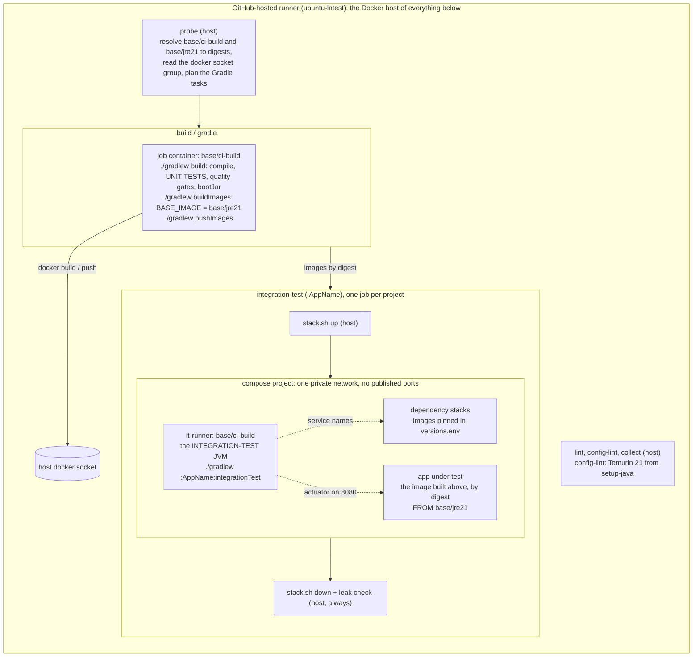

# The CI build environment: the runner, the two base images, and what runs where

**In short:** every CI job runs on a GitHub-hosted runner, which is also the Docker host of everything the job
starts. Two base images, built and published outside this repository under `<registry>/base/`, decide what the
Gradle build and the tests run on: `jre21` is the base of every app image, and `ci-build` is the JDK environment
of the Gradle build job and of the integration-test JVM. A repository without the two images runs on their public
fallbacks and goes green anyway ([ADR-0033](adr/0033-public-base-image-fallback.md)). This guide shows the picture
in one place; the decisions are in [ADR-0009](adr/0009-one-shared-image-definition.md),
[ADR-0021](adr/0021-ci-layering.md) rule 6, [ADR-0025](adr/0025-integration-tests-on-compose-stacks.md),
[ADR-0033](adr/0033-public-base-image-fallback.md) and
[ADR-0044](adr/0044-no-system-test-one-integration-test-level.md).

## The two base images

| Base image | What it carries | Who runs on it | Public fallback (`.github/versions.env`) |
|---|---|---|---|
| `<registry>/base/jre21` | Temurin 21 JRE, the company CA in the OS and JVM trust stores, tzdata, curl, the non-root user `app` (10001) | every app image: `docker/spring-boot.Dockerfile` starts both stages `FROM ${BASE_IMAGE}` | `eclipse-temurin:21-jre`; the Dockerfile's runtime stage then adds the user, `/config`, `/app/logs` and curl itself, and changes nothing on the company base |
| `<registry>/base/ci-build` | Ubuntu, Temurin 21 JDK, the same CA, git, curl and the container CLIs | the Gradle build job, as its job container; the `it-runner` compose service, in which the integration-test JVM runs | `eclipse-temurin:21-jdk`; the Gradle job then runs on the runner host with `actions/setup-java`, and `it-runner` runs in the JDK image |

Both are external inputs ([ADR-0009](adr/0009-one-shared-image-definition.md) rule 6): CI resolves
`<registry>/base/<name>:latest` to a digest at the start of each run, and Renovate proposes their dated tags.
`platform.yml` names the registry; nothing else does.

## One pipeline run

The same run, step by step:

1. **probe**, on the host: resolves the two base images to digests (or to nothing, when they are not published),
   reads the group of the host's Docker socket, and plans the Gradle tasks from the build files.
2. **build / gradle**, in a job container on `base/ci-build`: `./gradlew build` compiles, runs the **unit tests** and
   the quality gates and writes the boot jars; `buildImages` builds every app image with `BASE_IMAGE` set to the
   `base/jre21` digest; `pushImages` pushes them. The container runs as the runner's user and joins the socket's
   group, so the host engine does the builds and nothing runs as root. When `ci-build` is not published, the same
   steps run on the host with Temurin 21 from `actions/setup-java`.
3. **collect**, on the host: resolves the pushed tags to digests, the `images` output every later job reads.
4. **integration-test**, one job per project that has integration tests, on the host: `stack.sh up` starts the
   project's dependency stacks on the images `test-infra/compose/versions.env` pins, then the app under test from
   the digest built in this run, on one private network with no published port. Then
   `compose run --rm it-runner ./gradlew :AppName:integrationTest -Pcompose.managed=false` runs the
   **integration-test JVM** inside `base/ci-build`, on the stack network, with the workspace and the Gradle home
   bind-mounted from the host. Teardown and the leak check run in `always()` steps
   ([ADR-0024](adr/0024-ephemeral-ci-environments.md)).
5. **config-lint** and **lint**, on the host: `./gradlew configLint` with Temurin 21 from `setup-java`, and the
   linters and script tests. No base image is involved.
6. On `main`, **publish**, **kind-deploy** and **deploy-dev** consume the images by digest and build nothing.

## What each step uses

| Step | Runs where | JVM or image used | Notes |
|---|---|---|---|
| Gradle build, unit tests, quality gates | the build job | the JDK of `base/ci-build` (job container) | unit tests never touch an app image or a dependency |
| Image build and push | the same job | `base/jre21` as the `BASE_IMAGE` of every app image; the host's Docker engine through the mounted socket | `buildlogic.docker-image` reads `BASE_IMAGE`, which `setup-build-env` exports |
| Integration tests: the test JVM | the `it-runner` service inside the compose stack | the JDK of `base/ci-build` | CI exports `CI_BUILD_IMAGE`, which wins over `versions.env` |
| Integration tests: the app under test | a service of the compose stack | the app image built in this run, by digest, so `base/jre21` underneath | started as deployed, with the real configuration layers ([ADR-0025](adr/0025-integration-tests-on-compose-stacks.md) rule 3) |
| Integration tests: the dependencies | services of the compose stack | the images pinned in `test-infra/compose/versions.env` | the only images the tests run against ([ADR-0044](adr/0044-no-system-test-one-integration-test-level.md)) |
| config-lint, the `public-base` proof, the release checks | the runner host | Temurin 21 from `actions/setup-java` | no base image needed |
| kind deploy, dev deploy, publish | the runner host | pull the app image by digest | consumers of the image, never builders |

## How a job finds a base image

`setup-build-env` resolves each base image a job asks for, in this order
([ADR-0033](adr/0033-public-base-image-fallback.md) rule 2): the published `<registry>/base/<name>:latest`, by
digest; else a local build of `docker/base/<name>/Dockerfile`, when that file exists; else the public fallback of
`.github/versions.env`, with a notice that names the missing image. It exports the result as `BASE_IMAGE` or
`CI_BUILD_IMAGE`. The first run of a new repository is therefore green before its base images exist, and the
`public-base` job of `pr.yml` proves the fallback path on every shared change.

Where a run shows which case applied: the probe job's summary lists `base/ci-build` and `base/jre21` with their
digests or "not used", and the build job's "Build environment" step prints either "Job container `<digest>`" or
"Runner host with Temurin 21".

## On a laptop

The same commands run without the runner ([ADR-0021](adr/0021-ci-layering.md)): `./gradlew build` uses the
laptop's JDK; `./gradlew :<AppName>:buildImage` uses the laptop's engine, with `BASE_IMAGE` defaulting to
`<registry>/base/jre21:latest` (`-Pimage.arg.BASE_IMAGE=<ref>` or the variable `BASE_IMAGE` overrides it);
`./gradlew :<AppName>:integrationTest` builds the image, starts the same stack with ports published on
`127.0.0.1`, runs the test JVM on the host and stops the stack. `base/ci-build` plays no part on a laptop.
